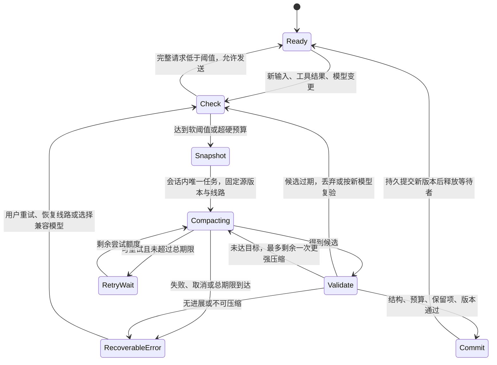

# Codey 内部开发文档

本文档面向开发和维护人员，只保留当前架构、开发流程、关键边界和已知限制。用户可见功能维护在 README.md；历史方案和逐版本改动由 Git 记录，不在这里累积。

## 核心设计

- Codey 是 Rust 桌面辅助进程，负责启动、监控和停止官方 Codex Electron 客户端。
- 配置界面由 React 实现，构建后嵌入 Codey，并通过 CDP 注入 Codex 页面；通常没有独立常驻配置窗口。
- 本地路由开启时，Codex 只连接本次启动的回环网关。官方账号沿用 Codex 登录，第三方线路使用 Codey 保存的凭据。
- 线路、模型和上游格式分别识别。模型选择器使用带线路信息的稳定 ID；页面 `turn/start` 使用供应商原始模型 ID，通过独立元数据传递线路，其他入口的别名由本地路由在转发前还原；关闭本地路由后，历史标识由会话恢复入口还原。
- Codey 配置与 Codex 配置分开保存。用户 Codex 配置原则上只读，只允许维护 Codey 自有的路由恢复桩和清理旧版 Codey 遗留项。
- 启动生成的模型目录只有模型数量大于零时才传给 Codex；空集合沿用内置目录回退流程，避免 Codex 拒绝空 `model_catalog_json`。路由启动前的配置修复独立清理旧 Codey 目录引用，不依赖路由或子代理配置残留，并保留用户自有目录。回归覆盖官方线路禁用、第三方线路无模型时反复启动，以及独立旧引用的清理。
- 无法确认线路、模型归属或兼容能力时应停止请求并给出错误，不猜测、不跨线路自动切换，也不重放可能已经送达的请求。
- 子代理角色的运行时模型 ID 跟随启动时实际启用的模型目录。自定义目录不可用（例如本机缓存缺少新模型的完整模板）而回退到内置目录时，仅将唯一线路的角色模型还原为上游 ID，避免原生派发阶段因线路别名返回 `Unknown model`；缺失或同名多线路在写入角色前拒绝派发。启动阶段捕获该校验错误，仅关闭本次运行的子代理增强并继续启动，记录可恢复日志及停用原因；保存配置和角色选择不变，修复后重启重新尝试。热更新仍返回错误并保留当前运行配置。保存配置仍保留线路别名，角色热更新沿用当前进程的目录模式，不能根据后来生成的目录文件切换模式；恢复自定义目录后需重启 Codex。
- 内置目录模式下，只要启动时启用了子代理增强，线路与模型映射在重启前保持不变。路由更新与角色热更新共用前置校验，拒绝映射变化时均保留原运行配置，避免旧角色及运行中的子代理被父任务线路元数据重新定向；即使同时保存关闭子代理增强也不提前解除保护。角色模型、思考深度和列表排序仍可在映射不变时热更新，自定义目录模式不受此限制。
- 账号额度摘要在 `/account/usage` 返回错误时回退到 `account/rateLimits/read`，仅使用顶层 `rateLimits`，不合并 `rateLimitsByLimitId` 中的模型专属额度。5 小时窗口是否显示取决于账号通用额度实际返回的窗口，不按套餐名称隐藏。

## 子代理角色选择提示

- 开启子代理增强时，`ROOT_AGENT_MULTI_AGENT_MODE_HINT` 按任务用途优先推荐五种已启用的 Codey 角色，并建议显式填写 `agent_type`，减少习惯性选择 `default`、`explorer`、`worker` 或省略类型的情况。用户明确指定、Codey 角色不可用或不适合、其他角色对任务有明确优势时，提示允许选择其他可用角色；不新增角色白名单、参数改写或拒绝条件，原有权限与运行时校验继续适用。
- 该提示通过生成配置中的 `features.multi_agent_v2.multi_agent_mode_hint_text` 更新，不覆盖用户自定义约束文件。更新 Codey 后，通过 Codey 重启 Codex 加载新提示；已注入当前会话的旧提示不会被源码修改直接替换。

## 官方线路额度估算

- `QuotaEstimateDialog.tsx` 复用现有 Dialog 和 HeroUI Table。弹窗支持宽屏自适应布局（`sm:w-[min(1240px,calc(100vw-32px))]`），移除冗余的底部 footer 区域（由右上角关闭按钮及遮罩接管关闭），并在 `DialogContent` 中支持自定义宽度覆盖默认的 480px 限制。仅请求日志 header 提供周限额度估算按钮，配置页不再提供入口；提示集中在一个 Alert，详细说明使用原生 details 折叠；表格合并档位与上下文及计价依据，并将 Token、缓存、费用明细和额度估算各自分组展示，仅以现有 `officialAccountAvailable === true` 官方登录状态控制显示；删除线路名称及供应商分组旧入口，不依赖 profile、分组方式或额度显示开关。独立日志页的 `RequestLogCatalog.officialAccountAvailable` 来自后端登录探测结果，`request_log_catalog_exposes_login_status_independently_of_profiles` 覆盖有官方配置但未登录和已登录无保存线路的目录序列化。弹窗固定统计官方账号 `openai` 的当前周周期全部模型，不沿用日志筛选时间。关闭或刷新弹窗不修改原页面筛选和记录。
- `quotaEstimate.ts` 内置 OpenAI Standard、Fast、Batch、Flex 各档独立 Token 单价，来源为 https://developers.openai.com/api/docs/pricing 及对应模型文档，2026-09-09 核对；GPT-5.6 Sol 使用官方当日公开促销价。2026-09-10 按用户要求将 gpt-6-astra 所有档位及长短上下文的缓存读取单价设为已核对价格的 2 倍，弹窗标注为自定义规则；其他费率保持原值。金额为 USD API 等值估算，不是订阅真实扣费。按模型、档位、长短上下文、计价依据分别聚合；Fast 不使用统一倍数。未知档位或缺少对应费率时保留用量，金额显示不可计价，合计排除并警告；全部未计价时结果显示不可计算。新增价格需重新核对官方来源。
- 请求日志 schema 7 增加 `requested_service_tier` 和 `service_tier`，对外为 `requestedServiceTier` / `serviceTier`。共享 Responses 代理链路记录请求档位；JSON、SSE、WebSocket 响应记录实际档位，实际响应优先，priority/fast 等价，default/standard 等价。仅有明确请求档位时单独标注推定；未记录档位或仅有 auto 时按默认 Standard 计价，来源单独标为默认档位（未记录），计入推定请求数；其他未知响应档位不猜价。旧 SQLite 库写入时迁移，迁移前只读查询以 NULL 补列；NDJSON 保留相同字段。第三方协议转换可能缺失实际档位；重启开发版后才采集新增字段，历史记录不补造。
- 通过 `query_route_request_log_stats` 读取日志健康状态，再复用 `query_route_request_logs` 每页 100 条游标分页，逐请求计价后按模型及各计费规则分别累加，避免分组统计 50 条上限及汇总后无法区分长上下文的问题。关闭后停止后续分页并忽略迟到响应；分页失败不提交部分结果。大量历史记录查询可能较慢，必要时再改后端聚合；分页期间发生日志补写或清理时不保证跨页事务快照，更新时间表示本轮读取完成时间。
- 缓存读取与写入视为输入 Token 的子集，按请求限制到输入总量，防止重复计费；新版 `usage.input_tokens_details.cache_write_tokens` 优先于旧写入字段，并由有界流式投影保留。Chat 与 Anthropic 转 Responses 时保留缓存写入量，缺失字段不生成伪零值；额度表按模型和合计标注未记录写入量的请求数，缺失部分仍按普通输入价估算，额外写入费用可能未计入。读写费用单独展示，所在档位没有独立缓存价时使用该档位输入价。缓存节省仅作为参考，不从总价重复扣除。支持长上下文的模型单请求输入超过 272,000 时使用该档长价；未公布长价的组合保持未计价，不借用 Standard 价格。输出包含推理 Token，不另加一次。
- 额度估算不使用地区规则：不按上游域名分组、不加收地区费用、不因地区拒绝计价。日志缺少工具调用完整计量、搜索内容特殊计价、容器容量与时长、账户存储数据，因此这些费用尚未计入，弹窗明确说明。
- `renderer-inject.js` 提供 `__codeyReadQuotaAccountUsage`，优先复用开启显示时 60 秒内且周窗未过期的结果。主程序与独立日志路由共用同一个 `Arc<Mutex<AccountUsageCache>>`，成功缓存保留 60 秒。AppServer 通用额度回退结果通过认证 bridge 的 `store_official_account_usage` 同步到该缓存，保留 `fetchedAt`，校验窗口数值、同步时间和 `authGeneration`；auth.json 指纹改变时清空缓存并拒绝旧查询的回写。普通打开传递 `forceRefresh:false`，手动刷新才绕过成功缓存，仍保留失败退避。刷新失败但本周快照有效时返回 `stale:true` 和提示，日志截止时间仍使用原快照时间；跨周或账号变化不复用。查询不启用额度显示或轮询。
- 从 `primary/secondary` 选取 `windowMinutes=10080` 的周窗，使用官方 `usedPercent`，上次重置 = `resetsAt × 1000 − 7天`，请求截止 = `fetchedAt × 1000`；区分秒与毫秒，校验比例、更新时间和周期边界。缺少周窗、数据无效或已经重置时提示错误，不回退到手填比例或最近24小时。
- 设本周期已记录消耗为 C、从上次重置到额度更新时间的时长为 T、官方已用比例为 p：预估周限 L = C / p，当前预估剩余 = L − C；按当前速度预计的整周消耗 W = C × 7 天 / T 单独展示，不用于周限反推。p 为 0 时周限及剩余显示不可计算。官方比例可能包含其他设备或渠道用量，缺失日志和跨账号历史可能使反推不准确，界面明确提示。
- 缺失用量按 0，已知输入或输出仍分别计费；不按采样率补推。计算保留原始精度，金额显示 4 位、Token 显示整数、占比显示 2 位。`tests/ui-browser.html?view=quota` 提供大数值、缺失数据与未计价模型的分组布局预览；`node --test tests/quota-estimate.test.mjs` 覆盖各档独立价格、Fast 回退与推定、缓存读写、长上下文边界与未公布费率、缺失数据、未知模型、比例边界、周换算、完整分页、异常与取消。`cargo test -p codey --lib --no-default-features request_log` 覆盖档位迁移、字段往返及分块流式提取。

- Fast WebSocket 转发核验：`websocket_service_tier_survives_forwarding_and_connection_reuse` 使用本地模拟上游，确认新建及复用同一连接时，`priority → default → priority` 请求档位逐次原样送达，上游返回的 `default` 也原样传回客户端。通过 `cargo test -p codey --lib --no-default-features websocket_service_tier_survives_forwarding_and_connection_reuse` 与 `cargo test -p codey --lib --no-default-features billing_tiers` 验证。此测试覆盖当前代码的字段透传，不代表历史运行实例的原始发送内容，也不能验证官方账号权限或服务端调度。

## 诊断存储手动清理

- Trace 与 Crashpad 卡片分别传入 `clear_diagnostic_storage` 的 `target: trace | crashpad`，缺省和其他值在执行前拒绝，仅分析并清理指定目标。沿用诊断操作互斥锁、日志库压缩和 Crashpad 文件白名单及静默期保护，不修改用户的保护开关。
- 独立诊断存储面板、统计刷新 API、联合清理入口及诊断统计轮询已移除。运行状态不再携带诊断占用快照；Trace 清理通知仅扫描日志库及附属文件大小，不再读取日志条数、内容估算和时间范围。Crashpad 自动保护继续使用原有内部状态。
- Ant Design Notification 通过 `DiagnosticCleanupNotice` 组件呈现卡片式清理结果：包含顶部释放空间汇总与清理前后占用变化对比、处理库/记录/报告删除数量胶囊标签、保留项提示及未完成项告警，结果在 5 秒后自动关闭，也可手动关闭；处理中提示持续显示至操作完成。Trace 中途失败时返回清理前快照和清理后统计，不将缺失统计显示成零占用。
- `tests/diagnostic-cleanup-notification.test.mjs` 覆盖分别展示、空数据、保留项、失败提示以及 `DiagnosticCleanupNotice` 组件渲染结果；本地预览使用模拟数据验证按钮和通知，不清理真实诊断文件。
## 目录

- src/：Codey 控制台、请求日志页和前端状态逻辑。
- public/：注入 Codex 页面的轻量脚本。
- backend/src/：启动器、配置、CDP、本地路由、会话、通知、诊断和更新实现。
- backend/resources/：随二进制分发的运行时规则数据。
- vendor/CodeyRuntime/：backend 实际消费的跨平台能力子集：应用位置发现、CDP 桥接、Codex config.toml 事务读写、Codex SQLite 会话发现与删除、插件市场快照、诊断日志、端口守卫、Windows 进程工具和启动命令构造。2026-09-06 起未被 backend 引用的旧模块（独立启动器、relay/settings 存储、Zed 远程、worktree、stepwise、更新器、旧注入脚本等）及其测试已删除，历史实现从 Git 获取。 2026-09-07 又按 `cargo check --all-targets` 的 dead_code 结果删除了 backend 未引用的零散函数（回环端口守卫锁、CDP 周期求值与新文档脚本注入、旧会话库路径探测、config_manager 备份恢复与 wire_api 写入、运行时版本缓存等）；Windows 专属的 `windows_open_url`、`windows_activate_process_window`、`windows_apply_codey_icon_to_process_window`、`windows_process_control_strategy` 在 backend 中同样无引用，但本机无法交叉编译核实，暂保留。
- scripts/：开发、构建、前端打包、更新清单和发布脚本。
- tests/ 与 backend 各模块测试：JavaScript 集成测试和 Rust 测试。
- .github/workflows/：质量检查与桌面安装包构建。

## 本地开发

需要稳定版 Rust、Node.js 22 和 pnpm。首次进入仓库先安装依赖：

    pnpm install

常用开发命令：

    pnpm run dev
    pnpm run check
    pnpm run test:js
    cargo test --workspace

pnpm run dev 会先构建完整 Cargo 工作区，再启动 Codey，确保主程序和 FastCtx sidecar 同目录。Windows 若检测到同一构建产物仍在运行，会要求先正常退出；只有确认进程卡死时才使用 CODEY_DEV_FORCE_KILL=1。

## 检查与构建

提交前至少执行：

    pnpm run check
    pnpm run test:js
    pnpm run vite:build
    cargo fmt --all -- --check
    cargo test --workspace
    cargo clippy --workspace --all-targets -- -D warnings
    git diff --check

侧栏额度测试通过 `data-window` 和完整的额度标签检查五小时窗口，避免误匹配重置倒计时中的 `5 小时`；回退场景固定使用约 29.5 小时后的重置时间覆盖该情况。重启测试需保留对 `withTimeout(invoke("restart_codey"), ...)` 调用的检查。

JavaScript 源码合同测试共用 `tests/helpers/`：`read-source.mjs` 读取仓库文件并统一换行；`startup-patch.mjs` 提供 `loadStartupPatchTemplate` 渲染 `codex_startup_patch.js` 占位符，以及 `loadSpawnCodexSections` 按 `#[cfg]` 切分 `spawn_codex` 的各平台段落；`flush.mjs` 提供微任务与定时器刷新；`fake-element.mjs` 的 `FakeElementCore` 已内置 `append`、`focus`、`insertAdjacentElement`，测试文件只覆盖各自需要的特殊语义。新测试不要再复制这些辅助函数。`assert.doesNotMatch` 只用于锁定近期刻意删除的实现；被删代码从未存在或已超出兼容窗口时应连同守卫一起删除。

新增 bridge 命令时同步维护 `src/api.ts` 与 `invoke_api` 白名单，包括 `store_official_account_usage`。启动与退出的源码测试分别检查启动失败分支和最终清理段落，避免依赖 `match`/`loop` 写法或同一清理赋值出现的次数；保留运行时清理、遗留进程回收和 Windows 错误提示断言。内嵌面板产物检查使用当前根节点、弹窗容器与样式层标记，不再要求旧 UI 库的样式哈希属性。

`save_selected_models` 的参数逐项对应命令请求字段，因此仅在该函数上允许 `clippy::too_many_arguments`；工作区继续以 `-D warnings` 检查其他警告。

`spawn_codex` 在 Windows 启动重试时需要替换调用方的应用目录，因此保留 `&mut PathBuf`，仅在非 Windows 平台对该函数允许 `clippy::ptr_arg`。

完整构建使用：

    pnpm run build

该命令先重建前端与注入脚本，再进行 Rust release 构建；随后的 cargo 调用带 `CODEY_SKIP_OVERLAY_BUILD=1`，backend/build.rs 据此跳过再跑一次 Vite，只校验 dist-overlay/codey-overlay.js 已存在。直接运行 cargo 时不设该变量，build.rs 仍会自动构建前端产物。macOS 会额外生成 target/release/bundle/macos/Codey.app；Windows 安装包由 .github/workflows/build-desktop.yml 使用 NSIS 生成。CI 的实际门禁以 .github/workflows/ci.yml 为准。

Windows x64 发布任务通过 CARGO_PROFILE_RELEASE_LTO=thin 和 CARGO_PROFILE_RELEASE_CODEGEN_UNITS=16 覆盖默认的 fat LTO 与单代码生成单元，以减少 release 优化和链接耗时；macOS 及本地构建沿用 Cargo.toml 默认配置。Windows 的 Rust 测试、Clippy 和格式检查继续保留。此调整可能影响二进制体积和运行性能，实际提速幅度需由下一次 Windows Actions 构建确认。v0.9.18 的参考耗时为 Windows 任务 12 分 43 秒，其中可执行文件构建 10 分 17 秒、NSIS 打包 36 秒。

macOS 本地调试未签名安装包时，确认来源后可用 `xattr -dr com.apple.quarantine /Applications/Codey.app` 移除隔离属性。此操作不会补齐签名或公证，发布包仍需单独处理。

## 代码质量与性能核验（2026-09-08）

本轮以已有未提交改动为起点，检查了启动与退出、会话维护、SQLite 访问、本地路由与 SSE、请求日志、通知、子代理与 FastCtx、React 控制台、页面注入和构建入口。原有 vendor 模块删除及前端构建去重改动予以保留；本轮没有新增对外接口或修改配置、请求、响应的数据结构，无需迁移。

优先处理的问题与当前约束：

| 优先级 | 原因与处理 | 主要文件 |
| --- | --- | --- |
| P1 | 原有清理留下缺失函数调用、失效测试引用和未使用导入，导致 Rust 无法编译。删除 15 个无调用的私有辅助函数及已删除功能的测试；将仍有效的永久删除、关联记录、事务回滚和越界路径保护测试保留或改用当前接口。删除 data crate 不再使用的 serde、uuid 直接依赖。 | vendor 的 storage.rs、paths.rs、codex_sqlite.rs、storage_adapter.rs、cdp_bridge.rs，data/Cargo.toml、Cargo.lock |
| P1 | 会话导出和导入临时文件包含完整会话内容。Unix 下创建文件使用 0600，目录创建与已有目录权限统一为 0700；仍使用 create_new 防止覆盖已有传输。Windows 沿用现有目录访问控制。 | backend/src/session_transfer.rs |
| P2 | 缺失的旧数据库候选不应让其他数据库的成功删除变成部分失败。仅明确不存在的路径按未找到处理，权限等查询异常继续报错；打开数据库禁止隐式创建。schema 查询的真实错误不再吞掉。 | vendor 的 storage.rs、storage_adapter.rs |
| P2 | 会话时间按 ID 逐条查询，且单个可用时间字段会生成非法的单参数 COALESCE。改为每批最多 200 个参数的 IN 查询，保留时间字段优先级、秒转毫秒、空值和非正值处理。元数据缓存持有已有数据库发现缓存；文件替换、删除或 WAL 变化仍触发重新探测，失败探测不缓存为无会话表。 | backend/src/session_metadata.rs，vendor 的 codex_sqlite.rs |
| P2 | SSE 首帧 BOM 导致 data 字段无法识别。流式游标仅移除流开头的 BOM，跨分片和缓冲压缩仍保留已处理状态；提示词优化入口同样处理开头 BOM。 | backend/src/local_router/sse.rs、backend/src/prompt_optimization.rs |
| P3 | 模型分组在每条线路重复筛选官方模型，即使本地路由开启时根本不使用该结果。现在仅在需要时筛选一次。 | src/ModelSection.tsx |

性能验证使用本地临时 SQLite 数据库，不访问用户会话：5,000 行、每批 200 个 ID，新旧查询先断言结果一致，再交替顺序各测 9 组、每组 100 批。debug 测试构建下，每批中位数从 0.972 ms 降至 0.420 ms，约 2.31 倍，耗时减少 56.8%；每库时间 SELECT 从 200 次降至 1 次，不包括两版共有的 schema 检查。数据库发现已有计数测试验证不变候选的后续 schema 探测为 0 次，并覆盖 WAL、替换、删除失效。这些是合成数据和操作次数结果，不代表完整界面延迟或线上吞吐量。

重跑查询基准：`cargo test -p codey --lib timestamp_query_benchmark --locked -- --ignored --nocapture`。常规回归另覆盖 405 个 ID 的分批查询、单时间字段、重复和缺失 ID、无效时间、BOM 全部分片尺寸、Unix 权限、缺失旧库以及损坏数据库错误。

已验证：TypeScript 与 JavaScript 检查通过；JavaScript 364 通过、1 跳过；Rust 1,203 通过、4 个可选基准忽略，其中新增查询基准已单独运行；Rust 格式、Clippy 全目标 `-D warnings`、`cargo-machete .` 和 diff 空白检查通过。`pnpm run build` 完整通过，包含 Vite、注入脚本压缩、Rust release、macOS 应用打包与本地签名，共 118.70 秒，其中 Vite 2.49 秒且只执行一次；含依赖重编译，不能与其他构建的总耗时直接比较。

保留的限制：本轮没有移除发布独立质量门禁，也未将额度缓存的单次刷新互斥改成并发请求。rusqlite 0.32.1 新连接已默认设置 5 秒 busy timeout，无需另加重复重试。Windows、Linux 的平台行为、Windows 安装包和真实 Codex UI 端到端体验仍依赖对应平台验证。

后续修复（同日）：

- 会话永久删除在一次操作内按 Codex home 复用 rollout 扫描结果，数据库记录中的路径仍逐库校验；扫描失败不缓存，已成功删除的孤立文件从缓存移除，避免后续空数据库重复计为删除成功。缓存不跨操作存活。2,000 个文件、3 个数据库、9 组交替测量的中位数为 78.254 ms → 25.968 ms，约 3.01 倍；目录遍历从每库一次降为每个 home 一次。重跑：`cargo test -p codey-runtime-data rollout_discovery_benchmark --locked -- --ignored --nocapture`。
- 模型选择器使用 Ant Design Select 的分组、搜索、键盘导航和虚拟滚动；手动模型使用 AutoComplete，保留任意输入与列表补全。10,000 个模型的人工回归页面为 `tests/model-combobox-browser.html`。线路模型配置弹窗使用 Ant Design `Input.Search` 合并搜索与手动添加，输入同步筛选官方及线路模型，回车或添加按钮沿用原有校验。全选和取消全选覆盖所有匹配结果（包括尚未展开的分页项），通过同一选择回调批量更新草稿，保留原有取消选择时的清理规则，不会批量启用 Auto Review 或 1M 上下文。
- Chat 和 Anthropic 流式转换不再在校验用 accumulator 内重复拼接正文、拒绝信息或 thinking 内容；非流式收集仍保留全文，工具参数、类型检查、结束原因、用量与错误顺序不变。1 MiB 正文回归验证重复正文缓冲区 capacity 从至少 1 MiB 降至 0；这只衡量被移除的重复副本，不代表进程总内存减少比例。完整输出仍由 Responses 状态保留以生成既有终态事件。18 组长响应事件、工具与错误场景的标准化全文摘要保持一致。重跑：`cargo test -p codey local_router::tail_tests --locked`。

日志游标分页和筛选索引由同工作区的日志任务并行实现；协议任务另行调整响应预算和超时。本轮保留这些修改，不将其列为上述三项优化的行为兼容结论。旧页码接口和关键词包含匹配仍有深页或全表扫描成本，需要在日志任务的端到端验证中单独衡量。

后续修复的验证结果：

- TypeScript 检查、模型选择器回归与浏览器验证通过；运行时两 crate 共 107 项测试通过、1 个扫描基准默认忽略但已单独运行，严格 Clippy 通过。SSE 重复正文测试和 18 组事件全文比对通过。依赖检查与 diff 空白检查通过。
- 完整构建快照通过，包括 Vite、注入脚本压缩、Rust release、macOS 打包及本地签名，耗时 127.32 秒。工作区并行修改仍在继续，此耗时不作为性能改善指标，也不能证明后续修改已验证。
- 最近一次全量 JavaScript 测试为 365 通过、1 失败、1 跳过：失败位于 `tests/request-log-viewer.test.mjs`，仍断言改版前的筛选标签及页码控件。后端库测试为 1,098 通过、5 失败、4 个基准忽略；失败涉及 `renderer_model_catalog_routes_official_account_models_through_the_codey_router_carrier`、`startup_fallback_removes_search_from_a_stale_chat_route_catalog`、`cached_catalog_fallback_removes_stale_capability_metadata`、`optimize_prompt_retries_v1_after_successful_non_json_response`、`sqlite_sink_prunes_expired_rows_during_normal_writes`。新的游标、时间范围、旧页码查询及组合筛选回归通过。
- 工作区整体 Clippy 和格式检查尚未通过，报告指向并行修改中的模型上下文、协议、日志及启动模块；本轮上述 Rust 文件没有格式差异。需要在相关任务完成后统一复核，不能将本轮局部通过视为整个工作区已通过。

对应日志保存在 `/tmp/codey-followup-*.log`，包含扫描基准、浏览器配套测试、SSE、运行时、全量测试、类型、Clippy、格式与构建结果。

### 追加审查：本次会话基线与新增改动（2026-09-08）

本次以进入任务时已有的未提交内容为基线，另外检查了 React 控制台、页面注入、Rust 启动与维护、会话导入导出、SQLite、路由与 SSE、通知、子代理、FastCtx、vendor、构建脚本和 CI。审查期间其他任务仍在更新同一工作区；原有元数据批量查询、日志游标分页、模型窗口化、资源预算及上下文配置等改动均保留，不计为本次新增成果。测试数量和最终体积包含工作区同期更新，不能仅用 Git HEAD 差异推算本次收益。

初始实际检查：TypeScript 与启动脚本语法检查通过；JavaScript 365 通过、1 失败、1 跳过；Rust 主库 1093 通过、5 失败、4 忽略，失败后尚未执行后续包；rustfmt 和 Clippy 未通过。依赖检查使用 `cargo-machete .` 通过。完整 macOS 构建先后为 169.369 秒、116.772 秒，两次均成功；首轮存在 Cargo 锁等待，且两轮间有并行源码更新，因此这些耗时仅作为现场基线。

本次直接实施的修改：

| 文件 | 修改与理由 |
| --- | --- |
| `scripts/build-overlay.mjs`、`scripts/build-output.mjs`、`backend/build.rs` | 使用 Vite 现有构建 API 在内存生成产物，统一比较 overlay 与注入脚本的字节内容，仅更新变化文件，清理过期文件和空目录。每个目录只扫描一次，递归返回清理后是否为空；产物目录中的符号链接先移除，避免写入链接指向的位置；新增脚本纳入 Cargo 构建输入。没有引入内容缓存、额外依赖或修改编译优化等级。 |
| `src/formatters.ts`、`src/RequestLogDialog.tsx` | 日期格式器移入现有格式化模块并复用，避免每行日志重新创建 `Intl.DateTimeFormat`。保留本地时区、中文日期格式、无效数值占位和超范围日期异常。 |
| `backend/src/route_request_log.rs`、`backend/src/local_router/websocket_context.rs`、`backend/src/local_router/tests.rs` | 删除无生产调用的 `set_upstream_transport`、`UpstreamWebSocketBackoffs::clear` 及相应过时注释。传输切换测试改用已有的 `mark_upstream_send`，继续检查首次发送时间不被覆盖；删除仅验证已废弃 clear 方法的断言。 |
| `backend/src/model_catalog.rs` | 合并合成模型的两处相同保守上下文配置；修复缓存恢复将缺失字段转成 null 导致重复校验失败的问题，保留字段缺失与显式 null 的区别。 |
| `backend/src/commands/models/catalog_refresh.rs`、`backend/src/local_router/responses.rs`、`backend/src/route_request_log.rs`、`backend/src/local_router/compaction.rs` | 按 Clippy 建议简化等价条件，保持错误返回、调用顺序和校验边界。 |
| `backend/src/commands/models/selection.rs`、`backend/src/model_catalog.rs` | 对两个沿用现有请求字段或能力参数的入口局部允许 `too_many_arguments`，保留现有接口，避免为了检查阈值引入参数封装；其他 Clippy 警告仍按错误处理。 |
| `backend/src/prompt_optimization.rs` | 测试服务器明确断言读取到请求字节，修复忽略读取量的检查错误。 |
| `tests/build-output.test.mjs`、`tests/pure-frontend-helpers.test.mjs`、`backend/src/model_catalog.rs` | 新增产物时间戳保留、内容更新、失效文件和空目录清理、符号链接隔离、日期格式兼容、缓存投影重复执行一致性回归。Rust 文件同时统一为项目 rustfmt 格式。 |

没有删除源码文件、前端资源、依赖或配置项。全部 public 注入脚本均由动态嵌入入口使用；开发 Vite 配置和人工模型选择器验证页面仍保留。旧 ignored 构建产物不进入当前安装包，未把它们计为产物体积优化。

日期基准先断言新旧输出一致，再交替执行 9 组、每组 100 次，每次处理 100 个时间戳。每 100 条中位耗时为 2.547 ms → 0.0667 ms，约 38.2 倍；这是格式化函数的合成基准，不代表页面整体速度。可运行 `node output/audit-2026-09-08/format-timestamp-bench.mjs` 复核。日期回归另在 UTC 和 America/New_York 环境执行通过。

同一份源码分别经过旧 Vite CLI 与新 API 构建，overlay 脚本逐字节一致；9 个注入脚本同样保持一致。因此构建流程本身的产物体积变化为 0，收益来自复用现有 Cargo 增量结果。最终输入稳定后的连续完整打包为 3.336、2.770、2.972 秒，中位数 2.972 秒；后两次检查全部嵌入文件的纳秒级修改时间均未变化，Cargo 无需重新编译。此前首次应用全部更新的完整打包耗时 109.648 秒，构建脚本更新后另有一次 105.497 秒的重新编译；不把这些过程与无改动构建混为同一指标。

| 指标 | 现场基线 | 最终结果 |
| --- | ---: | ---: |
| JavaScript 测试 | 365 通过 / 1 失败 / 1 跳过 | 369 通过 / 0 失败 / 1 跳过 |
| Rust 测试 | 主库 1093 通过 / 5 失败 / 4 忽略，后续包未执行 | 完整工作区 1235 通过 / 0 失败 / 5 忽略 |
| TypeScript 检查 | 通过 | 通过 |
| rustfmt / Clippy | 失败 / 失败 | 通过 / 全目标 `-D warnings` 通过 |
| overlay JS | 977,899 B | 978,536 B |
| 9 个注入脚本合计 | 186,501 B | 186,501 B |
| Codey 主程序 | 20,259,264 B | 20,275,792 B |
| FastCtx sidecar | 42,352,240 B | 42,352,240 B |
| macOS App 文件字节合计 | 62,891,336 B | 62,908,589 B |

最终应用比现场基线增加 17,253 B；期间包含其他任务的功能更新，不能据此归因本次重构，也不声称压缩了整体安装包。最终 `pnpm run check`、`pnpm run test:js`、`cargo test --workspace --locked`、`cargo clippy --workspace --all-targets --locked -- -D warnings`、`cargo fmt --all -- --check`、`cargo-machete .`、15 个源码脚本的 `node --check`、`git diff --check` 通过。项目没有单独配置前端 ESLint 或格式工具，因此未新增相关依赖。App 的 `codesign --verify --deep --strict` 和 Info.plist 检查通过，两个程序均为 arm64。最后再次比对构建输入的 SHA-256，无构建后源码变化。

机器可读结果存放于 `output/audit-2026-09-08/verification.json`，包含每次命令的耗时、返回码、基准原始样本、同源码构建对照和产物体积；本机完整日志与初始源码快照位于 `/tmp/codey-audit-20260908/`。忽略项是仓库原有的可选基准，没有通过新增跳过项掩盖失败；符号链接新增测试仅在 Windows 缺少创建权限的环境跳过，本机已实际通过。

保守保留：启动维护重复扫描和会话导入重复数据库发现涉及并发写入、目录成员和 WAL 变化；子代理账本扫描涉及跨进程冲突判断；通知重试、启动兼容、事务回滚和日志可靠写入均有现有约束，不进行推测性删除或跨请求缓存。没有修改依赖版本、release LTO、架构目标或对外请求结构。本机验证仅覆盖 macOS arm64，Windows/Linux 平台行为和 Windows 安装包仍需要对应 CI；真实 Codex 客户端启动与 UI 端到端体验未在当前运行中的客户端上重启验证。

## 发布

发布脚本会同步 package.json、Cargo.toml 和 Cargo.lock 的版本，运行检查，创建提交与标签并推送：

    pnpm run release -- 0.9.13

默认要求工作区干净。确实要把现有改动纳入发布时使用 --include-existing-changes；只在本地创建标签时使用 --no-push。

v* 标签会触发 macOS arm64、macOS x64 和 Windows x64 构建，并附加到 GitHub Release。配置以下 GitHub 变量和密钥后，工作流也会上传安装包与 latest.json 到 Cloudflare R2：

- CLOUDFLARE_R2_BUCKET
- CLOUDFLARE_R2_PUBLIC_BASE_URL
- CLOUDFLARE_ACCOUNT_ID
- CLOUDFLARE_API_TOKEN

CODEY_UPDATE_BASE_URL 可在编译时覆盖客户端更新源。发布标签版本必须与项目版本一致。

## 运行流程

宠物精简设置是可选启动步骤：读取 `.codex-global-state.json` 时使用 `serde_json::value::RawValue` 保留非目标字段的原始 JSON 值，兼容 Codex 保存的未配对 UTF-16 代理项，只修改 `electron-avatar-overlay-open`。主文件无法读取时沿用 `.bak` 回退；两者都无法读取时不覆盖文件。顶层字段名包含未配对代理项仍无法解析。解析、写入或后台任务失败均记录 `startup.pet_slim`、`recoverable: true` 和 `fallback: continue_startup`，继续启动，不触发运行配置恢复。回归测试覆盖特殊字符原样保留、备份恢复及宠物开关两种状态下读取失败仍可完成启动准备。

1. 恢复上次异常退出留下的 Codey 自有临时状态，并执行启动更新检查。
2. 加载 Codey 配置，只读检查 Codex 配置、登录状态和应用位置；首次空配置可导入当前第三方线路。
3. 在 Codex 未运行时完成会话索引维护、旧版 Codey 状态清理和诊断保护准备。
4. 按设置启动本地路由、生成本次进程覆盖、Hook、子代理角色和注入脚本。
5. 启动 Codex，通过启动补丁或 CLI 包装入口传递本次 app-server 配置，再通过 CDP 安装桥接与页面增强。macOS 的 `CODEX_CLI_PATH` 指向私有可执行包装脚本，由脚本恢复可能被 Codex 子进程过滤的兼容环境后再进入 Codey CLI 包装分支，禁止把完整 Codey 桌面入口直接暴露为 CLI。包装器使用官方 CLI 的 `-c` 参数，执行目标程序后才完成握手；握手证明目标已执行，不代表 app-server 已完成初始化或接受了所有配置。Inspector 不可用时，以已确认的 CLI 包装入口正常运行；两条入口都失败且存在必须的运行时约束时停止 Codex。
6. 启动健康检查、退出监听、通知和平台保护任务。设置保存后，支持热更新的项目立即替换；影响启动参数、角色集合或能力目录的项目标记为需要重启。
7. Codex 退出、系统信号或安装更新时，先确认受控 Codex 已停止，再关闭 watcher、回收 Child、恢复临时配置，最后停止路由。停止进程失败时保留 watcher、桥接、配置和路由；配置恢复失败时保留路由，使同一运行时可以重试。只有清理完成后才释放 Hook、租约及其他 Codey 自有运行状态。

启动必需步骤失败都应走同一清理路径。会话数据的安全修复不会在退出时回滚；临时路由、Hook 和运行文件必须可恢复。初始 Trace/Crashpad 任务在 profile 与路由 Provider 校验通过后创建；应用定位、旧进程停止或维护失败时，仍等待已启动任务结束并更新状态，再返回原始错误。Trace 失败也会等待 Crashpad，避免丢弃 JoinHandle 后后台清理继续运行。旧 Codex 停止后，模型目录准备与会话维护并行；两者及存储保护全部结束后，才启动路由并写入最终运行配置。并行减少串行步骤，尚未测量问题设备上的冷启动耗时收益。

启动前先读取 Codex Electron 二进制的 fuse wire（`backend/src/electron_fuses.rs`，按 @electron/fuses 的 sentinel 与 v1 位序解析，结果按路径、大小和修改时间缓存在状态目录 `electron-fuses.json`）。`EnableNodeCliInspectArguments` 为关闭或移除时，Electron 会在解析命令行时丢弃 `--inspect-brk`，主进程 Inspector 永远不会出现：Windows 直接以 CLI 包装器作为唯一入口启动，不再传 `--inspect-brk`，也不等待 Inspector；macOS 保留该参数作为进程清理标记，但只等待 CLI 包装器。fuse 未知（二进制缺失、扫描失败）时保留 Inspector 尝试，由运行时证据决定是否放弃。2026-09-06 本机 ChatGPT.app 的 Codex Framework 读到 wire `010011001`，Inspect 位为关闭；Windows 商店包按同一打包配置，实机日志 `launcher.electron_fuses` 会记录实际值。

Windows Store 自动定位优先读取当前用户 `Get-AppxPackage` 返回的已注册 `InstallLocation`，查询失败或位置无效时才扫描 `ProgramFiles` 下的包目录；显式指定和已保存的应用位置仍优先。避免跨盘迁移或更新后，C 盘残留目录被用于 CLI、fuse 和完整包名，而系统按 AUMID 激活 D 盘的已注册应用。2026-09-08 的故障日志同时出现 C 盘认证探测拒绝访问、D 盘实际进程，以及 CLI 无握手、无执行记录；这能确认路径不一致，不能单独证明所有握手超时均由路径引起。修复后仍需 Windows 实机核对所选目录、实际进程路径和包装器执行确认；不得以跳过确认或忽略 Store 清理失败替代验证。

2026-09-10 补充商店更新期间的包切换处理：每次启动尝试都按原应用的 package family 调用 `FindPackagesByPackageFamily(PACKAGE_FILTER_HEAD)` 查询当前用户注册的主包，再用 `GetPackagePathByFullName` 刷新安装路径；不切换正式版/Beta 或发布者，不影响独立安装版。CLI 暂存、fuse 检测和后续进程管理使用刷新后的路径。激活后通过保留的进程句柄调用 `GetPackageFullName` 核对实际包，无法确认身份时先清理再报错；版本变化时先停止本次进程、完成临时环境清理，再按原有两次上限重新准备。此类重试保留 Inspector 选择，不强制退到 CLI。`DisableDebugging` 的 `0x80070490` 只有在查询成功、旧包已不再注册且同一 family 存在替代包时才可视为更新后的清理完成；旧包仍注册、包被卸载且无替代包、权限或查询失败仍中止启动。新增诊断事件记录路径刷新、激活期间包切换及更新后的清理。本次 macOS 上运行 63 项启动模块 Rust 测试和 4 项 Windows 启动 JavaScript 检查通过，覆盖旧包仍在、无替代包、跨 family/发布者及清理失败禁止重试；新增原生 API 代码通过临时最小 crate 的 Windows 目标类型检查。完整 Windows 交叉检查仍因缺少 Windows SDK 在 `ring` 的 `assert.h` 处失败，真实商店更新过程与打包运行待 Windows 实机验证。

Windows 的启动兼容安装最多尝试 2 次，仅超时、中断、WouldBlock、启动等待期间进程退出、确认的应用包切换，以及明确的 Windows 文件共享/锁冲突（错误码 32、33）允许重试。目标程序无效、配置解析错误、权限拒绝、Inspector 响应不兼容和清理失败均不重试。仍使用 Inspector 时首次同时等待 Inspector 和 CLI：渲染进程调试端口已应答而 Inspector 端口仍被拒绝，立即判定 Inspector 不可用并把整个预算留给 CLI，不杀进程；Inspector 发现窗口耗尽且调试端口也未就绪，判定主进程可能停在断点，立即结束本轮并在清理后去掉 `--inspect-brk` 重试。首轮失败后先成功清理进程和 Store 临时环境，第二次重新准备包装器，只等待 CLI 执行确认。Inspector 已关闭且包装器无法准备（暂存失败）或 Store 无法应用包装器环境时，不再启动一个随后必被停止的进程：存在运行配置或子代理约束直接报错，否则按基础参数启动并返回 `degraded`。

每次系统激活返回后重新建立 60 秒的 CLI 确认上限；Inspector 发现窗口仍为 20 秒，补丁安装和 app-server 覆盖校验各 10/24 秒。等待期间每秒检查进程是否存活（直接子进程用 `try_wait`，Store 激活优先使用保留的进程句柄，打开句柄失败时按 PID 检查），进程退出立即结束等待并允许重试一次，不会等到上限。进程清理保留独立的 20 秒上限；文件暂存和系统激活不通过取消 Future 强行中断，因此上述数值不是整个启动过程的硬性耗时保证。回归模拟首轮 Inspector/CLI 均不可用、长清理等待、第二轮 45 秒后握手成功、进程提前退出、渲染端口就绪时的 Inspector 放弃，并检查缺少包装器、不可重试错误和最多两次的限制。Windows Store 系统激活与环境继承仍需 Windows 实机验证。


准备 CLI 包装入口时，先确认真实内置 CLI 同目录的 `codex-code-mode-host`（Windows 为 `.exe`）存在且为普通文件，因为 Codex Desktop 会显式启用 `features.code_mode_host`。缺失时返回具体路径和修复安装提示，避免到工具调用阶段才发现宿主不可用；这项检查不代表宿主已成功执行。Windows Store 仍先校验并修复暂存副本，回归同时覆盖主程序损坏和各配套执行文件被删除。

CLI 包装器在目标校验和创建进程前建立认证连接。回连单次 500ms，端口被拒绝（启动器已不再监听，例如 app-server 重启）立即放弃，超时等暂时性错误在 3 秒内重试，避免回环被安全软件或高负载拖慢时一次失败就静默放弃握手。除握手连接外，包装器还按 `CODEY_CODEX_CLI_WRAPPER_MARKER` 指定的路径（状态目录 `cli-wrapper/<令牌>.json`）写入记录文件：连接前写 `launching`，创建目标进程后写 `executed`，失败写 `failed` 并附原因与是否可重试；macOS 在 exec 前先写 `executed`。启动器同时监听握手端口和每 250ms 轮询记录文件，任一确认即成功，等待结束后删除记录，准备包装器时清理一小时以上的残留记录。令牌后的 EOF 仍只表示目标已执行；失败时发送 `!` 和最多 8 KiB 的结构化错误，保留具体原因与是否允许重试。收到明确失败立即结束兼容等待；创建进程不再使用独立的 750ms 确认窗口，改为共享启动截止时间。握手监听器只服务首次启动，其关闭后仍允许后续 app-server 调用 CLI。回归使用真实子进程覆盖目标缺失、配置无效、执行失败、参数和环境隔离、监听器关闭后的重启；退出码与监听器关闭后的重启回归复用测试程序作为固定返回 17 的原生子进程，避免让 CLI 配置参数参与 shell 命令解析；断言失败时保留子进程输出。Windows 测试另用独占文件句柄验证共享冲突分类。重试分类、截止时间和立即返回通过 Rust 行为测试覆盖，源码检查只保留平台清理顺序等约束。

浏览器和计算机操作执行器会从 Codex 获取 `CODEX_CLI_PATH`，但其子进程环境可能过滤 `CODEY_CODEX_CLI_WRAPPER_*`。CLI 包装分流因此不能只依赖目标环境变量：辅助参数先由各自入口处理；其余带参数的调用从 Codey 保存的应用位置恢复真实内置 CLI，Windows Store 继续复用已校验的用户运行目录。定位该目录时优先采用绝对路径的 `LOCALAPPDATA`；变量被辅助进程过滤、为空或为相对路径时，通过现有 `directories` 依赖调用 Windows Known Folder API 获取本地应用数据目录，不拼接用户主目录，也不扩大子进程的环境变量集合。正常启动与 CLI 回退共用此解析，保留运行文件完整性校验；回归覆盖缺失、空值、相对路径及有效目录优先级。找不到目标、配置损坏或执行失败时直接报错，禁止进入桌面启动及 Codex 进程清理流程。无参数启动、旧 watcher 的 `--debug-port` 和 macOS 的 `-psn_` 启动参数保留桌面行为。此恢复不依赖主进程 Inspector；现有兼容环境完整时仍优先使用本次启动指定的目标和运行配置。未携带 `CODEY_CODEX_CLI_WRAPPER_TARGET` 和运行配置的独立浏览器调用（含 `app-server`）原样转发参数给恢复出的内置 CLI，不注入 Codey 配置；携带本次启动目标的受控 `app-server` 仍必须提供运行配置，缺失时继续拒绝启动。回归覆盖环境缺失、保存位置无效、参数及退出码转发和正常桌面分流；Windows 下的 Chrome 端到端行为仍需实机验证。

诊断日志记录 fuse 探测结果与扫描耗时（`launcher.electron_fuses`）、Store 临时环境启用与清理、激活返回的 PID、线程恢复结果、Inspector 发现或探测汇总（`launcher.inspector_probe_summary`：拒绝/超时/其他错误次数、渲染端口是否就绪）、尝试次数及是否为无断点 CLI 启动、包装器自身的启动时间与回连结果（`launcher.cli_wrapper_started`、`launcher.cli_wrapper_handshake_connect`）、CLI 认证和执行确认、记录文件确认（`launcher.cli_wrapper_marker_*`）以及进程提前退出（`launcher.startup_process_exited`）；环境只记录是否存在，不记录令牌或完整配置。CLI 超时区分未收到有效握手与已认证但未确认执行，便于识别桌面未启动包装器和目标程序启动缓慢。Inspector 探测报「被拒绝」还是「超时」是关键区分：fuse 关闭时无人监听，应当立即被拒绝；连续超时说明回环连接被拖住，同一原因也会拖慢包装器回连。

### 启动与补丁核验基线（2026-09-05）

Codey 当前声明版本为 0.9.18，不固定安装某一版 Codex。macOS 根据应用位置启动桌面客户端，CLI 包装器的目标来自该应用的 Resources，不能用 PATH 中的 `codex --version` 代替桌面运行版本。

本次本机证据：`/Applications/ChatGPT.app` 的 Info.plist 与 app.asar/package.json 均为 26.901.22334，构建号 7746，签名标识 com.openai.codex、TeamIdentifier 2DC432GLL2；运行主进程及 app-server 均来自此应用。内置 CLI 为 0.153.0，PATH 中独立安装的 CLI 为 0.145.0。包内开发依赖声明 Electron 42.3.0，实际 CDP 报告 Chromium 152.0.7977.64；不能把开发依赖版本当成定制运行时版本。

已读取早期标签 0.2.0（e8082e6）和 0.2.1（48937a3）：两版都传递 `--inspect-brk` 并把主进程补丁失败视为启动失败，WMI Worker 拦截已存在，尚无 Git 请求保护。两版之间主进程补丁文件未变，页面注入改为延迟加载会话工具；没有旧 Codex 安装包，无法证明当时实际二进制是否开放 Inspector。CLI 兼容入口由 e8d485b 于 2026-09-03 加入，2f844dd 随后隔离包装器环境，Windows Store 使用 86b1af4 的用户目录运行文件暂存方案。

本次实际进程携带 Inspector 参数，但对应端口拒绝连接；renderer CDP 可用。Codex Framework 的 Electron fuse wire 为 v1、9 项、`010011001`，`EnableNodeCliInspectArguments` 为关闭状态。由此确认本机主进程 Inspector 不可用的直接原因。保持只读检查，不改写 fuse、应用包或签名。桌面 bundle 的 `src-BXVxNf6C.js` 中仍有 `CODEX_CLI_PATH` 解析及 app-server 子进程入口，实际 app-server 参数包含 Codey 的运行时覆盖。

当前保留 renderer CDP 页面增强和 CLI 包装器运行配置；主进程 Inspector 可用时还会安装桌面统计上报和定时状态采集精简、窗口聚焦触发的插件刷新去重、任务标题模型处理，以及模型/页面控件兼容等可选修改。CLI 包装入口不安装这些主进程修改。

Fast 控件使用统一的页面侧兼容（模型注入脚本 v54）：所有线路和模型都补充 `priority` 服务档位与 `fast` 速度选项，包括关闭本地路由后的直连模式。模型菜单的鼠标或键盘交互在原生处理前修正选择器的原生权限缓存，不再检查线路归属或模型是否声明 Fast；菜单及 `serviceTierForRequest` 使用同一修正结果，由原生控件和回调保存设置。保留加载状态，卸载脚本时恢复权限原值；React 父节点查找最多 80 层，待恢复的权限对象最多 64 个，不扫描全页、不改写安装包。回归覆盖路由及直连模式、官方与第三方模型切换、未声明 Fast 的模型、React alternate 缓存、开关、键盘交互、加载状态和卸载恢复。选项展示不代表上游服务承诺支持加速。

Fast 新版控件兼容不再依赖已移除的 `composer.intelligenceDropdown.model.rowLabel` 和 `showFastServiceTierIndicator` 字段；通过模型选择器与档位图标字段定位，支持编译后的 React 缓存将控件配置与显示条件分开的结构。所有线路和模型统一采用新版原生控件，仍保留 `hideLabel` 和实际选中档位的显示语义。回归覆盖旧结构、新缓存结构、入口能力开关及 Fast 开关；本机安装包的 `app-primary` 资源已验证两处新旧控件切换条件均成功替换，未修改安装包。

Inspector 与 CLI 包装器是内部启动路径，不是用户可切换的运行模式。任一入口安装成功即返回 `ready`；页面继续按实际功能探针显示正常、待确认或异常，不再把 CLI 路径显示为兼容模式或声称所有优化均已生效。只有 Windows 在两条入口均失败、且没有必须的运行时约束时，才可按基础参数重新启动并返回 `degraded`，界面显示需检查和具体原因。必要配置或子代理约束无法确认时仍中止启动。`performanceStatus`/`performanceDetail` 保留现有接口名称，当前表达启动健康状态。官方文档公开的 [codex app](https://developers.openai.com/codex/cli/reference) 用于打开客户端，[app-server](https://developers.openai.com/codex/app-server) 用于客户端协议；`CODEX_CLI_PATH` 按当前 bundle 的兼容入口维护，不标为官方稳定扩展 API。

### 性能补丁删除与依赖审查（2026-09-05）

按维护者明确要求，彻底删除 WMI 周期采样 Worker 拦截、主进程和 renderer Git 请求限流、临时 WebView 生命周期管理、Codex 执行环境及子代理的额外回收补丁、avatar overlay 预加载改写与隐藏窗口限速。同步删除状态 IPC、自检、renderer 探针、平台筛选、预览状态、专属脚本和已失效的测试。上述行为交回 Codex 自身处理，删除决定不代表已确认所有上游性能问题都已修复。

WMI 拦截自 0.2.0 存在；Git renderer 保护由 3280462 引入，主进程 IPC 由 1a0c4c7 引入。审查时上游 `worker.js` 已有 `sharedRuns` 去重、`repositoryRuns` 排队与 watcher 复用，缺少当前 Windows 实机证据。历史实现可从 Git 查询，当前代码不再保留兼容分支或等待命中状态。

Windows Store 运行文件暂存、CLI 环境隔离、Inspector 启动时防止 Worker 继承调试参数，以及用户可选的 Trace/Crashpad 管理仍有独立用途，予以保留。

### Windows 启动稳定性改造（2026-09-07）

现场报错「Codex 启动补丁失败：等待 Codex 启动补丁超时 … operation timed out；CLI 兼容入口失败：等待 Codex CLI 兼容执行器超时」的结构性原因：Inspector 路径在当前 Codex 构建上不可能成功（fuse 关闭），却决定了等待结构；CLI 握手窗口固定 20 秒且包装器回连只尝试一次 500ms，冷启动、Defender 首次扫描未签名的 codey.exe 或安全软件拖慢回环连接时，健康的 Codex 会被当作失败杀掉重启。v0.10.2 还让两次尝试共用一个 44 秒总时限。本轮改动：

- 启动前读取 Electron fuse，Inspect 位关闭时 Windows 不带 `--inspect-brk`、不等 Inspector；macOS 保留参数作为清理标记但只等 CLI。
- 包装器回连可重试，并新增记录文件作为第二确认通道；启动器不会因握手丢失杀掉已执行目标的 Codex。
- 等待按证据结束：确认进程退出后失败并重试一次；渲染进程调试端口就绪而 Inspector 被拒绝时立即放弃 Inspector；单轮 CLI 确认上限 60 秒。
- Windows Store 启动进程通过 `OpenProcess(PROCESS_SYNCHRONIZE)` 和 `WaitForSingleObject(0)` 检查存活状态。仅 PID 确实不存在或进程句柄已结束时报告退出；访问被拒绝等查询错误记录为 `launcher.process_probe_failed`，继续等待原有握手时限，不跳过运行时覆盖确认。退出监视与维护锁检查也保留查询不确定状态。
- Windows 进程枚举返回 `Result`，快照创建、首项读取或后续项读取异常均不能转换为空列表或不完整列表；仅 `ERROR_NO_MORE_FILES` 表示遍历正常结束。查询最多尝试 3 次，间隔 50ms。激活前检测、旧实例清理及清理结果确认在持续查询失败时明确报错，避免误报清理成功。
- Inspector 关闭且没有可用包装器时在启动前决策，不再启动随后必被停止的进程。
- Windows Store 运行文件存放于 `%LOCALAPPDATA%\Codey\codex-runtime\<哈希>`，临时复制目录也位于此根目录。Codex Desktop 会清理自身 `%LOCALAPPDATA%\OpenAI\Codex\bin` 下的旧 16 位哈希目录，因此 Codey 不再向该公共目录写入或复用副本；首次使用新位置时重新复制，旧目录留给 Codex 自身管理。回归模拟官方清理规则，确认四个运行文件及清单仍完整，后续启动能直接复用。运行文件暂存按包文件的大小与修改时间识别，复制时校验一次 SHA-256 并写入目录清单 `.codey-staged.json`，后续启动只核对清单与文件大小，不再每次对约 300 MB 的运行文件全量哈希；副本大小不符时重新暂存。
- 补充探测与包装器阶段的诊断日志，见上文诊断段落。
- Electron fuse 模块仅在 Windows、macOS 或单元测试中编译；诊断和异步探测入口仅在 Windows、macOS 编译，Linux 仍运行解析、扫描和缓存测试。`startup_launch_arguments` 仅在 Windows 及 macOS 单元测试中编译，与调用方保持一致，避免 Linux CI 在 `-D warnings` 下报告未使用代码。

本机验证：`cargo test -p codey --lib`（electron_fuses、launcher、codex_startup_patch 相关用例，含读取已安装 ChatGPT.app 的真实 fuse wire）、`cargo test -p codey --test codex_cli_wrapper`、`cargo clippy -p codey --all-targets -- -D warnings`、`cargo fmt --check`、`pnpm test:js`。本次进程检测修复另通过 `cargo check --workspace --locked`、`cargo test --workspace --locked`（后端库 1077 项）及 14 项相关 JavaScript 测试。完整 `windows_integration.rs` 及其原生测试通过临时最小 crate 的 Windows 目标类型检查；完整 Windows 工作区交叉编译因本机缺少 Windows SDK 停在已有 C 依赖。Windows 原生存活检测、清理快照故障注入及 Store 实际启动仍需 Windows CI 与实机验证。未签名的 codey.exe 仍是 Defender「首次可见即阻止」拖慢启动的诱因，签名属于发布链路事项。

启动连接测试不依赖关闭的本机端口及时返回 `ConnectionRefused`：Windows 在单次连接时限内可能只返回 `TimedOut`。握手测试通过可替换的连接函数分别验证拒绝时不重试、超时后重试成功和达到截止时间后结束；成功路径仍连接真实监听端口。Inspector 测试明确提供先超时后拒绝的探测结果，并使用真实渲染进程监听端口，验证超时本身不会触发 `InspectorUnavailable`。生产环境仍使用原有 TCP 和 HTTP 请求及超时配置。

Windows 集成模块已删除无调用方且未对外导出的快捷方式创建、桌面目录查询、注册表写入与删除、仅按 PID 终止进程函数，以及这些函数专用的 COM 和注册表辅助代码。现有窗口操作、进程枚举及校验路径或创建时间后终止进程的入口保持不变，避免 Windows CI 在 `-D warnings` 下因遗留代码失败。

依赖审查结合三个 Cargo 包、前端清单、构建脚本、平台 cfg 和源码调用；`cargo-machete .` 未发现未使用的直接依赖。`cargo tree --locked -i zopfli -e features` 确认 ZIP 的 deflate 特性同时由 FastCtx 启用，仅调整本项目不会移除 Zopfli。系统代理、系统证书、二维码、压缩包读取及原生平台依赖均保留，未改动依赖版本或锁文件。此次删除减少注入代码及随包资源，不宣称减少第三方依赖数量。

上轮审查清理复用 `http_response::read_bounded_body`，删除模型列表的重复限长读取实现；保留声明长度和分块读取的双重限制。发布脚本及标签打包流程均执行带锁定依赖的 Rust 测试和 Clippy，不能假设只监听 master/PR 的 CI 已验证标签。

此次删除后的 macOS 验证：`pnpm run check`、`pnpm run test:js`（348 项）、`cargo fmt --all -- --check`、`cargo test --workspace --locked`（1591 项）、`cargo clippy --workspace --all-targets --locked -- -D warnings`、`pnpm run build`、`git diff --check` 全部通过。计数来自共享工作区，包含其他任务尚未提交的模型测试。回归确认原生 Worker 和 IPC handler 不再被 WMI/Git 补丁拦截，用户脚本隔离、CLI 启动和剩余页面增强保持通过。

release 应用通过 `plutil -lint`、`codesign --verify --deep --strict` 和可执行权限检查；使用临时 HOME/CODEX_HOME，经 release 包装器调用内置 CLI 0.153.0，app-server 的 initialize 请求成功且退出码为 0。未重启当前桌面会话。`cargo check --workspace --all-targets --locked --target x86_64-pc-windows-msvc` 在 ring 的 C 编译阶段因本机缺少 Windows SDK 的 `assert.h` 失败，不计为 Windows 验证通过；原生 Windows 测试由发布/CI 工作流执行，仍需实际运行。

### Windows 启动退出补查（2026-09-08）

现场截图对应 `StartupProcessExited`，表示兼容等待时检测到启动进程结束。旧错误仅包含 PID，缺少退出码和进程身份，无法据此区分原生崩溃、正常退出或单实例交接；重试后恢复也不足以证明具体原因。本次补齐以下流程与诊断：

- Windows Store 激活后尽早保留 `OwnedHandle`，启动等待通过同一个进程句柄判断退出，避免轮询期间 PID 重用干扰；句柄保留到启动流程结束，进程结束后仍能读取退出码。打开句柄失败时记录原因并沿用原有保守 PID 检查，查询错误仍不等同于退出。
- `launcher.startup_process_exited` 和启动错误增加十进制、十六进制退出码；`launcher.windows_package_activated` 及兼容失败记录增加包内进程和激活 PID 对应的路径、名称、父 PID、创建时间。快照失败记录查询错误，不影响启动判断；不记录令牌或运行配置。根据这两处事件可核对激活进程退出时是否仍有同包进程，但代码不会未经兼容确认自动接管另一个 PID。
- 系统激活、直接创建进程的可重试错误纳入原有最多两次尝试；Store 的共享或锁冲突 HRESULT（32、33）、Windows 超时（1460）及 `E_APPLICATION_ACTIVATION_TIMED_OUT` 允许重试。激活失败后显式停止可能已创建的 Codex，并清理 Store 临时环境；任何一项清理失败都保留错误并禁止重试。环境安装失败也先显式清理，再决定是否允许原有降级路径。

本机验证通过 17 项 CLI 启动 Rust 回归、8 项相关 JavaScript 回归及后端库 `cargo check`。完整 `launcher/platform.rs`、原生进程模块及平台测试通过临时最小 crate 的 Windows 目标类型检查（应用发现、日志等非目标依赖使用替身）；完整 Windows 工作区检查因缺少 Windows SDK 的 `assert.h` 停在 ring 编译阶段。新增 Windows 原生测试覆盖进程回收后读取退出码，以及合法退出码 259 不被当作仍在运行；这些测试尚需 Windows CI 实际执行。此次改动补齐已确认的流程缺口，截图所涉具体退出原因仍需问题设备的当次日志验证。

## 配置与数据

- Codey 配置由 directories crate 放在系统配置目录的 config.json，并保留三份有效滚动备份。Unix 下配置、备份、日志和本地请求日志应限制为当前用户可读写。
- CODEX_HOME 非空时始终优先；否则使用 Codex 默认目录。
- auth.json 只读，Codey 不修改官方登录凭据。兼容旧文件缺少或使用 null 的 auth_mode：存在非空 ChatGPT token 时可作为文件探针的登录依据；显式其他认证模式仍不接受，原生明确未登录或 API Key 状态仍优先。加载旧线路时，缺失或为空的 authMode 暂留为空；仅对严格匹配官方 ChatGPT HTTPS 端点且未配置 API Key 的线路恢复官方账号类型，再复用启动时的官方线路及模型配置迁移，不要求旧 Provider ID 与当前 ID 相同。显式 apiKey 认证模式、已有 API Key、OpenAI API 地址及相似域名均不自动转换。新建线路仍默认使用 API Key。回归命令：`cargo test -p codey --lib config::tests`、`cargo test -p codey --lib official`、`cargo test -p codey --lib codex_provider`。
- 官方账号识别：当前 Provider 优先读取选中 profile 的 model_provider。API 凭据及其环境变量声明、自定义 Authorization 头、requires_openai_auth=false 均排除官方直登；显式端点只接受 HTTPS 的 chatgpt.com/backend-api/codex，OpenAI API 地址和相似域名不算官方账号线路。原生探针须成功退出并返回独立状态行 Logged in using ChatGPT，普通 ChatGPT/OAuth/bearer token 字样不作为已登录证据。第三方线路在原生探针无法确认时不使用 auth.json 残留凭据补判官方账号；原生明确确认的官方登录仍支持与第三方线路并存。回归覆盖旧凭据、模糊命令输出、相似域名、未设置的认证环境变量和 profile 选择；`cargo test -p codey --lib` 验证通过（1126 passed，4 ignored）。
- config.toml 在启动准备和正式启动前做快照复核。除 Codey 自有 codey_router 恢复桩和明确识别的旧版污染外，不改写用户 Provider、MCP、模型或未知字段。
- codex-lease.json、hooks.json 中的 Codey 组、角色运行副本和证明状态均属于临时运行资产，异常退出后由下次启动恢复。
- 第三方 API Key、通知地址和机器人令牌目前仍以明文保存在 Codey 私有配置及备份中；配置响应保留 API Key、飞书和企业微信的 Webhook 地址及 Telegram Bot Token 供编辑回显；ClawBot 显示已绑定的接收用户 ID，其机器人令牌、上下文令牌及其他渠道地址仍会清空。后续若迁移系统凭据库，应同时处理备份格式和升级兼容。
- codey-errors.log 只记录脱敏后的失败信息。不要把提示词、响应正文、认证值或完整敏感地址写入日志。

## 主要子系统

### 线路与模型

官方模型目录包含 `gpt-6-astra`，优先使用本机 Codex 缓存中的运行参数与推理强度；内置兼容元数据不包含提示词。GPT-6 的第三方线路别名仅在原模型模板声明 Ultra 和多代理能力时保留对应能力，通用第三方模型不继承这些参数。运行时只校验本次生成的模型条目；旧缓存缺少 GPT-6 模板时仍可使用已有模型，使用 GPT-6 前需直接启动官方 Codex 刷新缓存。

local_router.rs 维护不可变线路快照，按明确线路元数据、带线路的模型 ID 和可信会话绑定解析请求。保存线路后只影响新请求，已有流继续使用原快照。

本地路由开启时，启动环境和 Inspector 补丁均设置 Codex 原生的 `CODEX_APP_SERVER_FORCE_CLI=1`，避免本机任务复用不接收本次配置的 daemon 或外部 WebSocket。自定义 `app-server proxy/daemon` 启动命令直接报错；CLI 包装入口若丢失本次运行配置，也停止启动，不以空配置继续。Inspector 和 CLI 包装器都把运行参数放在 app-server 参数末尾，防止后续 `model_providers` 父表覆盖本地端点。关闭路由时保留原有传输选择。

仅校验启动参数不能保证旧任务经过路由。实际 CLI 回归已复现：启动默认为 `codey_router`，但 `thread/resume` 传入 `modelProvider:null` 时，会恢复 rollout 中的旧 Provider，带线路前缀的模型直接到达旧端点。桌面主进程的内部恢复请求会绕过页面脚本，因此发送前还需要统一处理 `thread/start`、`thread/resume`、`thread/fork`：显式设置 `modelProvider=codey_router`，删除请求 config 中的 `model_provider`、`model_providers` 及其点号子键，保留模型、任务标识与其他配置。

启动补丁 v39 在 Vite 共享 transport chunk 编译时安装该处理，位置在 Codex 自身 `transformOutgoingMessage` 之后、序列化之前，仅作用于本地 host。缺少匹配的发送入口时停止该启动路径，不将参数存在视为路由成功。Inspector 不可用时，CLI 包装器通过独立输入转发进程处理相同请求；其余 JSON-RPC 消息和无效输入原样交给 CLI。macOS 保留 exec 和 PID，桌面关闭输入管道后转发进程退出；Windows 在 CLI 退出后回收转发进程。非 app-server 调用及关闭路由时不经过该输入处理。

回归包括分段输入、旧 Provider 配置覆盖、原始模型保留、远程 host 不变、缺少主进程匹配时停止启动，以及包装器的 PID、退出码和非路由调用。`tests/codex-runtime-optimization-patch.test.mjs` 可用 `CODEY_TEST_CODEX_CLI` 指定实际 CLI、`CODEY_TEST_CODEX_WRAPPER` 指定构建后的 Codey，运行临时 HOME/CODEX_HOME 中的旧任务持久化、进程重启、恢复和发起下一轮；两个 HTTP mock 分别记录旧端点和本地入口，测试不使用真实账号，也不替代问题设备验证。

同一真实 CLI 回归还覆盖新任务：创建时 Provider 为空、显式指定远端 Provider、config 覆盖默认 Provider、config 覆盖本地 Provider 的端点。未处理请求时，后三种情况均会绕过本地入口；主进程请求处理和 CLI 包装器分别验证四种情况，均只向本地测试入口发送请求。测试包装器路径应使用本次 Cargo 构建产物，不使用构建缓存目录中的旧二进制。

页面脚本 v50 移除旧官方任务直连例外；模型目录未加载、未知模型和缺少模型的恢复请求也经过统一供应商检查。新建、恢复和分支任务统一使用 `codey_router`，清除请求配置中可覆盖供应商及其端点的字段，保留其余配置和原始模型。升级脚本版本使已有页面重新注入时替换旧闭包，不能只刷新旧实现的模型目录。回归覆盖官方任务、目录加载失败、未知模型、任务配置覆盖、共享后台服务和启动配置缺失。使用临时 HOME/CODEX_HOME 与两个本地测试服务启动实际 Codex CLI，确认旧默认供应商及冲突父表存在时，有效供应商仍为 `codey_router`，错误端点收到 0 个请求，指定回环端点收到 1 个 `/v1/responses` 请求；此检查不使用真实账号，不代表问题机型已完成验证。

模型选择器采用 `percent_encode(provider_id)/upstream_model`，用于区分不同线路上的同名模型；显示名称和短名称不参与标识。`modelAliasHistory` 在配置规范化、线路保存和删除前记录已发布别名与原始模型的对应关系，删除线路或关闭路由后继续保留，不保存凭据。旧配置缺少该字段时自动补齐当前已知别名；升级前已经删除且没有记录的任意前缀不做推断，仅对旧 `codey/` 格式保留兼容入口。

页面脚本 v53 对已解析线路的 `turn/start` 使用目录中的原始模型名，并通过 `responsesapiClientMetadata.codey_route` 传递线路；保留其他元数据，覆盖旧线路提示。第三方模型的线程启动、恢复、分叉和设置请求，以及默认模型和子代理配置继续保留内部别名。目录未加载或无法确定线路时不猜测模型前缀。线程回复先按明确线路提示或已有绑定恢复选择器，再检查原始模型是否已在目录中，避免官方与第三方同名时丢失线路展示。后端沿用现有元数据提取与路由解析，转发前删除 Codey 专用元数据；本次不调整官方候选优先规则及自动请求的线路选择。页面回归覆盖同名线路切换、序列化后再次处理、历史恢复、元数据保留及含 `/` 的原始模型。

解析先匹配当前有效别名及原始模型，再按完整历史别名还原一次，使用现有线路提示、官方模型优先规则、会话绑定和唯一候选规则选择同一模型。比较沿用模型目录的大小写无关规则，转发保留该线路配置的原始拼写。真实模型名称可以含 `/`，历史还原结果只按原始模型查询，避免递归解释成另一条线路。无候选或存在无法消除的歧义时返回可操作的错误，不替换成无关默认模型。默认模型和子代理配置在原线路失效时也优先迁移到同一模型。

渲染目录通过 `legacy_model_aliases` 发布兼容记录；注入脚本同时兼容没有该字段的旧目录，并记录本次页面见过的别名。线程绑定仍使用原来的 v1 数据格式，恢复后按需写回有效线路；未能解析的绑定继续保留，避免省略模型的恢复请求错误采用全局默认值。关闭本地路由时，历史请求在恢复阶段还原模型并切换到当前原生 Provider；仅当前模型目录确认支持时放行，迁移失败不会标记成已成功。正常原生请求保持原有参数，不批量改写 rollout 或 SQLite 历史。

配置热更新替换路由快照，并仅清理已变化线路的 WebSocket 能力缓存；Prompt cache key 已包含线路和上游模型，迁移沿用隔离规则。兼容处理只发生在发送前，不提供请求失败后的跨供应商重试。回归测试位于 `model_id.rs`、`config.rs`、`local_router.rs`、`commands/models.rs` 和 `tests/codey-model-whitelist-inject.test.mjs`，覆盖带前缀与原始模型、删除/停用、重命名/切换、重启恢复、原生模式、歧义和旧数据。

启动维护不再把 rollout 和 SQLite 中的任务 Provider 批量改成 config.toml 的默认 Provider。该旧行为会使带第二条线路模型别名的任务直连第一条供应商，本地路由因未收到请求而没有日志。已有 `codey_router` 任务通过启动前写入的本地路由表恢复，其他任务沿用恢复入口的运行时迁移。保留陈旧锁、已删除消息和会话索引清理，删除不再使用的 Provider 同步缓存。恢复响应顶层 `modelProvider` 明确返回实际供应商时，以它为准；旧响应仅含 rollout 中的 Provider 时仍兼容成功请求的迁移记录。页面注入较晚、尚未取得任务供应商状态时，`turn/start` 同样要求先恢复任务，不能假定它已使用本地路由。回归检查覆盖配置、普通及归档 rollout、SQLite 保持原值，以及供应商未知或迁移响应明确返回旧供应商时阻止第三方模型请求。

本地路由负责官方与第三方认证隔离、模型 ID 还原、流式转发和上游格式适配。图片生成请求按明确线路元数据、会话绑定或全局默认模型的顺序选择线路，并只向 OpenAI 兼容上游透明转发 Images API，不尝试转换为 Anthropic Messages。WebSocket 能力由共享 Provider 开启，再通过模型目录的 `prefer_websockets` 按线路选择；支持的线路使用 WebSocket，不支持的线路继续使用 SSE。线路的 WebSocket 开关仅控制上游传输；已有 Codex 会话仍可能通过本地 WebSocket 入口访问关闭 WebSocket 的线路，此时上游使用 HTTP/SSE。该路径的响应读取、解析或提前断开错误按上游 HTTP 响应失败返回，保留线路与错误原因，避免被入口的通用 WebSocket 错误覆盖。第三方线路的网页搜索、自动审核和远程压缩能力只有在配置与模型目录都能确认时才启用。本地路由关闭时，不安装路由覆盖，模型列表使用当前 Codex Provider 的可用模型，历史任务在恢复入口完成模型兼容转换。

仅在主进程 Inspector 可用且标题补丁安装成功时，Codey 才调整 Codex 自动标题模型：优先使用可用官方账号的 `gpt-5.6-luna`；没有官方账号时，依次使用当前默认第三方线路的同名模型和当前默认模型，推理强度保持 `low`，请求失败则保留客户端临时标题。CLI 包装入口沿用 Codex 自身的标题生成行为。

路由层不做跨供应商故障转移、轮询或自动重试。长连接只允许在请求尚未发送时回到同一线路的普通流式请求；发送后失败直接返回。

### 本地路由延迟与协议审查（2026-09-05）

首轮只调整共享 SSE 分帧状态和请求日志计时，新增可重复的本地基准。不改变选路、认证、请求字段、工具映射、流式事件、错误码、超时、重试、连接上限或日志结构。维护性改动和性能证据保存在本节；原始基准数据文件已于 2026-09-06 从仓库移除，需要时从 Git 历史（v0.10.3 及之前的 `backend/benches/*.json`）获取。取消传播与终态处理的后续进展见下节。

调用链与延迟边界：

1. Codex renderer 通过 app-server 发起请求，`codex_startup_patch.js` 在发送入口同步补充线路信息；运行时 Provider 使用本次启动的回环 Responses 地址。已有 owner 恢复等待和完成后 reconciliation 不属于普通新请求的 token 转发路径。
2. `LocalRouter::start` 创建共享 HTTP 客户端、路由快照、会话绑定和并发/请求体配额；入口检测 HTTP 或 WebSocket，先鉴权再读取请求体。HTTP 一连接处理一个请求，WebSocket 会话可承载后续轮次。
3. Responses 请求按需要解压、解析 JSON，按显式模型、路由元数据、会话绑定和默认配置选路，再还原模型别名并设置上游认证。大 JSON 的解析和转换已有 blocking worker；原生 Responses 未变更时保留原始请求字节。
4. 原生 Responses 直接转发；Chat Completions / Anthropic Messages 分别转换多轮消息、工具、图片、上下文和输出结构。非流式客户端等待上游完整结果属于 JSON 契约，不能通过提前返回局部内容缩短该等待。
5. 上游 HTTP 已复用连接池、开启 TCP_NODELAY 和 HTTP/2 自适应窗口；WebSocket 在线路和身份一致时按会话复用，有心跳和失败退避。仅在请求尚未发送时允许同线路降级，发送后不重放。未增加跨线路重试、并发模型调用或响应缓存。
6. 上游数据经过类型识别后立即逐块转发，适配流在完整 SSE 帧到达后生成 Responses 事件。已有嗅探会在前缀足以判定时继续，不固定等待 1 KiB；每个 HTTP chunk 合并为一次写入。Codex 原生 renderer 消费最终事件，Codey 注入层不拦截 token 流。

影响与处理顺序如下。收益评估针对具体触发条件，不能直接等同于所有对话都会获得的加速。

| 顺序 | 问题及影响范围 | 影响 / 收益 / 风险 | 本次处理 |
| --- | --- | --- | --- |
| 1 | 首字前取消未并发中止上游等待，连接名额可能继续被占用；等待上游响应头或空闲流时尤其明显 | 高 / 高 / 高 | 仅方案：将连接关闭信号接入发送和读取 future，先验证 TCP 半关闭、WS 会话和取消日志语义；不修改所有权和请求生命周期 |
| 2 | 一个未完成的 SSE 帧跨多个网络分片时从头重复扫描，事件越大，CPU 和邻近请求调度延迟越明显 | 高 / 高 / 低 | 已实施：共享分帧器记录已消费位置和已扫描位置，只扫描新增内容并重看最多 3 字节边界 |
| 3 | 请求日志把后台观察任务的排队/解析时间算入首内容和完整耗时，妨碍性能判断 | 中 / 高 / 低 | 已实施：传递分片成功写出后的时间戳；首次结束时固定总耗时，仍等待观察任务补齐 usage、状态和错误后只提交一次 |
| 4 | Chat SSE 缺少 `[DONE]`、Anthropic SSE 缺少 `message_stop` 时，部分 EOF 路径仍会合成成功结束 | 高 / 稳定性收益高 / 中高 | 仅方案：明确对不发送结束标识的兼容上游如何处理，再补终态检查；直接收紧会将既有可接受响应变为错误 |
| 5 | Anthropic 非 2xx 固定映射为 502；适配 WS 在已发 `response.failed` 后返回 Err，外层可能再发失败事件 | 高 / 协议收益高 / 中高 | 仅方案：确定客户端错误契约后复用安全错误摘要，并显式区分已提交终态的错误；不能用吞掉 Err 来消除第二个事件 |
| 6 | Chat / Anthropic 流式路径同时保存输出和累积器状态，结束时重建整份响应提取 usage / incomplete 信息 | 中 / 长回复收益中 / 中高 | 保留。重建过程还涉及工具名还原、JSON 参数验证和错误时序，不能直接删除；后续以长文本、并行工具、无效参数的逐事件等价测试先确定边界 |
| 7 | 每个转换后 SSE 事件经过 JSON 字符串、SSE 字符串和 HTTP chunk 缓冲；部分无线路元数据的头也会重新编码 | 低 / 微小 / 低中 | 保留。先做分配计数再决定是否合并编码；本轮不改请求头原有规范化结果 |
| 8 | 下游 HTTP 使用 `connection: close`；错误日志每次独立 `spawn_blocking`；429 等状态的 reason phrase 可能回落到 OK | 低至中 / 场景相关 / 中高 | HTTP keepalive 需请求边界和连接生命周期改造；错误风暴需有界队列及丢弃统计；reason phrase 单独作为协议修正处理，本轮均未改变 |

已实施修改的具体边界：

- SSE 的根因是旧游标只在找到完整帧时前移，找不到分隔符时下一次扫描仍从帧首开始。现在同一批输入的工作量随字节数及分片数线性增长，缓冲压缩同步移动两个位置。所有八处调用统一更新，覆盖 Chat / Anthropic 的流式、非流式汇总、完整字节解析和 Native HTTP/SSE 到 WS 的降级路径。保留 LF/CRLF 优先顺序、UTF-8 原始字节、未结束尾帧、容量限制、事件顺序和异常处理。额外状态仅为一个扫描位置。
- 计时的根因是异步观察任务使用解析当时的时钟，且最终记录等待观察者退出后才计算总耗时。现在首内容使用已写出分片的时间，完整耗时在第一次请求结束时固定。异步解析、usage 补全、失败标记、隐私过滤、队列满时降级和恰好一次写入均保留；启用日志时每个观察队列元素增加一个时间戳，受原有队列上限约束。回归测试人为延后观察者 20 ms，验证该延迟不会进入这两个指标。
- 未拆分大型路由模块、引入新依赖或新缓存，也未删除仍承担兼容校验的重复转换代码。当前单文件包含大量协议状态和测试，后续可以独立搬迁测试以便阅读，但这种整理本身没有延迟收益。

指标与基准：

- `ttft_ms` / `upstream_first_byte_ms` 继续表示上游首次数据，可能只是控制事件或心跳。`downstream_first_content_ms` 表示下游写出可展示内容，包含正文、工具输入及推理摘要，不代表屏幕绘制。
- 本次基准专门等待客户端收到非空 `response.output_text.delta`，排除响应头、`response.created`、心跳和空 delta。非流式首内容等于完整响应到达时间。没有将这两个指标冒充真实供应商或 Codex renderer paint TTFT。
- 环境：Apple M4 / macOS 27.0 arm64 / rustc 1.96.0。基线生产代码来自 `a5a3a65a08a97860abcdf7c31d734db47ee4fab7`；先编译带相同基准的优化前二进制，再编译优化后二进制，两者交替执行。使用 release 优化、关闭 LTO、16 个 codegen units，两侧构建参数一致；运行期间不同时执行编译或其他本任务压测。
- 四组端到端场景为 Native Responses SSE、Chat SSE、Anthropic SSE、Chat 非流式 JSON；每组覆盖 1/8/32/64 并发，4 次预热后每个 worker 连续发 8 次多轮请求。模拟上游在文本前等待 10 ms，在结束前再等待 10 ms。三轮合计每侧 10,080 次计入统计的请求，错误均为 0。
- CPU 是当前进程每批请求的用户态与内核态 CPU 时间，包含 mock 上游和客户端；RSS 是该进程整轮运行的累计峰值，不能解释为单请求或仅路由的内存。日志在性能基准中关闭；开启日志后的语义通过日志和观察队列回归测试验证。本机 mock 每次关闭上游连接，连接池与 WS 复用由独立正确性测试验证，没有在该基准中测得握手收益。
- 下列数值为三轮各自分位数/指标的中位数，原始各轮 P50/P95、吞吐、CPU、RSS 和错误数见 Git 历史中的 `backend/benches/local_router_results.json`（已不再随仓库跟踪），不能解释为所有样本合并后的分位数。

分帧微基准：同一个事件按 256 字节依次输入，每个大小运行 8 次。此表只测共享分帧器，不包含网络、模型生成或 UI。

| 事件大小 | 优化前 P50 | 优化后 P50 | 分帧加速比 |
| --- | --- | --- | --- |
| 16 KiB | 0.356 ms | 0.012 ms | 29.2× |
| 128 KiB | 21.879 ms | 0.094 ms | 233.6× |
| 512 KiB | 353.056 ms | 0.367 ms | 962.1× |

普通短回复的 64 并发对比，箭头均为优化前 → 优化后：

| 场景 | 首正文 P50 ms | 完整 P50 ms | 成功请求/秒 | CPU ms / 512 请求 | 整轮峰值 RSS MiB |
| --- | --- | --- | --- | --- | --- |
| openaiResponses SSE | 16.57 → 17.00 | 30.26 → 29.88 | 2130 → 2134 | 172.3 → 161.7 | 31.03 → 30.75 |
| openaiChatCompletions SSE | 16.90 → 16.86 | 30.00 → 30.50 | 2125 → 2100 | 221.2 → 217.9 | 32.58 → 32.14 |
| anthropicMessages SSE | 16.33 → 17.10 | 29.70 → 30.49 | 2133 → 2090 | 224.0 → 225.7 | 33.02 → 32.56 |
| openaiChatCompletions JSON | 29.47 → 29.43 | 29.47 → 29.43 | 2161 → 2170 | 166.1 → 162.3 | 33.03 → 32.64 |

普通短回复没有稳定的端到端加速。三轮中 Anthropic 首正文中位数有小幅增加，因此额外执行 10 轮成对的 64 并发复测，每侧再测 5,120 请求，仍无错误：首正文 P50 16.975 → 17.159 ms，P95 18.790 → 18.690 ms；完整 P50 30.531 → 30.550 ms；吞吐 2084 → 2088 请求/秒；CPU 231.602 → 232.251 ms；RSS 30.148 → 30.273 MiB。复测没有显示与大帧收益同量级的短回复变化，也不足以声称短回复更快。主要已验证收益是消除大分片事件的重复 CPU 扫描，预计能减少这类响应对并发请求的调度影响，后者仍需真实负载测量。

复现命令：

```sh
cargo test -p codey --lib local_router::tests -- --test-threads=4
cargo test -p codey --lib route_request_log::tests
cargo test -p codey --lib latency_bench --release --config profile.release.lto=false --config profile.release.codegen-units=16 -- --ignored --nocapture --test-threads=1
CODEY_BENCH_PROTOCOL=anthropicMessages CODEY_BENCH_CONCURRENCY=64 cargo test -p codey --lib loopback_latency --release --config profile.release.lto=false --config profile.release.codegen-units=16 -- --ignored --nocapture --test-threads=1
pnpm test:js
pnpm check
```

验证结果：优化前 150 项路由测试通过；优化后 153 项路由测试、31 项请求日志测试、349 项 JS 测试及 TypeScript/启动补丁检查通过。新增检查覆盖逐字节/不规则分片、中文和多字节字符、CRLF/LF、超过 64 KiB 后压缩缓冲、尾帧延续、上游空闲超时、下游背压超时和读端关闭。既有测试继续覆盖非流式汇总、错标 Content-Type 的渐进输出、鉴权和路由错误、zstd、函数/自定义/命名空间工具、多轮 continuation、上游 WS 复用/退避/降级、发送后中断不重放，以及日志队列满时降级和用量补全。超时检查采用虚拟时钟，保留 Tokio 的毫秒取整容差。格式检查与 `git diff --check` 通过。

未解决的测量与兼容性边界：真实供应商推理、TLS/代理网络质量、原生 renderer 从事件收到至绘制的延迟、错误风暴、开启日志的长期吞吐和稳定 RSS、首字前立即取消仍未由此基准证明。下一步优先在可控的真实供应商请求上关联路由阶段指标与 renderer trace，再决定取消传播、错误/终态契约修正和流式收尾去重。只有明确测得本地握手或日志争用占比后，再考虑下游 keepalive 或错误日志队列；不通过缩短超时、扩大重试、预先发送伪文本或缓存模型回复改变既有业务行为。

### 本地路由稳定性跟进（2026-09-05）

在前述审查基础上，进一步完成 WebSocket 取消传播、截断识别和终态去重。生产代码只修改 `backend/src/local_router.rs`，沿用既有请求内存预算、日志、超时和单请求串行处理机制，没有新增依赖、后台读取任务或重试策略。新增回归集中在 `backend/src/local_router_stability_tests.rs`，不会进入发布构建。前节问题表的第 1 项已完成 WebSocket 部分，第 4 项已按下述兼容边界完成，第 5 项已完成重复终态修正；Anthropic HTTP 状态映射仍保留原契约。

| 优先级 | 问题表现与根因 | 修改与收益 | 影响及风险 |
| --- | --- | --- | --- |
| 1 | 一次 WS 请求独占等待上游，期间未读取下游 Close/Ping；用户关闭后连接名额继续占用 | 复用原有下游对象，在同一任务中同时等待上游和下游控制帧；Close 退出代理并释放上游，Ping 及时回复 | 覆盖原生上游 WS 握手、发送、读事件，以及三种协议的 HTTP 响应头、嗅探、流、完整 JSON 和错误体等待；不在已发送请求后降级或重放 |
| 2 | Chat/Anthropic 内容流在无任何完成依据的 EOF 后，仍被组装为成功 | 在共享累积器收尾处校验已有完成状态，所有汇总和流式调用统一生效 | 保留 `[DONE]` / `message_stop`，也继续接受非空 `finish_reason` / `stop_reason` 后的 EOF；末尾未补空行和 usage 保留。仅内容 EOF 改为既有协议错误路径，避免误报成功 |
| 3 | 适配器发出失败后继续返回 Err，外层再次发送失败；完成写入后的异常也可能触发第二个终态 | 适配状态和 WS 传输层记录终态是否已尝试，每个新消息重置；原始错误继续传播和记录 | completed / incomplete / failed 最多尝试一次，包含终态写入失败。无效消息不会影响下一次请求，取消记为 cancelled，上游故障记为 failed |

取消处理边界：

- 下游 WS 的后续应用消息按原顺序暂存，最多 8 条并计入共享请求内存预算；预算不足时最多暂存一个已受帧大小限制的消息，随后停止读取。出队或取消时释放预算，实际处理仍沿用原有预算校验。缓存上游心跳确认优先于后续请求，Ping 不重建已经开始的上游等待或其超时。
- 队列满后，排在其后的 Close/Ping 仍可能等待当前请求推进。这是有界缓冲和顺序处理的已知限制；不能宣称任意排队压力下取消都立即完成。
- HTTP `shutdown(Write)` 表示客户端不再发送数据，但仍可继续读取响应。TCP FIN 无法可靠区分合法半关闭和取消，因此没有增加 EOF 取消、轮询或提前发送响应头。HTTP 取消仍依赖后续写入失败或原有超时。已通过原始 TCP 半关闭后仍收到完整响应的回归。
- 本轮释放的是本地连接和等待资源；供应商收到断连后是否立即停止推理或计费，需要供应商侧验证。没有修改请求字段、模型选择、工具执行、多轮上下文、超时长度和错误码映射。

验证：新增 12 项回归覆盖两种适配协议 × JSON/SSE/WS × 完成/截断的 12 个组合，原生 WS 取消且不重放，三种 HTTP 上游协议 × 响应头/嗅探/正文流/错误体/JSON 体的 15 个取消等待点，Ping/Pong、原超时保持、队列顺序/数量/共享预算释放、取消日志、连续无效消息后的有效请求、终态去重和 HTTP 半关闭。修改前已复现无完成依据 EOF 被接受和适配 WS 重复终态两个失败，修改后均通过。完整检查为 176 项路由及关联测试（另 2 项基准默认忽略）、31 项日志测试、349 项 JavaScript 测试、`pnpm check`、相关 Rust 格式检查及 `git diff --check`，均通过。

队列数量与共享预算回归测试将 9 条 WebSocket 消息批量缓冲后统一 flush，并使用 500 ms 的上游等待时间，减少逐条小包发送和测试调度对断言的影响；仍严格检查预算不足时暂存 1 条、预算充足时最多暂存 8 条，以及清空队列后预算完全释放。

取消测量使用 release 构建，在 16 个场景中连续执行三轮，共 48 次取消；全部通过，且均收到及时 Pong 和关闭确认，没有额外失败终态。从客户端发起 Close 到 mock 观察到上游连接释放，P50 为 0.108 ms，P95 为 0.123 ms，最大 0.142 ms，包含本地任务调度时间。优化前未单独测得取消延迟，因此不提供虚构的前后加速比；代码审查确认旧实现会继续等待上游推进或超时。

性能对比以首轮优化后的二进制为本轮基线，两侧继续采用相同 release 参数和相同 HTTP 下游 mock。先交替执行三轮 1/8/32/64 并发，再做 10 轮 64 并发复测，偶数轮交换执行顺序。每侧累计 30,560 次计入性能统计的请求，错误均为 0。以下为复测中各轮指标的中位数；P95 和所有原始样本见 Git 历史中的 `backend/benches/local_router_stability_results.json`（已不再随仓库跟踪）。

| 64 并发场景 | 首正文 P50 ms，前 → 后 | 完整 P50 ms，前 → 后 | 成功请求/秒，前 → 后 | CPU ms / 512 请求，前 → 后 | 进程峰值 RSS MiB，前 → 后 |
| --- | --- | --- | --- | --- | --- |
| Native SSE | 16.983 → 16.683 | 30.343 → 30.619 | 2106 → 2080 | 165.623 → 167.268 | 28.820 → 28.992 |
| Chat SSE | 16.617 → 16.790 | 30.538 → 30.840 | 2098 → 2069 | 209.340 → 207.487 | 30.578 → 30.727 |
| Anthropic SSE | 16.637 → 16.775 | 30.895 → 30.554 | 2064 → 2091 | 211.505 → 211.873 | 31.117 → 31.281 |
| Chat JSON | 30.176 → 30.457 | 30.176 → 30.457 | 2107 → 2084 | 164.826 → 161.623 | 31.133 → 31.305 |

首正文和总耗时仍有小幅双向变化；复测吞吐差异约 -1.4% 至 +1.3%，CPU 约 -1.9% 至 +1.0%，RSS 增加约 0.15–0.17 MiB。这些结果不能证明普通对话更快，也不能证明严格零开销；主要确定收益是提前释放取消请求的本地资源、避免错误成功和重复终态。该基准没有测量 WS 正常转发吞吐，取消结果也不代表真实供应商推理停止或页面首字。

复现新增检查：

```sh
cargo test -p codey --lib local_router -- --test-threads=4
cargo test -p codey --lib stability_tests -- --nocapture --test-threads=1
```

仍待推进：首先采集真实供应商与客户端绘制的分阶段指标，并补充 WS 持续高并发和开启日志的长时间压测；其次用长文本/并行工具逐事件对照验证适配流收尾重复构造的简化。HTTP 应用层取消、下游连接复用、错误日志有界队列及 Anthropic 状态码统一仍需要单独设计与兼容性验证，本轮未擅自调整。

### 长回复收尾内存优化（2026-09-05）

本轮完成前述收尾去重中的低风险部分：减少 Chat / Anthropic 流式结束时的临时文本副本，并提前释放临时转换结果。生产改动限定在两个流式函数，没有引入依赖、配置项或第二套工具校验。基线为 `f396fabc25633a37fba7cd49c2a8b4a7c48a60ad`；测试和原始数据分别位于 `backend/src/local_router_tail_tests.rs`、`backend/benches/local_router_tail_results.json`。

问题、修改与兼容边界：

- 流式状态已保存实际输出，但收尾又把累积器构造为完整 Chat/Anthropic 对象，再转换为完整 Responses 对象，最后只读取用量和结束原因。现在先释放 Chat 累积器的正文和拒绝文本；Anthropic 累积器只剔除已知可忽略的 text/refusal/thinking/redacted_thinking 块。工具块及未知块继续按原顺序进入完整转换，保留 JSON 参数、对象类型、工具名称和结束状态的校验及异常顺序。
- 结束原因原先借用临时 Responses 对象中的字符串，使整份临时结果留到终态写出。现在仅复制短结束原因，及时释放临时 Responses，以及 Anthropic 的临时 message，降低收尾发送期间的峰值内存。用量映射、错误返回、日志、工具执行、多轮历史和非流式 JSON 路径保持原有处理。
- 没有删除累积器或合并协议状态机：流式过程中仍保存两份状态，工具参数也仍经过原有完整转换。Anthropic 普通函数的最终 JSON 校验与流输出状态不同，Chat 的旧式 function_call 与 tool_calls 聚合也有兼容细节；直接共用一份状态会扩大风险。后续只有确认这部分成本仍显著时，再单独统一校验。

验证使用两种协议各 9 个场景：长文本、8 个并行函数、namespace/custom/tool_search 混合、普通函数非法 JSON、自定义参数错误、tool_search 非对象参数、拒绝、长度限制和思考块。归一化随机 ID 和创建时间后，修改前后约 8 MB 的完整事件记录逐字节相同，正文、参数、用量、事件顺序、失败和 incomplete 终态均参与比较。固定 SHA-256 已加入可运行回归；设置 `CODEY_TAIL_SNAPSHOT` 可以导出完整记录排查差异。检查通过：177 项路由及关联测试（另 3 项基准默认忽略）、31 项日志测试、350 项 JavaScript 测试、`pnpm check`、相关 Rust 格式检查与 `git diff --check`。

性能方法：Apple M4 / macOS 27.0 arm64 / rustc 1.96.0；两侧均为 release、关闭 LTO、16 个 codegen units。五轮成对运行，偶数轮交换顺序；每个场景和并发档位使用独立进程，1 次预热后每个 worker 连续请求 8 次。覆盖 1/8 并发、两种协议和三类负载，每侧共 2,160 次计入统计的请求，错误为 0。长文本为 1 MiB；混合负载额外包含三类工具各 16 KiB 参数；纯工具负载为 8 个函数各 64 KiB 参数。上游按 8 KiB 文本和 4 KiB 参数分片发送，不模拟推理等待；下游为真实回环 HTTP/SSE，日志关闭。

下表为五轮各指标的中位数，均为优化前 → 后。首内容包含正文或工具增量；CPU、RSS 包含路由、mock 和客户端，不能当作路由独占资源。P95、末个增量至终态时间、1 并发结果及各轮样本均保存在原始数据中。

| 8 并发场景 | 首内容 P50 ms | 完整 P50 ms | 请求/秒 | CPU ms / 64 请求 | 峰值 RSS MiB |
| --- | --- | --- | --- | --- | --- |
| Chat 长文本 | 11.341 → 11.550 | 42.310 → 41.697 | 182.7 → 186.7 | 1267.2 → 1224.5 | 162.33 → 137.88 |
| Chat 混合 | 13.140 → 11.752 | 43.268 → 42.157 | 179.2 → 178.8 | 1294.2 → 1271.8 | 250.52 → 229.42 |
| Chat 纯工具 | 7.007 → 5.893 | 19.938 → 19.647 | 391.1 → 399.4 | 585.5 → 575.9 | 70.58 → 67.06 |
| Anthropic 长文本 | 10.650 → 12.775 | 42.138 → 39.142 | 178.0 → 194.6 | 1270.0 → 1186.0 | 174.25 → 137.28 |
| Anthropic 混合 | 11.856 → 12.035 | 43.885 → 42.750 | 174.1 → 179.0 | 1321.2 → 1277.8 | 251.72 → 223.30 |
| Anthropic 纯工具 | 6.081 → 6.467 | 19.384 → 20.996 | 398.7 → 381.9 | 581.0 → 597.1 | 68.67 → 64.81 |

没有忽略不利结果：针对 Anthropic 长文本首内容增加和纯工具总耗时增加，再执行 10 轮成对复测，每侧额外 1,280 请求，错误仍为 0。长文本首内容 11.728 → 11.792 ms，完整 40.814 → 39.680 ms，CPU 1231.021 → 1197.345 ms，RSS 166.258 → 141.336 MiB；纯工具首内容 6.237 → 6.421 ms，完整 20.099 → 20.004 ms，CPU 592.792 → 594.936 ms，RSS 72.508 → 64.352 MiB。初始矩阵和复测均保留，不合并为新的分位数。

可确认的主要收益是降低本地长回复收尾内存峰值：五轮 8 并发长文本下降约 15%–21%，混合负载下降约 8%–11%；长文本总耗时和 CPU 有小幅改善。纯工具速度变化较小且有双向波动，首内容没有稳定加速，不能宣称真实对话 TTFT 改善。两组性能验证合计每侧 3,440 请求、零错误，也不能替代真实供应商、页面绘制、开启日志、长期 RSS 和持续高并发验证。

复现示例：

```sh
CODEY_TAIL_SNAPSHOT=/tmp/codey-tail.json cargo test -p codey --lib long_response_tail_preserves
CODEY_BENCH_PROTOCOL=anthropicMessages CODEY_BENCH_CASE=text CODEY_BENCH_CONCURRENCY=8 cargo test -p codey --lib long_response_tail_latency --release --config profile.release.lto=false --config profile.release.codegen-units=16 -- --ignored --nocapture --test-threads=1
```

`CODEY_BENCH_CASE` 还支持 `mixed`、`parallel_tools`。仍未处理的错误日志有界队列、HTTP 显式取消/连接复用、Anthropic 状态码统一和真实客户端性能采集，继续按前节边界推进；本轮不将这些改造混入文本收尾优化。

### 本地路由复审与小修（2026-09-06）

在前三节基础上再次通读请求热路径（连接接入 → 头/体读取 → 解压/解析 → 选路与绑定 → 协议转换 → 上游发送 → 首包嗅探 → 下游写回），未发现新的串行等待、重复请求或阻塞调用；选路为一次哈希查找加一段短临界区，官方登录态有 TTL 缓存，大 JSON 解析/改写已在 blocking worker 上执行。本轮只做四处不改变协议和选路行为的修改，均位于 `backend/src/local_router.rs`：

- 上游 `reqwest::Client` 增加 HTTP/2 空闲 PING（间隔 30 s、超时 10 s、空闲时也发送）。目的：连接池里被 NAT 或供应商负载均衡静默丢弃的 HTTP/2 连接在下一次请求前被淘汰，避免该请求先在死连接上等待再重建 TLS。该收益是假设，尚未在真实供应商网络上测得；HTTP/1.1 上游继续依赖原有 TCP keepalive。
- 本地错误响应的原因短语改用 `http` 标准表（`429 Too Many Requests` 等），旧固定表外的状态码不再写成 `429 OK`；未知状态码写 `Unknown`。客户端按数字状态码处理，属协议文本修正。
- `RouterServer` 改为 `Arc` 共享，每个连接不再克隆两份 token 字符串与登录态路径。
- 请求体在拿到内存配额后按 `content-length` 一次预留容量，替代分片读取中的多次倍增扩容；上限仍由 `MAX_REQUEST_BYTES` 与配额信号量约束。
- 2026-09-07 精简：Chat Completions 与 Anthropic Messages 的成功响应写回合并为 `adapt.rs` 的 `write_adapted_upstream_as_responses`，按协议桥选择流式/汇总函数，错误文案与 502 转换错误契约不变；`ResponsesDownstream` 只保留带探针的 `proxy_response_with_probe` / `try_proxy_upstream_websocket_with_probe` 作为必需或默认方法，不带探针版本改为默认转调，HTTP、WebSocket 与观测包装三处实现各删去一份重复方法；透传响应状态行改用同一 `reason_phrase`。

新增回归：原因短语映射、文本错误响应状态行、请求体单次预留、Anthropic 错误状态透传。检查通过：`cargo test -p codey --lib local_router`（181 项，另 3 项基准默认忽略）、`route_request_log::tests`（31 项）、`cargo clippy -p codey --lib --tests -- -D warnings`、`cargo fmt --check`、`git diff --check`。本轮没有性能基准数据，不声称 TTFT 改善；复现基准见前节命令。

复审后处理结果与仍保留项：

1. Anthropic 上游非 2xx 原先固��映射为 502 JSON，Chat 与原生路径则透传状态码并写文本错误体。Codex 对 5xx 会重试数次，上游 401/400/429 因此被重复请求后才呈现。现已统一：三种上游协议的非 2xx 都经 `write_upstream_http_error` 透传状态码、脱敏摘要、上游请求 ID 并写入错误日志；HTTP 下游为文本体，WebSocket 下游为 JSON 事件。回归 `anthropic_upstream_http_error_keeps_status_and_safe_text` 覆盖 401 与凭据脱敏。用户可见变化：Anthropic 线路错误不再显示 502，而是上游实际状态与摘要。
2. 下游 HTTP 每请求一条连接并 `connection: close`。回环 TCP 建连开销远低于模型推理延迟，改造需重写请求边界与连接生命周期，收益未测，不建议单独推进。
3. 上游 WebSocket 首次连接超时 3 s 后回退 HTTP 并进入 5 s 起、最长 60 s 的退避。慢网络下首轮请求最多多付 3 s，这是既有设计取舍；系统代理生效的线路已在配置层禁用 WebSocket。
4. 第三方线路工具参数根节点被规范化时会丢弃原始字节并整体重新序列化。当前只在工具 schema 根不是 object 时触发，Codex 内置工具不会触发；如日后 MCP 工具普遍触发，可把 `tools` 加入原始字节改写的白名单字段。
5. 单文件拆分、错误日志有界队列、真实客户端性能采集与前几节结论一致，继续作为独立迭代。

cc-switch（farion1231/cc-switch，`src-tauri/src/proxy`）对照结论，仅基于其源码核实内容：

- 值得借鉴：错误分类后再决定是否可重试、失败不污染健康度的「中性释放」、熔断 HalfOpen 只放一个探测请求、2xx 先取首包（Responses 流再校验首个语义事件）后才向下游提交流。其中「首包校验再提交」与 Codey 现有嗅探思路一致；熔断与故障转移属于跨线路容灾，Codey 明确不做，若将来引入应沿用其分类与单名额设计。
- 不适合照搬：Anthropic 直连为保留头大小写每请求新建 TCP+TLS（无连接池）；请求体无上限整包缓冲并做 JSON 全量往返；401/403/429 也触发故障转移并异步改写「当前供应商」；无同线路重试、无退避；每请求多次同步读 SQLite 配置。其 reqwest 客户端未开 HTTP/2、TCP_NODELAY 与空闲回收，也没有 SSE 心跳，不能作为 TTFT 优化依据。Codey 现有连接池、NODELAY、原始字节透传、内存配额和取消传播均已优于该实现。

### 控制台与页面注入

`ModelSection` 按 `visibleProfiles` 渲染紧凑单列供应商列表（无独立卡片边框与内边距浪费，通过列表项下边框分割），线路信息、管理按钮、状态和模型共用一个滚动区域。标题行整合线路名称与状态徽章，官方额度开关与操作按钮右对齐，模型标签内联紧凑展示。禁用线路保留编辑入口，但不展示可选模型或计入模型总数；关闭本地路由后仅展示当前线路，保留同步和官方额度开关。排序支持拖动及手柄上的上下方向键。控制台各模块的行内微操作按钮（如线路列表与通知渠道卡片的编辑、删除操作）采用统一无边框纯图标规范（26px × 26px，透明背景，编辑统一为 macOS 品牌蓝 `#007aff`、删除为警示红 `#ff3b30`，悬浮呈现微透明背景色，操作间隙收窄至 2px），以保持轻盈扁平的 macOS 交互一致性。模型配置弹框（`ModelPickerDialog`）将 Auto Review 线路能力置顶，搜索框下移紧邻模型操作栏，全选采用带半选支持的标准 Checkbox，且模型上下文预算（`ModelContextFields`）采用旋转折叠徽章与卡片式参数面板。开发预览入口为 `/codey/tests/ui-browser.html`，使用 mock 数据验证默认模型切换、排序、禁用线路及 600px 窄窗口布局。

cdp.rs 负责准备嵌入资源、安装桥接、首次注入和健康复核。src/overlay.tsx 挂载 React 控制台；public/ 中的脚本分别处理模型、插件、会话、提示词和平台增强。

控制台首次打开时再加载完整界面。轻量健康探针持续确认桥接状态，只有确定桥接缺失时才重注入；页面忙或探测超时保持保守状态。

用户脚本在同一文档成功执行后不会因桥接恢复而重复运行，失败可重试，新文档正常运行。内置脚本保留自身的恢复逻辑。桥接安装检查 Runtime.evaluate 的 exceptionDetails；失败释放新连接，成功替换后关闭旧 pump。new-document 注册随各次 CDP 会话维护，不使用跨连接 target 缓存。

模型列表热更新通过 QueryClient 发布新结果，不直接修改 React 共享查询对象，确保已挂载的对话模型选择器收到通知。上下文兼容性检查忽略没有模型条目的供应商配置，避免保存模型时生成的空上下文表被误判为预算变化，导致热更新跳过、目录读取退回启动时配置；新增、修改或清除实际上下文预算及 1M 能力仍要求重启。回归入口：`cargo test -p codey --lib model_hot_reload_ignores_empty_context_entries_but_keeps_budget_changes_pending`。模型增删立即同步本地路由与页面列表，包括 WebSocket 和原生网页搜索线路；对应的 app-server 模型能力仍按启动配置判断是否需要重启，不能因页面刷新成功而清除重启状态。热更新检查只阻止线路能力开关、远程压缩身份、官方线路连接和路由模式等不兼容变更，不再因模型集合变化阻止所有线路刷新。保存提示分别报告模型投递、能力待重启和子代理配置失败，未执行热更新不再显示为刷新失败。

Codex 更新后，优先检查启动补丁、app-server 参数结构、入口资源和页面语义选择器。兼容判断必须唯一命中，不能用宽泛文本或 DOM 位置猜测。

### 会话与插件

启动期会话维护只在受控 Codex 停止后修改 rollout、SQLite 和索引。运行中的导入、导出、删除轮次与恢复备份会先释放目标会话，再使用临时文件、大小限制、原子替换和并发校验；无法稳定确认轮次或当前页面已切离时拒绝删除。

插件市场修复使用随程序分发的快照和回滚替换。状态读取保持只读，只有用户触发修复时才更新 Codey 管理的市场目录与注册项。

Computer Use 沿用 Codex 管理的 `unified-computer-use` 插件及其 `cua_repl` 服务。新版桌面端可能自动关闭旧 `computer-use` MCP，不能仅据此认定电脑操作不可用，应验证官方统一入口。Codey 不再创建 `codey_computer_use`，也不重写旧服务或插件开关；本地路由与原生线路启动均保留原配置。回归测试覆盖旧服务开启、关闭以及两种启动方式，验证磁盘配置和退出恢复保持原样，运行参数不新增 MCP 或插件覆盖。此前生成的重复条目可在确认官方入口可用后从用户配置及 Codey 保存的配置中移除。

### 提示词、子代理与 FastCtx

子代理详情标题栏由 `public/renderer-inject.js` 在页面增强阶段添加，不依赖启动期原生资源改写。通过原生标题组件的 `seed` 与父组件 `conversationId` 一致性识别子会话，复用现有会话控制器，等待 `manager.readThread(id, { includeTurns: false })` 的异步结果后读取 `thread.model` 和 `thread.reasoningEffort`。详情页缓存的 `latestModel` 可能为空，不能作为唯一数据源，也不能把 RPC Promise 当作同步状态。打开或交互时刷新，合并同一请求并限制一秒内重复读取，不新增定时轮询；切换和关闭详情时移除标识并丢弃旧响应。标题右侧显示模型名和推理强度，悬停提供完整模型标识；数据缺失时显示待获取，不回退到父任务或角色默认配置。回归位于 `tests/subagent-header.test.mjs`，覆盖异步读取、切换竞争、缺失值和关闭清理。本机已在现有 Codex 子代理详情实测显示 `gpt-5.6-luna · xhigh`。

子代理门禁与 FastCtx 路由 Hook 的定义只写入运行期 hooks.json，并通过 `-c features.hooks=true` 与 `hooks.state.*.trusted_hash` 覆盖项交给 Codex；启动补丁生成的临时 config.toml 文档不再携带 `[[hooks.*]]` 表，相关 TOML 写入和旧组清理代码已于 2026-09-06 删除。同日移除了隔离运行时设计之前的租约恢复路径（AGENTS.md / agents/default.toml 快照回滚）：旧版本遗留的 codex-lease.json 仍会被读取并释放，hooks.json 与策略文件按当前流程回滚，但不再回写 AGENTS.md 与 default.toml。

提示词优化可使用运行中的 Codey 路由，也可使用独立配置。地址、认证和模型由后端校验；日志不保存提示词正文或凭据。

子代理模型校正保留线路别名，并校正对应的思考深度。第三方模型优先使用精确别名元数据；只有当前线路可以回退到原始模型名元数据，避免把另一线路的同名模型能力混用。官方模型使用官方能力列表。其他线路缺少对应元数据时保留原设置，由后续运行校验处理，不推断支持能力；实际模型与思考深度的严格校验保持不变。

子代理增强只在原生 macOS 和 Windows 启用。五个用户角色与内部 default 角色的配置源位于 backend/src/codex_config_guidance.rs，默认规则数据位于 backend/resources/subagent-rules.default.json。关闭本地路由时，启动器会按当前 Codex Provider 的可用模型重新校正角色模型与思考深度，再生成本次运行配置。当前路径直接使用 Codex 原生 agents 工具和生命周期 Hook，不再使用旧版 sidecar、逐任务回执、prepare_delegation 或 resolve_batch 流程。只读任务最多并行三个；出现写入角色时最多两个，并由根代理在所有尝试结束后验收结果。活动 attempt 全部通过绑定、marker 和 `files.read` 能力校验时，可信根 turn 可继续使用规则确认的本地读取、网页检索、MCP Resource 与数据库 schema/只读 SQL 工具；SQL 只接受单条、可保守证明为只读的语句，写入、命令、视觉、未知工具以及 writer/mixed/unverified 批次仍保持关闭。角色名、词法 SQL 校验和 Hook 不是最终安全边界，真实权限仍由数据库只读账号以及 Codex sandbox 与 approval 设置决定。

完整且无筛选的 agents 列表若只包含根代理，会精准回收从未绑定、从未启动的 pending spawn，覆盖 provider 在线程上限等失败后缺少 PostToolUse 回执的路径；已绑定或已启动 attempt 不受影响。顶层 wait 超时和仅根代理快照不算语义进展，不得重置 Stop 的 10 分钟停滞恢复窗口，只有带具体代理身份的状态或输出变化才会重置。

停止后继续可能产生新的 turn_id，且不触发 UserPromptSubmit。门禁在 PreToolUse 和 wait/list 回执路径发现根轮次不匹配时，会核验 sessions 内本会话的根 rollout：会话 ID、cli/vscode 来源、旧绑定轮次的 turn_aborted，以及随后当前轮次的 task_started 必须全部匹配，才更新根绑定。读取限定为首行 64 KiB 和末尾 2 MiB；证据缺失时仍拒绝编排调用。恢复绑定不会清空子代理状态，仍需权威终态或中断成功回执结算。

2026-09-07 审查修复：全量快照恢复仅由无筛选的 `list_agents` 触发；`wait_agent` 即使返回 `agents` 数组，也只能结算明确提及的代理，不能把未出现的兄弟任务判为结束。wait/list 续行文案先给出全部门禁指令，再将工具原文放入明确标为不可信数据的 Markdown 围栏；围栏长度超过原文内最长的反引号连续段，防止原文提前结束围栏。该格式用于区分内容来源，不构成模型提示注入的完整防护。

运行时策略缺失时，角色准入（含省略角色的默认派发）和尚未缓存成功证明的 child 数据工具均返回 `CODEY_SUBAGENT_RUNTIME_POLICY_MISSING`。已缓存的证明仍允许原任务结束；向 `/root` 回报异常的消息不依赖策略文件。pending 更新不能仅因时间经过而忽略：进程可能在角色文件、lease 和策略提交之间退出，旧策略未必与磁盘上的角色一致。需通过重新保存设置或由 Codey 重启 Codex，执行现有完整校验与重建；Hook 拒绝文案包含此恢复办法。

SQL 词法检查拒绝引号内反斜杠、引号外的 `#`、方括号、美元引用、PostgreSQL `E` 字符串、嵌套块注释以及 `--` 后无空白的方言歧义。带引号的标识符同样检查禁用词；服务端文件访问、远程执行、延时和已知副作用函数不予放行。正常单条 SELECT、WITH、EXPLAIN 和元数据查询仍按原规则判断。该词法器不能证明自定义函数没有副作用，必须继续使用只读数据库账号。

当前跨会话写冲突检查仅覆盖相同 runtime generation；不同 app-server 的写入互斥仍需调用方安排。损坏的其他会话账本可能隐藏活动 writer，不能直接跳过，也不能仅按文件年龄忽略。无可靠身份关联的 marker 与 reservation 保持分别计数；身份未确认时不适用三个只读代理的上限。Stop 自首次受阻起累计 60 分钟达到绝对上限后会 fence 遗留 attempt，原代理是否已在上游停止不能由此推断；下一轮用户输入会提示先调用无筛选 list 对账，后续派发拒绝文案保留真实的超时原因。

视觉角色由原生任务胶囊授予 `visual.inspect`，受信的图像、截图、CUA 和 `open_in_codex` 工具只对视觉角色开放。Responses 工具结果中的图像在 Chat Completions 与 Anthropic 回退协议中会转换为紧随 tool result 的用户图像块，不能退化成 base64 JSON 文本。协作响应中的解密失败、空 payload 或任务体缺失统一触发一次活动代理任务重述恢复；Codey 不尝试本地解密 provider 载荷。

内置 FastCtx 只提供文件读取、搜索、发现和批量替换。检测到用户已有 FastCtx 时不重复注册；内置版本通过本次进程覆盖加载，不写入用户 Codex 配置。版本与固定提交以 Cargo.toml 和 THIRD_PARTY_NOTICES.md 为准。

### 通知与诊断

通知支持飞书、企业微信、Telegram 和微信 ClawBot，最多保存 32 个渠道。完成、失败和等待介入事件由真实任务状态触发；不确定是否已送达时不盲目重发。

等待介入解析同时覆盖 `request_user_input` 和 `request_user_input_async`。异步提问返回 `accepted: true` 只表示问题已发布，不能按同步工具结果清除等待；后续按用户回复中的 `questionItemId` 匹配调用和题号，全部答完后清除。工具失败、任务完成或中断也会释放等待状态，通知继续复用原有渠道与去重记录。`pending_approval::tests` 覆盖立即确认、多题与重复回复、无关回复、工具失败及终态清理。

Trace 与 Crashpad 保护由 Codey 的存储维护和后台任务执行，按用户设置及平台支持启用，不依赖主进程 Inspector；只处理各自允许范围内的诊断数据，不触碰会话和账号数据。

请求日志默认关闭，可在路由运行期间热启停。请求主路径只做有界、非阻塞观测，写入由独立线程完成；过载时允许丢弃记录，不能反压模型请求。日志区分路由前置耗时、上游首包和下游首内容，记录线路、模型、状态、Token 与脱敏错误正文，不主动记录提示词、正常响应正文或凭据；错误正文可能包含上游回显的请求片段。控制台日志页查询 SQLite；上游协议列及协议筛选使用 `upstream_transport`（HTTP / SSE / WS），反映上游发送及降级后的传输方式，缺失时显示空占位，不回退使用下游 `request_protocol`；`upstream_protocol` 仍表示上游 API 类型。内部仍保留 NDJSON sink 供调试。该日志只用于诊断，不用于计费、审计或 exactly-once 账本。

请求日志清空与重启的功能回归显式使用 10 秒写入线程停止期限，为 CI 文件 I/O 和线程调度留出余量；生产配置仍默认 1.5 秒，停止超时另有独立测试。清空断言失败时输出完整结果，以区分停止超时、文件删除失败和重启失败。

#### 请求日志查询、统计与维护

列表将耗时、Token 用量和缓存分列展示：首字与总用时上下排列；总 Token 下列出输入、输出和推理明细；缓存 Token 下显示命中率。命中率按 `cachedInputTokens / inputTokens` 计算并保留一位小数，仅在输入大于零、两项有限且缓存位于零至输入总量之间时显示；缺失或异常值显示 `—`，已知零缓存显示 `0.0%`。沿用后端总 Token，不重复累加缓存或推理子项。`tests/request-log-viewer.test.mjs` 覆盖参考数值、零缓存、全部命中及缺失、异常数据。

该布局已通过内置浏览器的桌面预览检查，使用参考数值验证总计 64,336、输入 64,268、输出 68、推理 24、缓存 32,000 与 49.8% 命中；检查了总量与明细的字号层次、对齐和间距、状态与命中率配色、缺失值文案及详情打开和关闭，浏览器未报告错误。沿用产品字体和耗时单位，无新增图片资源。参考图未标注的百分比、数字及左侧图标未映射为新指标。预览使用模拟数据，不代表真实上游验证。

独立日志页默认最近 24 小时，支持 7 天、30 天和本地时间输入的自定义范围。后端统一使用 UTC 毫秒与半开区间 `[fromUnixMs, toUnixMs)`，交互查询最长 366 天。列表调用 `query_route_request_logs` 并设置 `cursorMode=true`，按 `(timestamp_unix_ms DESC, request_id DESC)` 游标读取，额外取一条判断 `hasMore`，不执行 COUNT 或 OFFSET。前端使用 Ant Design Pagination 组件与游标状态同步，支持条数切换、按序翻页与历史页回跳；页面采用独立全屏布局，顶部依次为紧凑页头、常用筛选栏（直接集成搜索、供应商、模型、状态、协议、请求类型及时间范围筛选，去除了旧有高级筛选按钮）、概览区域和请求列表。概览面板默认折叠为单行核心指标摘要（持久化于 `sessionStorage`：`codey_request_logs_overview_collapsed`）以最大化表格可视区域，点击展开直接完整展示 4 项平面指标卡片（移除总数卡片下的冗余显示条数说明）以及趋势与分组统计卡片，去除了多级切换中间态。外层容器内边距与间距紧凑化，由列表内单独滚动避免多层滚动条，窄屏下筛选自动换行、指标改为两列。请求详情复用 Ant Design Drawer 的焦点管理和 Escape 关闭，日志行支持 Enter/空格打开，ID 复制使用原生按钮。专属样式由 `styles.request-log.css?inline` 注入当前组件所在树，兼容独立页面与 Shadow DOM。类型检查和 5 项请求日志测试通过，浏览器已检查 1440px、600px 预览及详情打开；预览使用模拟数据。旧页码接口保留兼容，但新页面不使用其总数。刷新返回第一页并更新时间上界；翻页保持时间范围不变。迟到日志及保留清理仍可能改变后续页，这不是跨多次 HTTP 请求的数据库快照。

统计单独调用 `query_route_request_log_stats`，不受当前页或游标影响。整体汇总、前 50 个分组和时间桶在同一只读事务中查询。7 天以内按 UTC 小时分桶，更长范围按 UTC 日期分桶，缺少的桶表示无请求；边界桶仅包含所选范围内记录。支持供应商、实际模型、状态、上游协议、请求类型、会话分组，并显式返回分组是否截断。成功率以所有已记录状态为分母；有效零耗时参与平均，TTFT 优先使用下游首内容。Token SUM 保留 NULL，另外返回 usage 已上报数和总 Token 已知数，不能把未上报当成零，也不把缓存、推理子项再次叠加到总 Token。

SQLite 保持单写入线程、批量事务、WAL 与 `synchronous=NORMAL`。索引覆盖时间与请求 ID、供应商与时间、实际模型表达式与时间、会话与时间，保留状态索引并移除旧的冗余索引。新查询的供应商使用稳定 ID；实际模型采用 `COALESCE(model, requested_model)`，缺失实际模型时回退到请求模型。名称和请求模型仍可通过关键词搜索查找，精确请求 ID 使用主键。只读 SQL 每 10,000 个虚拟机步骤检查 5 秒执行期限；页面分别串行执行列表与统计请求，并跳过尚未开始的过期查询，避免连续筛选积累并行扫描。当前直接扫描限定时间范围，不增加汇总表或缓存；长期统计确有延迟问题后再增加小时汇总。

SQLite 批次失败时最多尝试 3 次，间隔 25/50 ms，重试期间保留批次；`ON CONFLICT(request_id) DO NOTHING` 避免同一请求重复投递污染统计。NDJSON 可能存在部分写入，不自动重试整批。最终失败、队列满和关闭时丢弃仍遵循观测模式，并通过统计响应的 `recordingHealth` 暴露本轮记录状态、采样、待写入、写入错误和丢弃计数；计数不按页面筛选，切换记录周期时重置。页面不再声称审计级完整性。严格故障持久性需要另行设计接收确认与故障时的反压策略，不能只把 NORMAL 改为 FULL。

日志采集覆盖 Responses、两类上下文压缩、图像生成、模型列表，以及已经识别的未认证或不支持的业务请求和 Responses 请求体解析失败。拒绝请求仅在路径匹配已支持的模型列表、Responses、压缩或图像生成接口时记录；网站图标、浏览器探测及其他非模型地址均不记录，包括认证失败和认证后的未知路径。健康检查、控制台 API 与静态资源不记录，避免日志页刷新产生自身日志；请求头尚未成功解析、部分请求读取失败、WebSocket 握手失败和进程异常退出前未完成的请求仍不保证记录。单机没有正式用户身份体系，会话筛选不等同于用户筛选。图片响应沿用有界后台 usage 观察，不保存图像、提示词或完整响应。

保留清理每批最多删除 1,000 条；还有过期数据时约 1 秒后继续，空闲写入线程也执行到期维护，避免单次大 DELETE 长时间占用写入。删除释放页面供后续复用，不保证主库文件变小。统计响应提供主库和 WAL 文件字节数。需要维护备份时使用 SQLite Online Backup API 或 `sqlite3 源数据库 '.backup 备份数据库'` 创建一致副本，不能单独复制活动主库；源库较大时先验证恢复时间，维护窗口内再考虑 VACUUM。当前不自动归档或长期保存删除后的明细。

验证入口：`cargo test -p codey --lib request_log`、`cargo test -p codey --lib router_proxies_image_generation_to_the_default_openai_route`、`node --test tests/request-log-viewer.test.mjs tests/overlay-api-whitelist.test.mjs`、`pnpm exec tsc --noEmit`。新增验证使用临时 SQLite，覆盖同毫秒游标、时间边界、跨页统计、未知 Token、重复投递、锁释放后重试、小批次清理和图像/无效 JSON 记录；不对真实日志执行压测。

## 维护约束

- 兼容窗口：只保证从最近两个已发布版本升级时的平滑迁移，更早版本的数据格式迁移代码不再保留。2026-09-06 据此删除了 v0.10.2 之前的迁移路径：历史 guidance 版本常量（三段提示词只识别当前文本）、`ccSwitch*` 配置别名、`defaultModelByProvider` 旧字段与迁移、API-key 线路中官方模型的重分类迁移、config.toml 子代理并发的旧键迁移、请求日志 SQLite 列迁移与读侧列探测、旧模型目录 description 修复、子代理账本 schema 升级（仅接受当前 schema）、`codey/` 旧模型前缀识别，以及隔离运行时之前的租约恢复路径。

- README.md 只写用户能感知的功能与必要注意事项；实现、构建、发布、路径和限制写在本文档。
- 新功能先复用现有配置事务、桥接、URL 校验、错误脱敏和原子文件工具，不建立第二套流程。backend 内的时间戳、删除可选文件、文件锁占用判定和 SHA-256 统一使用 `fs_util`，不要在模块内再写一份。
- 对 Codex 持久数据的写入必须有所有权证据、快照复核、备份和原子替换；不确定时保持只读。
- 网络请求必须有输入与响应上限，凭据不能进入错误文本、URL、前端状态或请求日志。
- 本文档描述当前稳定结构，不记录调参历史、已删除方案或逐版本迁移过程。

## 已知限制

重启状态查询：前端 `runtime_status` 与 `restart_codey` 请求均设 10 秒等待上限；超时仅结束前端等待，不取消后台重启。重启轮询连续失败 5 次或达到 5 分钟上限且仍未完成时，通过 `onExhausted` 显示状态未知并停止加载，保留最后一次后台状态。按钮改为重新查询，仅调用状态接口；确认后台仍在重启时恢复轮询。超时请求的迟到响应不会提交前端状态。`tests/injection-status.test.mjs` 覆盖失败耗尽、轮询期限、恢复查询和迟到响应。

- 只支持 Codex Electron 桌面客户端；页面和 bundle 大改时可能需要更新补丁与注入适配。
- 第三方线路只能使用目标服务可表达的能力；无法无损转换的请求会在发送前拒绝。
- 本地路由没有跨线路自动容灾，长连接中断后也不会重放已发送请求。
- 子代理 Hook 用于本地协作约束，不等同于操作系统沙箱。
- FastCtx 不提供 PDF、MCP Resources 或 shell 工具，这些任务继续使用 Codex 自带能力。
- 请求日志是尽力而为的诊断数据，异常退出或队列过载可能丢失尾部记录。
- 当前发布的 macOS 与 Windows 安装包可能未签名，正式分发前应补齐平台签名与公证。
- 若系统拒绝终止 Codex，已建立的运行时会保留依赖供停止重试；若首次启动尚未建好运行时就发生注入失败且无法终止进程，Codey 退出仍会关闭路由，需要人工退出残留 Codex 后重启。当前测试不能替代 Windows 实机或完整桌面重启验证。

## 同步线路上下文管理与远程压缩审查（2026-09-08）

本节为源码审查与待实施方案。此次没有修改运行逻辑、用户配置或会话历史。审查基于工作区 HEAD `2e8a7ca9fd55e7bdd259dd38ad11c7371333d667` 及当时已有的未提交变更；不把工作区文件等同于正在运行的二进制。开源引用固定到实际下载核查的提交，详见本节末尾。

### 范围、结论与证据边界

将同步线路理解为：在 Codey 同步或配置的线路上，Codex 经本地路由访问原生 Responses、Chat Completions 或 Anthropic Messages。`commands/models/sync.rs::sync_current_provider_command` 本身同步线路与模型信息，不管理聊天历史；本文同时覆盖它所影响的模型目录和请求转发链。

核心结论：

- Codey 没有独立的会话压缩引擎；Codex 持有会话、统计上下文、触发摘要并写入 rollout。Codey 通过模型目录、统一 provider 身份和协议转换影响这些行为。Codey 缺少某项能力，不等于整条线路完全没有这项能力。
- **Codey 支持有限配置：逐线路逐模型的 1M 开关；不支持任意上下文上限、压缩目标、预留输出或冷却时间配置。** Codex 自身另有全局 `model_context_window`、`model_auto_compact_token_limit` 等配置，不能因此说整个系统完全不可配置。
- 本机候选目录常见声明为 272,000 Token，有效比例 95%；按本次核实的上游规则，可用窗口为 258,400，默认自动压缩阈值为 244,800。这些是客户端声明和触发值，**没有证明第三方服务具有相同容量**。
- 优先修复第三方窗口继承、结构化超限错误丢失、跨线路压缩项丢弃，以及路由更新早于能力更新的问题。继续复用 Codex 的历史管理，避免在代理中再维护一份可写聊天历史。
- 未指定某个 task/session，也没有采集其当前 `token_count` 与实际启动配置，所以不能报告某个会话此刻已使用多少 Token。磁盘目录、页面显示、服务端真实窗口和当前会话占用必须分别报告。

本次新核查纠正了早期草稿的三个判断：Anthropic 缓存写入 Token 已计入输入；上游 V2 会验证恰好一个 compaction 输出；V2 的消息保留规则还有 client-authored developer 等特性分支，不能概括为始终保留所有 user/assistant。旧草稿中相反说法不作为本次结论。

### 当前架构与完整调用链

| 阶段 | 当前调用与代码 | 实际职责及限制 |
| --- | --- | --- |
| 线路同步与选择 | [sync_current_provider_command](/Users/kim/Desktop/codey-f/backend/src/commands/models/sync.rs:66)、[模型保存调用](/Users/kim/Desktop/codey-f/src/useModelSelection.ts:295) | 同步可选模型和配置；不是上下文同步 |
| 模型目录生成 | [synthetic_model](/Users/kim/Desktop/codey-f/backend/src/model_catalog.rs:1184)、[configure_1m_context_window](/Users/kim/Desktop/codey-f/backend/src/model_catalog.rs:1252) | 第三方模型克隆模板；有条件清理模型能力，但保留窗口信息；1M 开关覆盖窗口 |
| 启动配置 | [launcher](/Users/kim/Desktop/codey-f/backend/src/launcher.rs:577)、[local_router_provider_table](/Users/kim/Desktop/codey-f/backend/src/codex_config.rs:2546) | 官方模式可继承 Codex 内置目录；同步路由使用生成目录和统一 provider。启动时根据全部线路决定远程压缩身份 |
| 页面切换模型 | [routedRequestParams](/Users/kim/Desktop/codey-f/public/model-whitelist-inject.js:306) | thread 请求使用 Codey provider；已解析线路的 turn/start 写上游原始模型名和线路元数据；官方线路始终使用原始模型名，第三方其他模型请求保留线路限定别名 |
| 压缩触发，Codex 层 | 上游 `session/context_window.rs`、`session/turn.rs`，来源 S1 | 在轮次前以及还需工具后续调用时检查；V2 经 `/responses` 的 `compaction_trigger`，旧版经 `/responses/compact`；不支持原生压缩时用普通模型请求生成文字摘要 |
| 入口和解析 | [responses.rs](/Users/kim/Desktop/codey-f/backend/src/local_router/responses.rs:216)、[解析流程](/Users/kim/Desktop/codey-f/backend/src/local_router/responses.rs:748) | 校验请求、解码、解析 JSON；旧 Compact 与普通 Create 分类不同，V2 仍被归类为 Create |
| 路由选择 | [proxy_parsed_responses_inner](/Users/kim/Desktop/codey-f/backend/src/local_router/responses.rs:909)、[RouteResolver](/Users/kim/Desktop/codey-f/backend/src/local_router/server.rs:610) | 每个请求持有一个 `Arc<RouterSnapshot>`；显式 provider/model 优先，原始模型名再看线路提示、官方候选、绑定或唯一候选；歧义拒绝 |
| 协议与端点 | [upstream.rs](/Users/kim/Desktop/codey-f/backend/src/local_router/upstream.rs:281)、[端点选择](/Users/kim/Desktop/codey-f/backend/src/local_router/responses.rs:1077) | 原生旧 Compact 访问 compact URL；适配线路的 Compact 仍走普通生成端点。Anthropic 先经过共享 Chat 消息规范化 |
| 上游请求 | [发送和降级](/Users/kim/Desktop/codey-f/backend/src/local_router/responses.rs:1189) | 替换线路认证、移除 Codey 路由元数据；原生请求保留大字段原始 JSON，适配线路重新序列化 |
| 结果和失败 | [write_proxy_response](/Users/kim/Desktop/codey-f/backend/src/local_router/upstream_response.rs:175)、[write_upstream_http_error](/Users/kim/Desktop/codey-f/backend/src/local_router/errors.rs:122) | 原生结果透传；适配结果转换为 Responses。HTTP 错误被统一为 `upstream_http_error`，原始错误码不再以标准字段返回 |
| 提交与恢复，Codex 层 | 上游 `compact*.rs` → `Session::replace_compacted_history`，来源 S1 | 更新活动历史、窗口编号、摘要响应 ID，记录含 `replacement_history` 的 Compacted rollout 项；Codey 不直接安装摘要 |

这里的 Codex 本地压缩仅指摘要与历史重建由客户端组织，摘要推理通常仍调用远程主模型；不是离线算法，也不等于 Codey 已有独立摘要服务。

### 上下文大小、消息计算、Token 统计与限制

**窗口来源和当前数值**

`model_catalog.rs` 的常量为 272,000、1,000,000、95%。关闭 1M 时，只有目录中恰为 1,000,000 的覆盖值会恢复为 272,000/272,000/95；其他模板值保持不变，不能把关闭状态理解为强制所有模型使用 272k。

本次仅提取模型目录的非敏感容量字段：`codey-official.json` 共 26 个模型，其中 22 个为 `272000/872000/95`，3 个为 `272000/272000/95`，1 个为 `1000000/1000000/100`，四元组最后的自动压缩配置均为空。gpt-6-astra 与若干第三方 glm 模型同样声明 272000/872000/95。另一个 `codey.json` 有不同值，说明磁盘存在多份目录；是否被当前实例加载仍须结合启动配置。用户级 config.toml 未显式设置上述两项上下文覆盖。

按来源 S1 的普通 `total` scope、无额外 fallback buffer 推导：

| 目录声明 | 默认自动压缩阈值 | 有效窗口 | 含义 |
| --- | ---: | ---: | --- |
| `context_window=272000, percent=95` | 244,800 | 258,400 | `max_context_window=872000` 是配置覆盖允许的上界，不自动把当前窗口扩大到 872k |
| `context_window=1000000, percent=100` | 900,000 | 1,000,000 | 1M 开关是声明，不验证供应商是否支持，也不单独控制输出最大长度 |

来源 S1 的公式：`resolved_window = context_window.or(max_context_window)`；可用窗口为 `floor(resolved_window × percent / 100)`；普通 scope 的自动阈值为 `min(显式阈值, floor(resolved_window × 0.9))`，未指定时取 90%。`body_after_prefix` 按新增部分统计，并可直接使用全局阈值；完整活动上下文仍受有效窗口检查。另有 token-budget fallback buffer/独立路径，因此不能把 90% 当作所有运行模式的唯一规则。

最终服务器接受范围还受真实模型、供应商网关、账号/部署配置、独立最大输入/输出限制及多模态限制约束。本地提高数值无法扩大服务端硬上限。未知第三方模型继承官方模板，会同时造成过早压缩和来不及压缩两类问题。

**消息与 Token 统计**

- 上下文由有序 `ResponseItem` 构成，既包含消息，也包含函数调用、工具结果、图片、音频、reasoning、compaction 等；一条 UI 消息不对应固定 Token 数。
- 来源 S1 的活动用量以最近一次模型返回的 `last_token_usage.total_tokens` 为基准，加上此后新增的工具结果等本地项估算；某些路径还补计过去 reasoning。它不是把整个会话所有轮次的计费用量相加。
- 完整估算函数为基础提示词估算加各项估算。普通项按序列化 JSON 的模型可见字节约除以 4、向上取整；加密内容、图片和音频有专门调整。源码明确称其为粗略下界，不是精确 tokenizer。普通图片的默认估算约 1,844 Token，original 图片另按 patch 等信息估算。
- 缺少 usage 时不能直接宣称精确回退：已有完整估算和重算路径，但不同事件是否触发重算须在实际客户端验证；不能把缺失值当零，也不能将累积账单量替代活动上下文。
- Codey 未实现发送前的目标模型 tokenizer。`request_log_tap.rs` 和 `route_request_log.rs` 是事后提取 usage。Chat 流式请求明确加 `include_usage=true`，供应商仍可能不返回。
- [Anthropic usage 转换](/Users/kim/Desktop/codey-f/backend/src/local_router/sse_anthropic.rs:153) 使用未缓存输入 + 缓存写入 + 缓存读取；缓存命中仍占上下文，不能扣除。输出 reasoning 字段当前填零，不能据此推定上游没有推理消耗。
- 现有字节估算不能精确覆盖不同供应商的角色封装、完整工具 schema、结构化输出 schema 和多模态收费规则。计数应基于实际发往目标模型的序列化请求，不能直接复用压缩模型的 usage。

**资源限制不是 Token 窗口**

[local_router/mod.rs](/Users/kim/Desktop/codey-f/backend/src/local_router/mod.rs:63) 规定请求 64 MiB、头部 64 KiB、错误体 64 KiB、适配响应收集上限 64 MiB、SSE 解析缓冲 2 MiB；全局最多 64 个连接，请求工作集预算 256 MiB 并按 4 倍载荷预留。它们约束内存和传输，不能当作上下文容量。原生响应逐块转发，没有同样的总响应长度检查，不能将 64 MiB 宣称为全部路径统一上限。

连接超时 10 秒；流式响应头等待 30 秒，非流式 5 分钟；读空闲 90 秒，下游写入 30 秒。持续有数据的慢流可以不断刷新空闲计时，当前没有独立压缩总期限。

**配置支持的准确结论**

Codey 的 `supports1MContextByProvider` 可按 provider/model 设置，前端有 1M 开关；通用窗口配置尚不存在。Codex 官方配置参考确认 `model_context_window`、`model_auto_compact_token_limit`、`model_auto_compact_token_limit_scope`、`compact_prompt`、`experimental_compact_prompt_file`，但全局覆盖会影响多个模型，窗口还会被目录的 `max_context_window` 截断。Codey 的 generic metadata 清理及 1M 覆盖会把目录 `auto_compact_token_limit` 置空；因此只手改生成 JSON 也不可靠。vendor 中另有 `model_windows`、数值后缀和 `build_model_catalog_json` 辅助实现，但在当前 backend 同步线路中没有发现对应调用，不能把它算作已接通的上下文设置入口。配置接口改造见下文模块清单。

### 远程压缩行为与问题清单

原生 Responses 的 V2 触发和旧版 Compact 都有透传测试。适配线路没有原生 compaction 语义：`compaction_trigger` 被拒绝；`compaction/reasoning/encrypted_content` 被过滤；旧 `/responses/compact` 可以转换成普通生成请求，响应没有保证是有效压缩窗口。后者只是现有兼容路径，不能作为已实现远程摘要 fallback 的证据。

Codey 不校验压缩输出内容，但来源 S1 的 V2 `collect_compaction_output` 会要求 `response.completed` 且恰好一个 compaction 输出；随后重算历史用量。没有证据证明它验证了摘要事实完整性，或强制结果必须缩短到新模型目标。上游普通摘要保留最近用户文本，预算 20,000 Token，再加摘要与重建的初始上下文；V2 在 64,000 Token 的明文保留预算下过滤项目、添加加密压缩项，有 client developer、图片预算和 AgentMessage 分支；assistant/tool 原始项不普遍保留，信息可能只存在加密结果中。

| 编号 / 优先级 | 已证实行为、影响与边界 | 推荐处理 |
| --- | --- | --- |
| M1 必须修复 | 第三方 synthetic model 保留官方窗口；上游能力未知，错误窗口可提前或延后压缩。证据：`model_catalog.rs:1192`、`model_suffix.rs:267` | 逐 provider/model 保存真实能力与使用预算，显示来源及未知状态 |
| M2 必须修复 | `errors.rs:180` 将 HTTP 错误统一为 `upstream_http_error`。原生 SSE 自带的 `context_length_exceeded` 可以透传；HTTP 4xx 的标准字段丢失，可能阻断客户端针对超限的恢复 | 分类并保留语义；分别验证 HTTP JSON、SSE 和 WS 被实际 Codex 识别，不能只改人类可读文本 |
| M3 必须修复 | `chat_tools.rs:62,173` 静默丢弃 compaction；测试 `nonportable_responses_history_items_are_ignored_during_chat_fallback_conversion` 明确把有压缩项的历史变成仅有 continue。若关键内容只在压缩项中，则发送时丢失 | compaction 与可丢弃 reasoning 分开；无法恢复时拒绝发送，保留旧历史。不可把删除压缩项称作等价转换 |
| M4 必须修复 | `config.rs:1115` 为所有运行线路计算一个压缩能力，任一适配线路会关闭全局原生压缩。`defaults.rs:147` 先更新路由 snapshot，随后才检查是否允许热更新；endpoint 能力固定于启动。已有重启提示，但过渡期两者仍可能不一致 | 把依赖能力变化的路由更新与启动能力原子生效，或显式禁止不兼容请求；保留现有重启提示。实际 UI 触发路径需端到端验证 |
| M5 必须修复 | 没有 compaction 来源/兼容域校验。同名模型原始 ID 会受当前 route hint 影响；单次请求的 Arc 快照只保证发送途中不换路，不能证明摘要属于目标线路 | 保存来源 provider、模型兼容标识、会话版本；跨账号/部署默认不兼容，只有明确契约允许时复用 |
| M6 必须修复 | `responses_tool_output_content` 遇到未知部分返回 None，调用者把整个原始 output 序列化。混合未知项和 encrypted_content 时可重新带出本应过滤的内容。来源 `chat_tools.rs:468,498` | 对结构化 content 使用明确白名单或拒绝；普通 JSON 工具结果单独保留。不能让整包回退绕过过滤 |
| M7 建议优化 | Codey 无每会话压缩幂等/版本提交机制；路由绑定短锁不覆盖网络请求。同线程多连接可重复发起；未观察到真实重复提交，Codex 轮次本身有串行控制 | 优先在历史所有者建立单一进行中任务和版本检查；代理只对明确标识的压缩请求作有界去重 |
| M8 建议优化 | Codey 缺专用压缩总期限、取消 ID 和压缩并发配额。HTTP FIN 可能是合法半关闭，当前等待上游不以 FIN 取消；WS 已有关闭传播。慢服务可能长期占用连接，但全局资源已有上限 | 应用层取消 + 总期限 + 线路限额；不能将 TCP 半关闭当取消，不能宣称整个服务无边界阻塞 |
| M9 建议优化 | Codey 无前后计数、目标长度或质量验证；客户端 V2 有结构检查，不能笼统说全链路不校验。普通摘要无严格结果缩小保证 | 在会话提交前验证完整候选、目标预算、进展及必要字段；加密项仅能验证契约、来源及统计 |
| M10 建议优化 | `AdaptedResponsesHistory` 保存单条线性 continuation 的完整历史，连接期间持续增长且反复 clone；不是任意分支缓存，也不是持久恢复库。原生 WS 的 response ID 集合亦增长 | 给累计历史/ID 数量与字节设界，重置时请求完整上下文；与现有请求内存预算共同计费 |
| M11 建议优化 | V2 与普通请求同记 `responses`；没有压缩阶段、源版本、前后大小、结果使用或丢弃原因；日志本来就是尽力写入 | 单独分类 V2/legacy/local，增加计数和状态；不要用诊断日志充当幂等账本 |
| M12 建议优化 | 请求日志不记录提示词/摘要正文，认证也有替换脱敏；但错误摘要允许保留上游 message 的 512 字符，只替换已知头部秘密。如果上游回显提示词，仍可能入日志；尚未发现真实泄露 | 压缩错误优先记录规范码，供应商文本另行最小化；测试提示词标记、API Key 和加密项不进入持久日志 |
| M13 可选增强 | `supports_remote_compaction` 来自可信导入，`merge_profile_secrets` 保存时沿用旧值，用户不能直接声明某第三方模型支持 V1/V2 | 增加受校验的能力配置/检测结果，分开 legacy 与 V2；不要以一个 endpoint 可访问证明两种契约都成立 |

原始上下文覆盖和失败恢复的判断：Codey 正常转发不修改 rollout；Codex 成功后替换活动上下文是预期行为，rollout 有 replacement_history 等记录。来源 S1 中状态更新与持久写入有锁和顺序，但仅凭这一函数不能证明断电时磁盘与内存事务原子，也不能保证每种会话保存策略都保留可重建原文。应补崩溃恢复测试，不能直接断言当前压缩失败必然永久丢失数据。

重试的判断：Codey 只有子代理流式连接建立失败时的一次非流式 fallback，发送后的失败不重放；客户端还可能重试。来源 S1 的 V2 流重试上限为 `min(provider.stream_max_retries, 2)`，本地摘要的普通错误按 provider 上限退避；摘要输入超窗时可逐次去掉最旧项及其配对结果。代理和客户端的两层行为要一起观测，不能只看代理得出完全没有重试，或简单再加一层无限重试。

### 推荐的上下文配置模型

分开能力与策略，避免让用户配置伪装为模型事实。按 `provider_id → upstream_model` 保存，别名仅作 UI 和路由标识。复用 `CodeyConfig`、现有保存事务、模型目录与能力校验，不新增数据库或记忆框架。

```json
{
  "modelContextByProvider": {
    "example-route": {
      "example-model": {
        "contextWindowTokens": 120000,
        "reserveOutputTokens": 8192,
        "reserveToolGrowthTokens": 4096,
        "safetyMarginTokens": 4096,
        "triggerRatio": 0.85,
        "targetRatio": 0.60,
        "summaryMaxTokens": 4096,
        "keepRecentTurns": 4,
        "minTokenGain": 2048,
        "cooldownSeconds": 30,
        "maxCompactionAttempts": 2,
        "compactionTimeoutMs": 60000,
        "compactionMode": "inherit",
        "summaryModel": null
      }
    }
  }
}
```

以上数值只是 128k 级别模型的起始策略示例，不是新增默认值已生效。小窗口按比例缩减预留与摘要目标；禁止固定 8k 预留导致小窗口没有输入空间。压缩尝试总期限默认建议 60 秒，允许按服务能力配置到更长；整个操作的 deadline 包含重试等待。

运行时能力结构建议 `ResolvedModelContext`：`hard_context_window?`、`max_input_tokens?`、`max_output_tokens?`、`tokenizer_id/version?`、`modalities`、`tool_capabilities`、`compaction_contract={none,legacy,v2}`、`compaction_compatibility_id?`、`source={official_catalog,provider_metadata,user_declared,unknown}`、`capability_revision`。这些字段是能力证据；用户输入的窗口是期望使用预算，不自动成为已验证硬上限。

预算推导：

1. `C = min(已知模型总窗口, 已知网关总窗口, 用户使用窗口)`。未提供用户值时继承可信模型目录；未知值保留 unknown，不能把未知当已验证无限容量或从另一官方模型猜测。严格模式要求用户补充保守预算；估算模式明确标记有限保证。
2. `Rout` 包括目标模型的输出和其计入上下文的 reasoning 上限，按供应商语义处理，避免重复扣除；与实际 `max_output_tokens/max_tokens` 保持一致。工具 schema 已在当前输入计数里，`Rtool` 只预留尚未返回的工具增长。
3. `B = min(已知最大输入, C - Rout - Rtool - margin)`。无独立输入上限时只使用后一项；完整最终请求输入必须 `estimate_upper <= B`。
4. 软触发 `H = floor(B × triggerRatio)`，目标 `L = floor(B × targetRatio)`；`0 < L < H < B`。示例 C=120000 时 B=103616、H=88073、L=62169。首次达到 H 压缩；压缩后尽量达到 L，留出滞回区间。
5. 摘要预算由 `min(summaryMaxTokens, L - 必须保留内容估算)` 得到。若必须保留部分已经超过 B，直接进入可恢复超限状态，不能删任务目标来满足数字。
6. UI 允许简化为上下文上限和自动压缩开关，高级设置再展开上述策略。所有 Token、比例和毫秒值做有限数、正值、范围和互相约束校验；未知能力不接受无根据的自动扩窗。

迁移：将已有 1M 勾选迁为明确的用户容量声明并保留来源标记；按最近两个版本的项目迁移政策处理旧字段。不能根据从模板继承的 272k 值生成真实模型上限。模型上下文配置优先于旧开关；显示用户级 Codex 全局覆盖冲突。

向 Codex 目录投影：`context_window=C`、`max_context_window=已知硬上限或保守 C`、`auto_compact_token_limit=H`；若只保留整数 percent，可用向下取整比例表达保守完整输入上限，但精确 B 与独立预留仍须会话层执行。将百分比与预留映射集中在一个函数，禁止分别扣减两次。generic sanitization 之后最后应用策略，防止阈值又被清空。第一阶段默认 `total` scope；其他 scope 仍需完整输入硬检查。

能力较完整时使用目标 tokenizer 和协议封装计数；缺精确 tokenizer 时复用字节估算，但加上多模态/工具封装以及按 provider/model 校准的误差余量，输出 estimate、upper、method 和 confidence。返回的 usage 用于校准同模型估算；切模型后重算，不能直接使用旧模型的统计。估算误差和服务端未公开限制意味着无法承诺绝对不被拒绝，必须保留可恢复的超限错误路径。

### 自动压缩流程、状态与保留策略

**唯一提交方：Codex 会话层。** 第一阶段用正确目录和错误契约改善现有自动压缩；要实现独立压缩模型、严格 target、版本检查和回滚，需要扩展或对接 Codex 会话层。普通代理不知道完整会话版本，也不能靠往 `encrypted_content` 塞明文/自造 Base64 来取得合法压缩契约。

建议状态流如下；每次模型调用前均执行 Check，工具调用完成后下一次采样也属于模型调用：



避免循环的条件：同一源版本、同一模型能力版本、同一策略版本只创建一个逻辑 operation；相同请求共享结果。同次操作最多两次生成，包括第一次，不叠加无限 transport 重试。候选未缩短至少 `minTokenGain` 且仍超过 H 时视为无进展；30 秒冷却只限制软触发。硬超限必须立即检查，冷却期间不得直接发送超限请求。

建议复用并扩展历史所有者已有的 `history_version/window_id/compaction_response_id`。最小操作记录：

```text
CompactionOperation {
  operation_id, session_id, source_history_version, source_prefix_hash,
  source_window_id, retained_item_ids, policy_revision,
  source_provider, source_model, target_provider, target_model,
  capability_revision, summary_model, compatibility_id,
  status, attempt_count, deadline, candidate_ref?,
  before_estimate, after_estimate?, failure_code?
}
```

`operation_id` 可由 session、源版本、目标能力版本和策略哈希派生；摘要正文不进入普通日志。没有可靠 session ID 的请求不得共享缓存；没有历史 revision 的代理不能声称实现了会话提交去重。会话进程内复用现有锁；跨进程协作才使用已有持久层的版本条件更新，不新增一套跨进程框架。

提交采用版本条件检查：只有源历史仍匹配、目标模型及能力版本仍有效时，才一次性发布 candidate。候选生成期间新消息按序暂存；若允许追加，只有已验证压缩的是不可变旧前缀时，才能将原样尾部追加到候选，再计数和检查工具配对。前缀被编辑、删除或回滚则候选失效。候选、原始历史和当前活动历史分离；持久提交完成前保留上一个有效窗口。崩溃恢复优先读取最后完整 checkpoint，未提交候选不生效。

| 内容 | 压缩规则 |
| --- | --- |
| system/developer 与当前权限、关键约束 | 从可信原始配置重建，角色和优先级保持；不让摘要模型改写规则，不把工具文本提升为系统指令 |
| 当前任务目标、验收条件、用户纠正 | 独立受保护记录，包含来源消息 ID；目标冲突保留最新明确决定及必要历史 |
| 旧对话 | 对完整旧前缀摘要，保存已决定事项、证据/文件引用、完成工作和未完成事项；保留源范围便于恢复 |
| 最近消息 | 默认保留最近 4 个完整 turn，可配置；不足以保留时按完整边界减少到安全最小值。当前未完成 turn 不能被截断 |
| 工具调用与结果 | function/custom/tool-search 的请求、call_id、参数、结果及并行组整体保留或整体摘要；未完成调用原样保留。不要重放已完成的写操作 |
| 巨大工具输出 | 原文可从可靠本地存储恢复时，以摘要、结果状态及内容引用替换旧结果；当前仍需的输出保留。引用访问失效必须报错 |
| 附件、图片、音频 | 保留类型、来源、ID/内容哈希和可用引用；需视觉证据时保留必要图片或经支持模型提取的说明。纯文本摘要不得假装看过图，URL 过期与权限变化要验证 |
| 结构化结果 | 保留有语义要求的 JSON、枚举、数值精度、工具参数和 output schema；不得用任意字符裁剪破坏格式 |
| 外部 compaction / encrypted item | 不解码、不改写；只在明确兼容域内复用。跨域要从可恢复原始记录生成可移植摘要，否则拒绝切换 |

可移植摘要可使用受限 JSON 字段：`goal/constraints/decisions/evidence_refs/completed/pending/open_tool_calls/source_range`，并附来源 ID；正文作为摘要数据进入合法上下文，不赋予 system 权限。必要字段、引用完整性、不可变约束哈希、工具配对、长度可自动检查；摘要事实质量仍需固定数据集评估，无法仅凭 JSON 合法就保证不丢关键信息。

执行时机比较：

| 时机 | 优点 | 成本与限制 | 建议 |
| --- | --- | --- | --- |
| 每次发送前同步检查和必要压缩 | 看到最新输入和目标模型，易保证唯一提交；包括工具循环内下一次请求 | 当前请求可能等待压缩，需要总期限和取消 | 默认实施 |
| 一轮内部仅在模型响应结束后检查 | 与现有 Codex 模式接近，能及时消化工具结果 | 新用户消息、工具 schema 或模型切换可在之后再次使请求超限 | 保留为提前检查，不能代替发送前检查 |
| 后台异步预生成摘要 | 能减少下次请求等待 | 候选会过期，增加费用、版本和取消复杂度；不能处理正在流式生成的半条消息 | 可选，只处理稳定旧前缀，提交前照常验证；不后台直接改历史 |

### 失败、异常与降级策略

- 压缩失败且原请求仍在 B 内：保留旧历史，允许本轮继续一次并记录软压缩失败，冷却后再尝试；禁止把失败文字当摘要。
- 已超 B：禁止把同一超限请求直接继续发往主模型。可选安全分块摘要或恢复到已知兼容且足够大的模型；没有合适路径则返回可恢复超限状态，并保留现有任务。
- 429/临时 5xx/连接异常：遵守 Retry-After 和操作总 deadline，最多使用剩余一次尝试；认证错误、格式错误、不支持能力不盲目重试。供应商是否保证幂等与计费去重必须单独确认。
- 超时、取消：记录阶段和结果未知状态，释放本地资源；迟到结果不得提交。HTTP 需要 operation 级取消信号，WS 复用已有取消传播。
- 压缩结果空、格式错、引用丢失、工具链不完整或明显无进展：拒绝 candidate，旧活动历史保持。可用一次更强目标的生成，仍失败则退出；所有重试共享同一操作预算。
- 压缩后仍超过新模型限制：按新模型重新完整计数，先减少可替换旧工具输出/摘要目标，再最多一次再压缩。受保护内容自身超限时提示保留原任务、换大窗口或拆分工作，不自动丢数据或自动开新会话。
- 压缩模型输入窗口小于待压缩前缀：按完整 turn/tool 组分块，每块都满足摘要模型输入与输出预留，再合并摘要；限制块数、总成本和总期限。第一阶段可直接返回摘要模型容量不足，不能静默只取最后若干消息。
- 消息异常：未知角色、非法 JSON、缺 call_id、孤立结果、重复 ID、无对应结果的非活动调用明确报错；既有 normalize 可复用，但不得把源异常修成另一项工具操作。
- 远程服务不可用：对已识别的原生压缩故障，可以在可重建原文且有经授权的可用摘要线路时转普通摘要；不能直接删 encrypted item。没有原文或兼容摘要线路时返回可恢复错误。

### 模型切换兼容方案

当前流程分为页面选择、Codey 路由选择、Codex 的 turn model 更新三层。Codey 单次请求已固定 Arc snapshot，显式线路别名优先于可能过期的 route hint；这些保护应保留。原始模型名仍可能由当前 hint 选路，因此给旧模型做压缩时，仅保留旧 model 字符串不足以证明使用旧 provider。

来源 S1：两个非空 `comp_hash` 不同会先尝试用上一模型压缩；切到更小窗口且用量超过新阈值时走 ModelDownshift。缺少 hash 时不能触发 hash 变化判断；用当前模型重试还受 Codex backend 登录与 OpenAI provider 条件限制，不能保证任意第三方都能 fallback。当前 generic 模型清理已移除 `comp_hash`，而精确复用官方模板的路由别名可保留它；前者可能没有 hash 变化信号，后者的官方 hash 也不能单独作为跨供应商兼容证据。

| 场景 | 推荐行为 |
| --- | --- |
| 主模型切到更小窗口 | 先取得新模型真实容量、tokenizer 和协议预算；固定旧 provider/model 执行压缩，输出目标按新模型 L 计算。压缩模型能读源历史且结果能进入新模型才提交；不满足则保留旧状态并返回兼容错误 |
| 主模型切到更大窗口 | 兼容域不变且预算足够则复用现有摘要，不因窗口增大重复摘要，也不自动把全部原文重新塞回上下文；兼容域不同仍要转换或恢复原文 |
| 压缩模型与主模型不同 | 文字摘要使用单独模型配置，生成输入按摘要模型预算，候选输出按主模型 tokenizer 和完整提示重新计算；工具禁用或明确限制为纯摘要。opaque compaction 只有已验证的兼容域可复用 |
| 压缩中切模型 | 将新选择记录为待生效的 target revision，进行中的请求继续使用不可变 source snapshot。候选返回后按最新目标复验；兼容且满足预算可复用，不能仅因名字变化重复生成；不兼容则丢弃候选并保持旧窗口。显式取消另行处理 |
| 压缩后仍超过新模型限制 | 重新计算完整请求，使用同次操作剩余的一次更强压缩；仍不满足则停在可恢复状态。新选择不能覆盖最后有效历史 |
| 旧线路被删除或凭据变化 | 保存旧 route revision 的使用边界；没有有效凭据就不继续发请求，不借当前同名线路冒充旧线路。可以从原始记录在另一明确允许的模型生成文字摘要 |
| 切换到无图像/无某类工具能力的模型 | 在发送前检查能力。可恢复附件说明或工具转换仅在有明确语义时使用；不可丢关键附件、伪造工具结果或把 function_call 当用户命令 |

提示词格式按目标协议生成：内部保留 system/developer 原始层级；Chat 当前把 developer 合并为 system，Anthropic 再抽为顶层 system，见 `chat_tools.rs:146`、`anthropic_request.rs:46`。目标协议无法表达所需约束时应拒绝，不能把转换当作完全等价。工具名、custom/function 桥映射、call_id 与完成状态随历史一起验证；旧 provider 的 `previous_response_id` 或 prompt-cache 会话不能跨 provider 直接复用，重建完整合法输入并重置相应增量连接状态。

### 开源方案调研与取舍

以下均读取了固定提交的源码及许可证，不以搜索摘要或项目名称代替证据。不存在某个库能够直接保证本项目的 opaque 兼容、跨线路事务和模型切换；保留策略与 Token 预算也需要按 Codey 的 Responses 项类型改造。

| 项目 / 来源 | 核实的机制 | 相对当前实现可采用的部分 | 不直接采用的部分及许可证 |
| --- | --- | --- | --- |
| OpenAI Codex，S1 | `ModelInfo` 窗口/90% 阈值、两种 scope；旧模型优先压缩；V2 最多 2 次流重试、完成事件和恰好一个压缩项检查；有历史版本与 replacement_history | 优先复用现有自动压缩、工具配对规范化与 rollout；在会话层补 target、版本提交及错误恢复，工作量最小 | main 不等于已安装版本；opaque 不是通用跨供应商摘要。Apache-2.0，复制代码需保留相应许可证和声明 |
| LangChain + LangGraph，S2/S3 | SummarizationMiddleware 在 before_model 执行，trigger/keep 可按 Token、比例或消息数；切点回退到关联 AI/tool 调用；近似计数可按模型调整；summary 调用最多 3 次，最终异常传播；checkpoint 有 id、channel_versions、versions_seen、parents | 借鉴成组保留、先生成再返回状态更新，以及 checkpoint 版本设计。Reported usage 的 provider 匹配提醒我们切模型不能照用旧统计 | 中间件采用其 summary model profile，不自动解决不同主模型的预算；默认待摘要文本裁到 4000 Token，计数异常回退最近 15 条，不适合本任务的关键信息保全；checkpoint 接口本身不等于业务 CAS。均 MIT，不引入整套 Python 框架 |
| LlamaIndex，S4 | ChatMemoryBuffer 可注入 tokenizer；ChatSummaryMemoryBuffer 把较老历史摘要、保留最新正文，并处理 assistant/tool 起始边界；只有已有单条 system 摘要时可复用 | 借鉴增量摘要和完整消息边界，明确独立摘要模型；作为小实现参考 | `_token_count_for_messages` 只拼 content，遗漏完整协议开销；`get()` 会 reset/set，摘要没有与尾部一起严格再计数；默认不计 initial tokens，摘要返回 system。需要改变角色与失败提交策略，不能直接复制。MIT |
| Semantic Kernel reducers，S5 | target_count + threshold_count 触发；函数调用/结果配对寻找安全切点；摘要成功后才替换；fail_on_error 可选择异常或保留旧状态 | 借鉴阈值与目标分离、先候选后替换、失败可保留，以及独立摘要 service | 此处阈值是消息数，不能替代 Token；默认不把 function 内容送摘要，Codey 需要保留关键工具证据；无本项目会话事务。MIT |
| LLMLingua，S6 | 专用模型按 rate/target_token 压缩文本，可设置 force_tokens 和保持顺序等；源码明确不同 tokenizer 下结果 Token 会波动 | 可选用于较旧、可重新获取的文档或检索结果内部，处理后仍按主模型再计数 | 输入为字符串列表，不保证角色、工具参数、JSON、图片或权限约束；不能压整个 Responses JSON，更不能处理 encrypted item。还引入推理模型和依赖成本。代码 MIT，模型权重许可证需另查 |

采用顺序：S1 的既有流程 → S2/S5 的安全切点与失败策略 → S3 的版本语义。暂不引入完整长期记忆服务或向量数据库；其跨会话检索解决另一类问题，会增加与 Codex 当前历史状态的一致性成本。

### 改造优先级、模块、接口与数据结构

**必须修复，第一阶段可在现有边界内完成：**

1. 修正逐模型目录及配置来源，支持任意保守上下文预算；移除第三方容量的无依据继承。配置保存、UI 展示、目录和实际 app-server 模型能力需统一版本。
2. 保留结构化超限错误，适配 HTTP/JSON/SSE/WS 并测试客户端能进入恢复路径；保留现有脱敏和状态码处理。
3. 对 compaction、trigger 和未知工具 content 增加明确契约检查；跨线路历史不可恢复时拒绝请求，不能静默丢信息。
4. 修复路由 snapshot 先变、远程能力仍旧的过渡期；按实际加载状态提示生效或重启。

**建议优化，实现完整自动压缩要求所需的第二阶段：**

5. 对接会话层的发送前预算检查、独立摘要模型、候选验证、单会话去重、版本提交、有限重试及失败恢复。若不能扩展当前 Codex 会话接口，应明确产品只提供第一阶段能力，不能声称已完成严格保留与自动降级。
6. 增加压缩总期限、取消、适配 continuation 资源上限和压缩观测；复用现有 Tokio、sha2、日志和持久工具。

**可选增强：** 后台稳定前缀摘要；经实测的 tokenizer 误差校准；来源安全的历史重取；大文档局部 LLMLingua 压缩；供应商能力探测。后台方案放在同步流程与恢复稳定之后。

| 模块 / 现有接口 | 必须调整的内容 |
| --- | --- |
| [config.rs](/Users/kim/Desktop/codey-f/backend/src/config.rs:562) 的 CodeyConfig / ProviderProfile | 新 `ModelContextPolicy` 与 `modelContextByProvider`；能力来源与协议版本，迁移、校验及线路删除清理；避免混淆用户预算和硬能力 |
| [commands.rs](/Users/kim/Desktop/codey-f/backend/src/commands.rs:904)、`commands/models/defaults.rs`、`sync.rs` | `save_selected_models`、官方线路模型保存及配置保存接受新策略；响应包含 resolved 值、来源、revision、当前生效/需重启；复用已有配置锁 |
| [model_catalog.rs](/Users/kim/Desktop/codey-f/backend/src/model_catalog.rs:1184)、[model_suffix.rs](/Users/kim/Desktop/codey-f/vendor/CodeyRuntime/crates/codey-runtime-core/src/model_suffix.rs:267) | 模板清理不保留不可信窗口/comp_hash；在清理后统一 `apply_context_policy`；更新新目录和缓存目录两条生成路径 |
| [commands/models/state.rs](/Users/kim/Desktop/codey-f/backend/src/commands/models/state.rs:132)、`launcher.rs`、`codex_config.rs` | 将真实 resolved 字段传入页面；联合决定能力及路由生效；不要以页面热刷新成功证明 app-server 已重载窗口 |
| [App.types.ts](/Users/kim/Desktop/codey-f/src/App.types.ts:83)、`useModelSelection.ts`、`ModelSection.tsx`、`App.tsx`、`dev/mockApi.ts` | 模型窗口与压缩设置、来源/冲突/未知显示，保存参数及 mock 同步 |
| [model-whitelist-inject.js](/Users/kim/Desktop/codey-f/public/model-whitelist-inject.js:648) | 已能透传 contextWindow/maxContextWindow；扩展 revision、阈值元数据与切换待生效状态时须修改；不能仅改 UI 列表 |
| `local_router/server.rs` 的 RouterSnapshot / RouteTarget | 携带 resolved 能力/策略 revision 与压缩兼容域，复用单请求 Arc 快照；路由绑定不能替代历史版本 |
| `responses.rs`、`upstream.rs`、`chat_request.rs`、`chat_tools.rs`、`anthropic_request.rs` | 分类 V2/legacy；目标协议前检查和转换后预算检查；明确拒绝不可表达的压缩项、附件或工具链 |
| `errors.rs`、`sse_responses.rs`、`downstream.rs` | 标准上下文错误和本地可恢复错误；压缩取消与总 deadline；候选响应禁止伪造 OpenAI 加密项 |
| `downstream.rs::AdaptedResponsesHistory`、`websocket_context.rs` | 累计字节/条数上限，模型/线路变化时正确重置和完整历史恢复 |
| `request_log_tap.rs`、`route_request_log.rs` | mode、operation ID、revision、before/after estimate、method、ratio、reason、attempt、timeout phase、candidate discarded；不记录原始提示词/摘要/加密内容 |
| Codex 会话层，仓库外 | 复用 `history_version`、`CompactedItem`、`replace_compacted_history`；新增 prepare/commit/cancel 的版本化契约或等价内部调用，执行完整保留、回滚和独立摘要模型 |

会话扩展接口建议先作为内部方法定义：`prepare_compaction(session_id, expected_history_version, target_revision, policy)`、`commit_compaction(operation_id, expected_history_version, candidate)`、`cancel_compaction(operation_id)`、`context_status(session_id)`。这些是设计接口，目前不存在，不能直接调用。Codey 代理只接收可信操作元数据并生成/验证候选；提交仍由会话所有者执行。若暴露为 RPC，必须绑定本地会话、验证来源与参数，禁止客户端伪造别的会话版本或覆盖记录。

### 测试方案与本次验证结果

继续使用已有 Rust/Tokio mock 上游、虚拟时钟及 JS 注入测试，不为本方案引入测试框架。测试分配置/转换单元、代理协议集成、真实 Codex 会话集成三层；最后一层使用固定客户端版本和本地 mock，不需要真实模型计费。

| 场景 | 输入与故障 | 必须断言 |
| --- | --- | --- |
| 阈值与超限 | H-1/H/H+1、B-1/B/B+1；新增超长用户消息或工具 schema | 低于阈值不压；达到 H 压；超过 B 不直接发送；计入 system/tools/schema/输出预留；配置 0/负值/溢出拒绝 |
| 服务端窗口更小 | 客户端估算合格，上游返回 context_length_exceeded | HTTP、SSE、WS、三种协议保持可识别语义；会话可恢复，不无限重试 |
| 摘要失败 | 401、429、500、断流、非法 JSON、空摘要、V2 零个或多个 compaction 项 | 分类正确；只重试允许错误；不将错误正文当摘要，不提交失败 candidate |
| 并发压缩 | 同一 session/revision 同时两个请求；不同 session 各一个 | 同源最多一个逻辑操作；重复结果共用或拒绝；不同会话不被同一长锁阻塞 |
| 消息更新与顺序 | 压缩期间追加、编辑、删除消息及回滚 | 追加尾部按原顺序合并且重新计数；前缀变化候选失效；无丢失、重复和覆盖 |
| 模型切换 | 大→小、小→大、同容量不同 tokenizer、同名不同 provider | 按新模型预算和兼容域验证；大窗口兼容切换不重复摘要；旧模型压缩固定旧线路 |
| 压缩中切模型 | 延迟摘要，连续切两次模型或更新能力 | 仅最新 target revision 生效；兼容候选可复用；过期结果不得提交；重试总数有界 |
| 独立摘要模型 | 摘要模型窗口更小、无图像能力、不同工具协议 | 按摘要模型分块或明确拒绝；最终按主模型计数；不把摘要 usage 当主模型预算 |
| 压缩后仍超限 | 故意生成超长/无缩短摘要，受保护内容超过 B | 最多两次尝试，无进展退出；原窗口可恢复；冷却不绕过硬限制 |
| 工具调用链 | 并行 function/custom/tool-search，缺 ID、孤立结果、未完成调用 | 请求/结果成组，ID 和顺序不变；不重放已完成写操作；活动调用不可截断 |
| 附件与结构化项 | 图片、audio、过期 URL、JSON schema、unknown + encrypted 混合工具结果 | 无静默丢关键附件；未知结构拒绝或白名单处理；不重新带出过滤的加密字段 |
| opaque 跨线路 | A 的 compaction 交给 B；同 provider 不同兼容 hash；仅剩加密窗口 | 默认拒绝不兼容；有原文才重建；不能变成只有最新一句的正常请求 |
| 远程超时与取消 | 不发头、每 80 秒发少量内容、取消后迟到响应 | 总 deadline 生效；释放配额，迟到不提交；合法 HTTP 半关闭仍能完成；WS 关闭及时传播 |
| 路由能力热更新 | 全原生运行中增加适配线路、切换能力标志、目录更改 | snapshot 与客户端能力一致或请求被明确阻止；UI 生效提示与 app-server 实际窗口一致 |
| 崩溃与恢复 | 候选生成后、提交前、持久写中、写完未回包时退出 | 读取最后完整 checkpoint；重发不重复提交；旧原文/引用仍可恢复 |
| 资源和日志 | 长 WS continuation、大错误体、大原生 compact 响应、日志队列满 | 有界资源；日志丢失不阻塞主请求；标记 prompt/API Key/summary/encrypted 内容不泄露 |
| 信息质量 | 固定中文/代码/多轮改需求样本，包含目标、约束、证据和未完成项 | 必要事实覆盖、数值/路径准确、用户纠正保留；未发生的动作不被写成已完成。与原始上下文基线比较 |

本次实际运行：

- `cargo test --offline --locked -p codey --lib compact -- --test-threads=4`：10 项通过，其中包含原生 V2、旧 Compact、适配 Compact 及能力重启判定；有少数名称包含 compact 的非上下文测试，不将 10 项都算作上下文覆盖。
- `cargo test --offline --locked -p codey --lib nonportable_responses_history_items_are_ignored_during_chat_fallback_conversion`：1 项通过，确认现有过滤行为；该行为正是 M3 要改变的对象。
- `node --test tests/codey-model-whitelist-inject.test.mjs`：82 项通过。
- 本次没有实现新状态机，没有运行新方案的测试矩阵或真实服务故障注入；上述通过结果不构成改造已完成或无风险的证明。

### 待确认问题与明确假设

这些问题不影响第一阶段修复，但影响完整方案边界：

1. 同步线路是否也包括关闭本地路由后的原生 provider 模式？本文已说明两者差别；完整功能验收建议分别覆盖。
2. 是否允许修改/固定 Codex app-server 版本或新增会话扩展接口？如果只允许修改 Codey 代理，严格原子提交、完整历史保留和独立压缩模型不能全部在代理内可靠完成。
3. 各线路每个模型的真实总窗口、最大输入、最大输出及 tokenizer 来源是什么？1M 勾选不能替代服务端证据，不能对未知供应商猜数值。
4. 希望独立摘要模型使用哪条线路，是否允许将原对话交给它？本次未发送任何真实会话到新服务；实现默认使用现有主线路，不自动扩展数据接收方。
5. 原始 rollout、附件引用和摘要候选应保留多久，是否有不落盘或加密要求？不能为了恢复默认无限期保存敏感原文。
6. 新窗口设置应立刻影响活动 turn，还是下一次安全调用边界生效？建议下一次模型调用前统一生效，并在压缩中保留 source snapshot。
7. 需要保证关键事实长期可恢复，还是要求每次模型输入都包含原文？有损摘要不能数学保证信息完全不丢；关键约束必须独立原样保留，其余内容通过历史引用恢复。

### 已核实外部资料

D1：[Codex 官方配置参考](https://learn.chatgpt.com/docs/config-file/config-reference)，实际打开核查了上下文窗口、自动压缩阈值和 scope 配置。该文档描述当前官方产品，不证明本机已安装版本与文档完全一致。

S1：OpenAI Codex，提交 `530383e36de9c74cd79177a0c31d35609019134f`。

- [窗口公式](https://github.com/openai/codex/blob/530383e36de9c74cd79177a0c31d35609019134f/codex-rs/protocol/src/openai_models.rs#L503)、[全局配置覆盖](https://github.com/openai/codex/blob/530383e36de9c74cd79177a0c31d35609019134f/codex-rs/models-manager/src/model_info.rs#L25)、[scope 与硬限](https://github.com/openai/codex/blob/530383e36de9c74cd79177a0c31d35609019134f/codex-rs/core/src/session/context_window.rs#L57)。
- [活动用量与估算](https://github.com/openai/codex/blob/530383e36de9c74cd79177a0c31d35609019134f/codex-rs/core/src/context_manager/history.rs#L677)、[模型切换](https://github.com/openai/codex/blob/530383e36de9c74cd79177a0c31d35609019134f/codex-rs/core/src/session/turn.rs#L1157)。
- [本地摘要与失败](https://github.com/openai/codex/blob/530383e36de9c74cd79177a0c31d35609019134f/codex-rs/core/src/compact.rs#L279)、[V2 结构验证及保留](https://github.com/openai/codex/blob/530383e36de9c74cd79177a0c31d35609019134f/codex-rs/core/src/compact_remote_v2.rs#L422)、[历史提交](https://github.com/openai/codex/blob/530383e36de9c74cd79177a0c31d35609019134f/codex-rs/core/src/session/mod.rs#L3778)、[Apache-2.0](https://github.com/openai/codex/blob/530383e36de9c74cd79177a0c31d35609019134f/LICENSE)。

S2：LangChain，提交 `e670c7a03ba36fd1516f0185f7ec1186c89aa471`：[摘要中间件](https://github.com/langchain-ai/langchain/blob/e670c7a03ba36fd1516f0185f7ec1186c89aa471/libs/langchain_v1/langchain/agents/middleware/summarization.py#L398)、[工具边界](https://github.com/langchain-ai/langchain/blob/e670c7a03ba36fd1516f0185f7ec1186c89aa471/libs/langchain_v1/langchain/agents/middleware/summarization.py#L797)、[消息工具](https://github.com/langchain-ai/langchain/blob/e670c7a03ba36fd1516f0185f7ec1186c89aa471/libs/core/langchain_core/messages/utils.py)、[MIT](https://github.com/langchain-ai/langchain/blob/e670c7a03ba36fd1516f0185f7ec1186c89aa471/LICENSE)。

S3：LangGraph，提交 `81bf17b23123e4ef8b9d5f49fa09a0122fc2edd1`：[checkpoint](https://github.com/langchain-ai/langgraph/blob/81bf17b23123e4ef8b9d5f49fa09a0122fc2edd1/libs/checkpoint/langgraph/checkpoint/base/__init__.py#L93)、[MIT](https://github.com/langchain-ai/langgraph/blob/81bf17b23123e4ef8b9d5f49fa09a0122fc2edd1/LICENSE)。

S4：LlamaIndex，提交 `d2ac544a27c73d2a68e9c57efec4b2ac0ef99892`：[ChatMemoryBuffer](https://github.com/run-llama/llama_index/blob/d2ac544a27c73d2a68e9c57efec4b2ac0ef99892/llama-index-core/llama_index/core/memory/chat_memory_buffer.py#L114)、[摘要、计数与写回](https://github.com/run-llama/llama_index/blob/d2ac544a27c73d2a68e9c57efec4b2ac0ef99892/llama-index-core/llama_index/core/memory/chat_summary_memory_buffer.py#L167)、[MIT](https://github.com/run-llama/llama_index/blob/d2ac544a27c73d2a68e9c57efec4b2ac0ef99892/LICENSE)。

S5：Semantic Kernel，提交 `872d29ea75c6d65c88630c0298c7c8b8396a25e9`：[摘要 reducer](https://github.com/microsoft/semantic-kernel/blob/872d29ea75c6d65c88630c0298c7c8b8396a25e9/python/semantic_kernel/contents/history_reducer/chat_history_summarization_reducer.py#L86)、[安全切点](https://github.com/microsoft/semantic-kernel/blob/872d29ea75c6d65c88630c0298c7c8b8396a25e9/python/semantic_kernel/contents/history_reducer/chat_history_reducer_utils.py#L64)、[MIT](https://github.com/microsoft/semantic-kernel/blob/872d29ea75c6d65c88630c0298c7c8b8396a25e9/LICENSE)。

S6：LLMLingua，提交 `e0e9d99beb94098bbd924aa53c2c112eac41c758`：[压缩参数与 tokenizer 限制](https://github.com/microsoft/LLMLingua/blob/e0e9d99beb94098bbd924aa53c2c112eac41c758/llmlingua/prompt_compressor.py#L426)、[MIT](https://github.com/microsoft/LLMLingua/blob/e0e9d99beb94098bbd924aa53c2c112eac41c758/LICENSE)。

## 上下文与远程压缩修复实施记录（2026-09-08）

前面的审查描述修复前快照；本节记录已落地行为和仍需宿主支持的边界。未增加依赖，未修改真实用户会话或运行配置。

### 配置与实际生效路径

`CodeyConfig.modelContextByProvider[providerId][modelId]` 支持以下字段，模型 ID 按现有规范归一化，保存时校验线路成员资格和重复项：

| 字段 | 约束与用途 |
| --- | --- |
| `contextWindowTokens` | 必填，1024 至 10000000 的整数，表示用户声明的运行预算 |
| `autoCompactTokenLimit` | 可选正整数，不超过窗口的 90% 及扣除预留后的有效窗口 |
| `reserveOutputTokens` | 可选正整数，小于窗口；空值不单独预留。按整百分比保守投影，不限制实际输出长度 |

投影公式：`percent = floor((window - reserve) * 100 / window)`，`effective = floor(window * percent / 100)`，默认阈值为 `min(floor(window * 0.9), effective)`。最终触发和 Token 记账仍由 Codex 负责；全局 Codex 配置可能进一步限制窗口。

优先级为显式预算、旧 1M 声明、精确匹配的官方模型元数据、未知模型保守预算。未知模型使用 32768/95%，来源标记为 `conservative_fallback`，不再继承无关官方模型的大窗口。`codey_context_base` 保存目录原始字段，撤销配置后恢复基线。用户声明不是已验证的服务端容量。

保存命令、启动目录、缓存恢复、运行配置比较、页面注入和开发 mock 已贯通。纯官方且通过本地路由运行时，显式预算会启用生成目录；无法获得合法目录时不静默忽略设置。模型配置保存流程在目录刷新及缓存回退后检查自定义预算能否应用；目录不可用则回滚目录快照并拒绝保存。对于此前已保存的预算，初次启动失败且运行配置清理成功后，提供恢复所有显式预算并重试的原生对话框；只有用户选择恢复才通过正常配置存储清除 `modelContextByProvider`，沿用备份机制，不修改其他设置。取消恢复或清理失败时仍退出。关闭本地路由后隐藏自定义预算编辑，并拒绝修改此配置，保留已保存值供重新启用路由时使用。

预算变化要求重启。`hot_reload_runtime_models` 先检查运行能力和预算兼容，再更新线路快照，避免接口报告需要重启时线路已经改变。

### 压缩请求处理

调用链：`proxy_parsed_responses → proxy_with_compaction_budget → proxy_parsed_responses_inner → write_validated_compaction`。同时识别旧 `/responses/compact` 和普通 Responses 中的 `compaction_trigger`，日志分别标记 `responses_compact`、`responses_compact_v2`。

状态顺序：识别请求 → 获取在途锁 → 固定线路快照 → 检查线路能力 → 请求上游 → 有界收集和校验 → 返回 Codex → 释放锁。任意失败或取消都释放锁；只有 Codex 可以安装压缩历史。

- 使用已有 `RouteBindings` 保存短期在途键；同会话重叠请求返回 409 `compaction_in_progress`，不同会话独立。没有会话标识时按输入 SHA-256 去重，进程内只保存摘要键。没有成功结果缓存或跨重启幂等保证。
- 每个压缩上游请求有 120 秒总时限，覆盖发送、响应头和响应体。仍保留现有连接、响应头和空闲读取限制；下游写入使用独立写超时，避免响应开始后再追加 JSON 错误。超时返回 `compaction_timeout`，不自动重放。
- 逐线路检查原生远程压缩能力。Chat/Anthropic 不会把旧压缩请求误送到普通生成端点。关闭能力的原生线路同样拒绝压缩请求。
- V2 通过 HTTP/SSE 收集完整候选后再输出事件；保留真实 `previous_response_id`，不修改加密内容。旧接口返回 JSON。增量压缩过程不提前暴露给客户端。
- 校验有效 JSON、V2 完成终态、`output` 数组、恰好一个带非空 `encrypted_content` 的 `compaction` 项、后续请求可接受的字节大小。失败返回 `invalid_compaction_response`；字节大小不等于 Token 数，不能保证语义质量或下一轮必然低于模型窗口。
- 压缩中切换线路不会改变已发送请求使用的快照，新配置只影响之后的请求。Codey 不保存第二份会话历史，不创建自有加密压缩格式。

### 协议、工具和错误恢复

原生 HTTP 上游的上下文错误及 Chat/Anthropic JSON/SSE 中的对应错误保留或归一化为 `context_length_exceeded`，HTTP 返回结构化 JSON，适配流和 WebSocket 返回可识别的失败事件。普通图片过大、参数错误和一般 413 不自动当作上下文超限。

适配线路收到顶层或消息内容里的 `compaction/compaction_trigger` 时明确拒绝，避免删除历史后继续生成。工具输出仍支持任意 JSON；当输出已含已知内容块时，混入未知项会拒绝，避免回退序列化原始数组而重新带入已过滤的加密字段。消息顺序和工具调用 ID 沿用现有转换，不自行裁剪工具链。

从适配线路切换到原生线路时，`resp_codey_` 历史引用必须先通过现有 WebSocket 历史展开，序列化完整输入后才发送。没有可恢复历史的 HTTP 请求返回 `context_not_portable`，不再直接删除引用并只发送最新消息；真实上游 response ID 保留原样。

HTTP 非成功状态的上游错误及原生 WebSocket 错误事件，在请求日志的既有 `upstreamErrorSummary` 字段保存脱敏后的原始内容，不再只保存分类，也不再压缩空白或截成 512 字节。HTTP 保存 JSON、纯文本或 HTML 正文；WebSocket 在添加线路说明前保存原始 JSON 帧，SSE 包装的帧保存解析后的错误事件 JSON。已配置的认证头及 Bearer Token 沿用共享脱敏逻辑；正文最多保存 64 KiB，达到读取或记录上限时附加内容可能不完整的提示，UTF-8 截断保持字符边界。列表浮层仅预览 512 字符，详情按纯文本保留换行并限制滚动高度，复制记录包含完整已保存内容。复用现有 SQLite/NDJSON 字段，无需迁移；旧记录无法补回正文。普通诊断日志仍只记录分类，正常请求和压缩正文不写日志；上游错误正文可能包含供应商回显的请求片段。HTTP 200 内的流式错误仍沿用原有元数据观测，不保证保存原始事件正文。

### 验证与后续边界

可重复运行的检查：

```sh
cargo test --offline --locked -p codey --lib local_router -- --test-threads=4
cargo test --offline --locked -p codey --lib model -- --test-threads=4
pnpm check
node --test tests/codey-model-whitelist-inject.test.mjs tests/model-selection-manual-fallback.test.mjs tests/native-model-controls-patch.test.mjs tests/route-capabilities.test.mjs
```

本轮验证：路由相关 205 项通过，3 项性能基准按原设置跳过；模型目录相关 45 项通过；相关 JavaScript 88 项通过；`pnpm check` 和 `git diff --check` 通过。没有重启真实 Codex 或执行真实供应商会话压缩；开发预览只确认页面加载，不作为完整 GUI 验收。

新增回归覆盖预算边界与预留、配置撤销、1M 优先级、官方目录选择、必须重启的变更、三种协议的超限错误、无效/未完成/重复压缩结果、工具混合内容、同会话并发、超时释放、失败后重试、压缩期间线路切换，以及 Chat 到原生线路的完整历史展开。已有回归继续覆盖工具链、图片、WebSocket 取消、HTTP 半关闭与终态顺序。

仍需 Codex app-server 接口支持的部分：跨原生供应商加密结果的来源验证、独立摘要模型、压缩目标和滞回、持久化会话版本与原子提交、压缩结果语义校验，以及压缩后仍超限时的有限二次摘要。当前仓库未持有这些宿主模块，不能把模型目录配置或在途锁当作这些能力已经实现。宿主集成验收还应覆盖大小窗口双向切换、压缩与新消息并发、进程崩溃恢复、以及二次摘要仍超限；代理单元测试无法证明这些场景的完整会话语义。

## 本地路由协议与资源修复（2026-09-08）

本节补充当前实现，前文审查快照中的无限响应、历史增长和永久 WS 负缓存问题已按本节修复。相关实现集中在 `backend/src/local_router/`，另有 `backend/src/prompt_optimization.rs` 的重复提交修复。没有新增依赖。

### 选择与降级契约

HTTP 入口沿用 HTTP 上游；WS 入口且线路为原生 Responses、有效 WS 能力开启时，先复用符合线路、配置和续接身份的上游连接，否则尝试握手。系统代理、能力关闭、退避期间或同能力已有探测时直接使用 HTTP。WS 勾选不保证每个请求都使用 WS，也不保证速度改善；控制台已改为说明实际条件。

仅握手和发送前失败允许同线路回退为 `stream=true` 的 HTTP 请求。SSE 是 HTTP 响应流格式；上游也可直接返回 JSON。读取失败、终态缺失、超时或已尝试发送 WS 消息后均报错，不重新提交非流式请求，不跨供应商重试。已移除子代理连接错误后的 `stream=false` 再次请求。提示词优化收到成功 HTTP 响应但正文无效时直接返回解析错误，只保留明确 404 的兼容端点处理。

### 缓存与连接生命周期

- WS 配置摘要涵盖有效能力、目标 URL、官方身份和已保存的上游头。修改自定义认证或租户头会使旧连接失效；仅修改显示名称保留能力缓存。热更新通知空闲连接回收过时上游，无须等待下一条请求。
- 未知能力同一线路和身份只允许一个握手探测，其他请求直接走 HTTP；确认支持后，各有状态会话可独立建连。探测守卫在取消和失败时释放，代次校验防止旧任务删除重新启用线路的新探测状态。
- 404/405/410/501 的不支持结果缓存一小时，然后允许新请求重新探测；其他失败按 5、15、30、60 秒退避，后续失败最多等待 60 秒。退避期限之后超过 60 秒仍没有新失败时，下一次失败重新从 5 秒开始。配置变化只清理受影响线路，缓存不超过既有限额。
- 同一退避期内的并发失败不增加失败次数，也不延后截止时间；较晚到达的普通失败不覆盖尚未过期的不支持结果。退避检查和探测名额申请在同一把锁内完成，避免检查后另一请求写入退避、当前请求仍发起握手。到期后由下一条符合条件的请求探测，其他请求继续 HTTP；健康的缓存 WS 可继续使用。
- 2026-09-09 的现场问题为连接重置后握手超时，旧策略令多个任务共同等待 5 分钟。缩短退避减少恢复等待，但故障持续时探测更频繁，探测请求仍可能多等待最多 3 秒握手时限；没有后台轮询或并发提交模型请求。`context_not_recoverable` 的历史完整性检查保持不变，跨下游连接的历史恢复另见下文原生 WS 续接补充。验证：`cargo test -p codey --lib websocket --quiet -- --test-threads=2` 42 项通过；完整 `local_router` 测试 209 项通过、3 项默认忽略；格式与差异检查通过。回归覆盖并发失败不累加或延长退避、到期逐级重试与上限、长期无失败后重置、不支持结果保留，以及探测名额内的退避检查。
- 每条原生 WS 最多保留最近 1024 个响应 ID 的 SHA-256 摘要，固定约 32 KiB 标识载荷。连接池和现有 WS 心跳继续复用；无续接状态的下游 WS 空闲 5 分钟关闭，有历史的连接保留续接能力。

### 流式结束、资源与 Token

- HTTP 接收体、zstd 解压输出和本地 WebSocket 单消息上限为 64 MiB；请求工作集估算预算保持 256 MiB。zstd 按输出容量增长、在扩容前增量申请配额，采用压缩输入容量与输出目标容量较大值的四倍；解压结束释放压缩输入并收缩输出容量和配额。解压窗口仍独立限制为 32 MiB，较大窗口的压缩帧会被拒绝。此预算不等于进程 RSS 上限。
- HTTP 声明体积或解压输出超限返回 413 `request_too_large`，提示大小限制和减少上下文的方法；临时配额不足仍返回 503 `router_memory_busy`，损坏的压缩数据返回 400。解压超限诊断仅保存传输大小、已解压大小下界和上限，不继续解压以统计完整大小，也不记录正文。
- 解压、JSON 解析、协议转换和原生请求改写的后台任务持有对应请求配额，取消等待不会提前释放后台任务的配额。协议转换后释放原始 JSON，序列化后释放目标 JSON，WebSocket 解析后释放原始文本。HTTP 发送结束后，无工具名称映射需要保留的请求归还配额；适配线路仍需保留的映射继续计费，原生 WebSocket 转发期间仍持有请求配额。
- 64 MiB 是接收上限，不保证全部线路可处理同样大小的会话历史。历史池保持独立的 256 MiB 预算，旧快照、待提交历史及展开副本仍会同时计费，因此适配或恢复路径可能更早返回历史预算不足；没有扩大该池或静默裁剪历史。回归入口：`cargo test -p codey --lib local_router`，覆盖大小边界、增量配额、失败释放、413/400 状态和大请求响应未结束时的下一次提交。
- HTTP/SSE 和原生 WS 响应累计最多 64 MiB；响应体读取使用固定 15 分钟截止时间，继续受 90 秒读取空闲限制。持续小分片和 Ping 不能重置截止时间。此限制不包含先前的连接/响应头等待，也不等于端到端硬期限；远程压缩另受 120 秒总期限约束。
- 适配响应和会话历史共用独立的 256 MiB 估算保留预算，按编码字节的四倍预留，配额不足立即报错。适配续接先检查展开后 64 MiB 上限，再复制；失败释放临时历史并保留上次成功历史。此预算是工作集估算，不是进程 RSS 的严格上限，也不是 Token 数。
- 原生 SSE 逐帧校验 Responses 终态；终态到达即结束，不再等待无期限 EOF。只有 `[DONE]` 或提前断开不伪装为成功。验证器保留一个事件并跳过未知 JSON 字段，已分配的缓冲容量继续计入预算；Images SSE 保持自身协议契约。
- 已开始的 HTTP SSE 每 15 秒发送注释心跳，在写入失败时取消上游等待；不把合法 TCP 写半关闭当作取消。请求日志区分接收端断开与上游故障，错误日志后台任务最多排队/运行 128 个，满额丢弃额外诊断，不阻塞模型请求。
- Token 收益来自减少重复模型提交，不能把协议切换、响应 ID 摘要或传输字节限制当作模型上下文压缩。不为普通失败再调用摘要模型，不静默裁剪提示词、历史或工具结果；上下文配置与压缩机制见前节。

### 验证与后续边界

回归入口为 `local_router/safety_tests.rs`、现有路由测试及提示词优化测试，覆盖分片和超大终态、缺少终态、提前完成、累计字节/固定期限、历史预算、探测取消/配置代次、热更新、续接保留、心跳与禁止重复提交。可运行：

```sh
cargo test -p codey --lib local_router --quiet -- --test-threads=2
cargo test -p codey --lib prompt_optimization --quiet -- --test-threads=2
cargo test -p codey --lib route_request_log --quiet -- --test-threads=2
pnpm check
git diff --check
```

本次验证：路由 204 项通过、3 项默认忽略；提示词优化 35 项通过；请求日志 34 项通过；`pnpm check` 和 `git diff --check` 通过。另单独运行 `local_router::latency_bench::loopback_latency`：4 种场景 × 1/8/32/64 并发，计入统计的 3360 个请求全部成功。64 并发时结果如下：

| 场景 | 首正文 p50（ms） | 总耗时 p50（ms） | 请求/秒 |
| --- | --- | --- | --- |
| 原生 Responses SSE | 19.88 | 34.16 | 1857 |
| Chat SSE | 17.34 | 33.03 | 1916 |
| Anthropic SSE | 16.68 | 29.33 | 2019 |
| Chat 非流式 | 32.31 | 32.31 | 1967 |

这是单次 debug 回环基准，上游固定两次 10 ms 等待，日志关闭，进程峰值 RSS 45.81 MiB 包含 mock 和客户端；没有本轮修改前的同环境对照，不能据此宣称百分比提速或 Token 节省。该基准不覆盖原生 WS 的持续吞吐。

兼容性边界：下游 HTTP 仍一连接一请求；响应头前及非流式等待不能仅凭 TCP FIN 判定取消；WS 的 8 条待处理应用消息队列满时仍会暂停读控制帧；有状态闲置会话仍占用有限连接名额。原生 SSE 终态早于 HTTP EOF 时会主动结束读取，HTTP/1.1 上游连接可能因此无法回池，HTTP/2 可保留底层连接。后续是否增加完整 HTTP 服务栈、独立 WS 读取任务或短时尾部排空，应结合实际压测决定；不通过并发提交真实模型请求来探测协议。真实网络首字延迟、长时间吞吐、供应商推理取消和计费 Token 改善尚无法从当前本地测试确认，需要固定供应商、代理和模型的分阶段日志及对照测试。

### 原生 WS 工具调用断线续接补充（2026-09-08）

此前的资源和退避修复没有覆盖原生 WS 的完整上下文恢复：真实 `previous_response_id` 找不到缓存连接时，仍会把增量工具结果交给 HTTP，依赖上游共享状态。现已补充 `native_history.rs`，每个下游 WS 使用既有预算和线性历史容器，保存完整 input 及有效 `response.completed` 中的 id/output。正常上游 WS 仍发送原始增量，不展开历史。

调用链为 `proxy_upstream_websocket → NativeResponsesHistory::prepare → 转发/记录终态`。响应引用不属于可复用的上游 WS 时，先通过 `NativeResponsesHistory::restore` 校验历史和身份，拼接本轮输入并删除 `previous_response_id`；允许探测时以完整历史建立新 WS，退避或握手失败时转 HTTP。若恢复失败则保留原有健康缓存连接，由公共 HTTP 回退入口返回明确错误。`prepare_native_http_fallback` 继续覆盖 WS 能力关闭等路径；历史展开后旧 `encoded_body` 必须失效，包括 WS 重连握手失败再走 HTTP 的情况。恢复后的 HTTP/SSE 和 HTTP/JSON 终态都会记录下一轮历史，新 WS 成功后后续轮次恢复增量发送。当前 instructions/tools 等顶层字段保留本轮值，不从旧请求重复添加。

- 恢复身份包含线路、上游地址、模型、已保存的上游请求头及实际认证摘要。显示名称和 WS 开关变化不改变上下文身份；健康的旧账号 WS 续接保留既有绑定，但不能把该历史回退到新账号的 HTTP 请求。
- 恢复时检查 function/custom 工具结果是否有同类型、同 call_id 的前置调用。工具结果不被删除；缺失、重复结果、跨身份历史、预算不足或不完整终态导致 400 `context_not_recoverable`，请求不会提交到 HTTP 上游。
- 对无法独立展开的 item_reference、压缩项和缺少 encrypted_content 的推理项，不猜测或删除内容；需要恢复时明确报错。远程压缩请求不参与该历史记录。
- 每条下游连接保留最近一个完整历史快照，并通过同一路由进程内的 `NativeHistoryCache` 保存近期分支。共享缓存最多 64 个快照、16 MiB 序列化估算大小，按既有 4 倍规则占用共享 256 MiB 缓冲预算；当前连接与缓存通过 Arc 引用同一快照，不重复复制。共享快照保存 5 分钟，读写时清理到期记录，超出数量或大小限制时先移除最旧记录；进程退出时全部释放。
- 跨连接缓存以握手中的有效 `thread-id`（优先）或 `session-id`、上游身份摘要和响应 ID 隔离，不使用父任务 ID。缺少有效任务标识时仅使用当前连接的最近历史。历史恢复仍受 64 MiB 请求限制；共享缓存不保证保留所有旧分支，缓存预算不足不把已完成的生成改为失败，无法恢复时明确要求完整上下文。
- 已发送 WS 请求后的断线仍禁止自动 HTTP 重放。这里恢复的是下一轮尚未发送的请求，不能据此声称模型调用具有跨连接的 exactly-once 保证。

新增回归在 `native_history.rs`：真实回环 WS 生成工具调用后主动关闭，等待路由释放连接，再连续提交两轮工具结果；覆盖 function/custom × HTTP/SSE、HTTP/JSON 四种组合，严格断言完整 input 顺序、无旧响应引用及本轮指令保留。另验证未知响应引用不产生任何上游连接、终态缺少 output、孤立工具结果和身份变化。`cargo test -p codey --lib local_router --quiet -- --test-threads=2`：209 项通过、3 项默认忽略；严格 `cargo clippy -p codey --lib -- -D warnings` 通过。

另一台电脑同时运行 Codey 和 Codex 时，需要部署包含本补丁的 Codey 并重启相关进程。此历史只存在于那台电脑的当前路由进程中；允许同任务、同身份在近期缓存仍有效时跨下游 WS 连接恢复，无法补回旧版本或进程退出时已丢失的内容，也不跨机器共享。

2026-09-09 补充：原实现只匹配 `history.last`，重建下游连接后没有历史，引用更早响应也无法恢复；现在成功终态保存有界快照，准备请求时优先当前连接、其次同任务共享缓存。只有完整 `response.completed` 可写入，失败、不完整、缺少 output、孤立工具结果和身份变化仍保留原保护。`context_not_recoverable` 同时记录脱敏的恢复失败原因与请求 ID，便于区分历史失效、预算不足及无法展开的内容；不记录输入、输出或凭据。

扩展回环测试覆盖 function/custom × HTTP/SSE、HTTP/JSON：上游断线后重建下游连接，新的 WS 握手失败时回退 HTTP，连续恢复两轮工具结果，再引用较早响应分支，核对完整 input 的顺序和本轮指令。另验证 WS 重连成功后恢复增量发送并保留加密推理历史、任务与身份隔离、无任务标识不共享、过期及淘汰释放、数量和字节上限。`cargo test -p codey --lib local_router --quiet -- --test-threads=2` 212 项通过、3 项默认忽略；`cargo clippy -p codey --lib -- -D warnings`、格式与差异检查通过。真实供应商网络行为尚未用本次构建现场验证。

## UI 组件与验证

前端统一使用 HeroUI 3（`@heroui/react` + `@heroui/styles`，底层为 React Aria Components 与 Tailwind CSS 4）。共用业务控件位于 `src/components/ui`：按钮语义变体、状态徽章（Chip）、输入框 / 密码框（Input、InputGroup）、`optionList` 形式的下拉（Select；`filter` 为真时为带搜索框的 Autocomplete）、复选框、开关以及受控对话框（Modal）。模型选择器、表格、折叠面板、抽屉、分页、提示、Toast 等直接使用 HeroUI 原生组件。`UiProvider` 提供简体中文 `I18nProvider`、置顶的 `ToastProvider`（`placement="top"`），并通过 react-aria 的 `UNSAFE_PortalProvider` 把所有弹层（对话框、下拉、提示、Toast）统一挂到 overlay 的弹层容器；业务组件不再各自指定 `getPopupContainer` 或 z-index，只有对话框保留 `container` 属性用于按需覆盖挂载点。连通性测试、通知渠道测试、模型列表获取及诊断清理结果均统一使用顶部 Toast 反馈；Toast 通过 `ToastContainerContext` 栈动态挂载至当前处于前台的弹窗（`SettingsModalShell` 或 `DialogContent` 嵌套对话框）顶部内部容器，避免因视口居中导致 Toast 溢出到外层遮罩。

`src/tailwind.css` 通过 `@import "@heroui/styles"` 引入 Tailwind 与 HeroUI 分层样式，并在 theme 层覆盖 `--accent`、`--danger`、`--success`、`--warning` 等语义色为 Codey 品牌色。HeroUI 主题变量声明在 `:root` / `[data-theme]` 上，ShadowRoot 内没有 `:root`，因此 overlay 在 `#codey-overlay-root` 与 `#codey-overlay-modal-container` 上设置 `data-theme="light"`，并在挂载前调用 `react-stately/private/flags/flags` 的 `enableShadowDOM()`，让 react-aria 的焦点、外部点击与 aria-hide 逻辑感知 Shadow DOM（该路径与 react-aria 共用同一模块实例，公开的 `@react-stately/flags` 包会是另一份副本，不能替代）。项目自有的 `src/styles*.css` 不分层，优先级高于 HeroUI 组件层，可用结构选择器（如 `.subagent-table th`）微调布局，不再保留任何组件库类名覆盖。

`patches/react-aria@3.52.1.patch`（由 `pnpm patch` 生成，在 `pnpm-workspace.yaml` 的 `patchedDependencies` 中登记）修复 react-aria `ariaHideOutside` 在 Shadow DOM 模式下的一个缺陷：它为 ShadowRoot 额外创建的 MutationObserver 没有随观察器栈一起断开或恢复，导致在内嵌设置外壳（本身是 Modal）里打开的下拉、提示、嵌套对话框刚挂载就被外层标记为 `inert`，无法获得焦点与点击。补丁只让这些 ShadowRoot 观察器与主观察器共用同一套 `observe / disconnect` 生命周期，独立页面行为不变。升级 react-aria 时需要确认上游是否已修复，再决定是否保留补丁。另一处 Shadow DOM 限制是 react-aria 的插槽 id 检测依赖 `document.getElementById`，因此共用对话框显式设置标题 / 描述 id 并以 `aria-labelledby` / `aria-describedby` 关联。

`src/shadowStyles.ts` 在内嵌入口把编译后样式的 `:root` 映射为 `:host`，使 HeroUI 基础变量与 Tailwind 派生变量在同一节点解析；同时复用 Tailwind `properties` 层生成的初始值，绕过 Chromium 在 ShadowRoot 内不注册 `@property` 的限制。否则下拉弹层的 `--shadow-overlay`、圆角和控件阴影会失效。样式仅在 ShadowRoot 内生效，不向 Codex 文档注册全局属性。`tests/shadow-styles-browser.html` 将 6 类控件与隔离 iframe 中的独立页面样式对照，并检查弹层和输入焦点轮廓。

共用 `DialogContent` 的入场缩放从 95% 到 100%，避免 HeroUI 默认 105% 缩放将整屏定位容器撑出临时滚动条，导致动画结束时横向跳动。`tests/ui-browser.html?check=dialog-motion` 自动打开 Telegram 删除确认框并逐帧检查中心位置与滚动溢出，不执行删除。

运行时验证可用 Chrome 无头模式加载 `tests/ui-browser.html`（内嵌 Shadow DOM 入口）、`?view=logs` 与 `tests/model-combobox-browser.html`，通过 DevTools 协议模拟点击线路编辑、协议下拉、子代理模型搜索、清理 Toast、日志抽屉、筛选下拉、分页与删除确认，检查控制台没有 react-aria / HeroUI 警告；样式覆盖层级正确的标志是 ShadowRoot 内 `.button--primary` 的背景色解析为品牌色。

模型选择器（`ModelCombobox`）基于 HeroUI Autocomplete：搜索框位于弹层内，线路分组用 `ListBox.Section`，`Virtualizer` + `ListLayout` 固定 52px 双行选项高度以支撑万条模型；手动模型输入（`ManualModelCombobox`）基于 ComboBox 的 `allowsCustomValue`。请求日志表格与子代理角色表格使用 HeroUI Table（React Aria 表格语义，行激活通过 `onRowAction`），分页由 HeroUI Pagination 组合件加页大小 Select 单行并排组成（Pagination 设置为 `width: auto` 避免 HeroUI 默认全宽破坏右侧水平流，并在右侧容器消除换行，保证与每页条数下拉对齐于同一水平行），游标翻页语义不变。请求日志表格与详情抽屉的上游传输协议标签按协议类型（HTTP 柔和蓝、SSE 柔和绿、WS 柔和紫、GRPC 柔和橙、默认中性灰）展示独立色彩与边框样式，增强可读性。

`tests/ui-controls.test.mjs` 以 SSR 渲染共用控件层，检查输入值、密码可见性、复选框、禁用状态、按钮语义类名、单一组件库依赖及弹层容器约定。

供应商与模型、通知及诊断界面的组件与按钮规范：
- 供应商卡片（`.provider-model-group`）采用左右分栏布局：左侧展示线路标识、标题、状态与模型列表（`.provider-model-group-left`），右侧为顶部紧凑上下两行操作区（`.provider-model-group-actions`，整体顶对齐避免纵向大空白）。官方线路上面展示额度开关、下面展示同步按钮；第三方线路上面展示编辑与删除图标按钮（使用 `variant="link"`，编辑为 `primary`，删除为 `danger`）、下面展示同步按钮（使用 `<Button color="primary" variant="filled">`）；按钮全局禁用两字中文自动插入空格，保持文字紧凑；
- 供应商与模型外壳沿用 Ant Design Card 外观，仅保留内容裁剪；内部列表 `.provider-model-groups` 使用 `overscroll-behavior-y: auto`，支持内部滚动到底后继续滚动外层页面；底栏 `.readonly-note` 保留业务布局与背景；
- 模型药丸（`.model-tag-pill`）：高度调整为 31px、字体 12.5px、内边距 4px 11px、药丸间距 8x10px、圆点 6px，兼顾列表轻盈度与点击舒适度；
- 内嵌配置弹窗（`SettingsModalShell`）：基于 HeroUI Modal，遮罩不可点击关闭且屏蔽 Esc，高度、布局、圆角与内容裁剪由外壳自身的工具类控制；次级弹窗（如通知渠道、模型配置等）必须挂载至 `popupContainer`（即 `modalContainer`），不得挂载至作为页面主体的 `portalContainer`，确保遮罩与弹窗正确覆盖包括 Header 在内的完整外壳。

`src/styles*.css` 均包含独立入口和内嵌入口使用的业务布局，因此保留文件；已删除无调用的 `.route-websocket-option`、`.notification-empty`、`.feature-disabled-*` 规则及组件外观覆盖，不保留空样式文件。`src/components/ui` 封装层只保留有调用方的 prop；`useAppNotice` 与 `useConfirmationDialog` 共用 `src/externalStore.ts` 的 `createExternalStore`。

第三方线路模型同步成功后直接打开模型配置，不再弹出模型数量提示。`NoticeToast` 展示提示时清空已消费的消息，避免配置弹窗重新挂载后重复显示旧提示；同步失败提示继续保留。`tests/app-notice.test.mjs` 验证消息消费、重新挂载和相同内容的新通知。

运行 `pnpm check` 和 `pnpm test:js` 验证类型与回归；`pnpm vite:build` 构建嵌入产物，`pnpm exec vite build` 构建独立页面。开发服务下，`tests/ui-browser.html` 验证真实 Shadow DOM 设置入口，`?view=logs` 使用模拟数据验证日志筛选、详情与布局；`tests/model-combobox-browser.html` 验证万条模型列表。这些页面不连接真实模型服务。

### 官方线路上下文设置限制

官方模型编辑弹窗不展示上下文预算和 1M 入口。`save_official_route_models` 忽略兼容参数中的上下文预算和 1M 变更，保留已有配置；第三方线路的设置流程不变。
